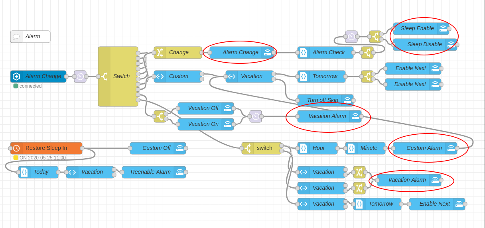
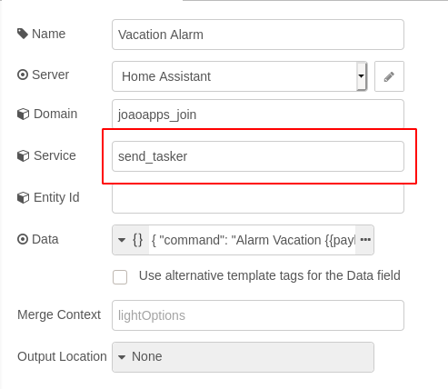

# Introduction

There's a million different ways of handling alarms to make sure you get up in the morning.  Some people turn on the radio.  Others need the lights to turn on bright.  Still others need literal klaxons blaring in their ears.  For me none of those options will work because usually I'm getting up early before my spouse to go for a run.  So anything loud won't work.  A pretty good solution for me is using [SleepAsAndroid](https://play.google.com/store/apps/details?id=com.urbandroid.sleep) tied to my Garmin watch so when my alarm goes off it first vibrates my watch.  If I don't turn the alarm off in ~2 minutes for some reason then it starts up with the progressively increasing in volume alarm sound.

Since I run, there are days when I don't want to run such as when it's too cold or pouring rain.  I try to look at the weather forecast but sometimes the rain is scattered or it turns out not to be as cold as forecasted.  So I wanted a way to automatically turn my early alarm off and turn on a later alarm, allowing me to sleep in.  I also just wanted a way to adjust my alarm without having to pull out my phone, and with the recent COVID-19 outbreak adjust my alarm on the fly depending on my work schedule has proven useful.

There are 3 basic parts to this: 1) the ability to toggle an individual days alarm on/off, as well as the next day's alarm, and then turn on a standard "sleep in" alarm, 2) the ability to turn off the next day's alarm and set a custom alarm time, 3) the ability to turn on "vacation mode" and disable all the alarms and turn on an extra-late sleep in alarm (just in case!).

The below solution works for me and could probably be adjusted to work for you fairly easily.  So far it's been fairly bulletproof with some minor tweaks, but I would strongly suggest you test it carefully before you become 100% reliant on it.

**Things we need (other than HomeAssistant and NodeRed):**

1) [**Join**](https://play.google.com/store/apps/details?id=com.joaomgcd.join) - similar to apps like Pushbullet, this one is made by the same dev as Tasker.  As a result, it has a unique feature we'll need which is the ability to call Tasker activities remotely.

2) [**Tasker**](https://play.google.com/store/apps/details?id=net.dinglisch.android.taskerm) - a super handy app for any Android user.  If you don't have it, it's worth the few dollars as it can pretty much do....anything.  And the dev is always adding new features. **This is Android only; sorry iOS users.**

3)  **[SleepAsAndroid](https://play.google.com/store/apps/details?id=com.urbandroid.sleep) ** (any alarm app should work, so long as it supports some way of being controlled by Tasker, such as via intents)

# HomeAssistant Setup

HomeAssistant is relatively simple and requires a number of input_booleans, input_numbers, and a template sensor (optional).  Below is the code you can copy in your `configuration.yaml`.

```yaml
input_number:
  alarmhour_custom:
    name: Hour
    icon: mdi:timer
    min: 1
    max: 12
    step: 1
  alarmminutes_custom:
    name: Minutes
    icon: mdi:timer
    min: 00
    max: 55
    step: 5
  alarm_custom:
    name: Custom
  alarm_disable_next:
    name: Skip Next Alarm

input_boolean:
  alarm_mon:
    name: Monday
  alarm_tue:
    name: Tuesday
  alarm_wed:
    name: Wednesday
  alarm_thu:
    name: Thursday
  alarm_fri:
    name: Friday
  alarm_sat:
    name: Saturday
  alarm_sun:
    name: Sunday
  alarm_vacation:
    name: Vacation
  alarm_custom:
    name: Custom
  alarm_disable_next:
    name: Skip Next Alarm
  work_home:
  	name: Pandemic Mode # aka Work from Home
    
sensor:
  - platform: template
    sensors:
      alarm_time_custom:
        friendly_name: 'Time'
        value_template: '{{ "%0.02d:%0.02d" | format(states("input_number.alarmhour_custom") | int, states("input_number.alarmminutes_custom") | int) }}'
```

The sensor is optional because I only use it to visually display my alarm time in Lovelace (see below).  I use a custom card called [Multiple  Entity Row](https://github.com/benct/lovelace-multiple-entity-row) and I think it's nice but not necessary for the core functionality we'll discuss.  Similarly optional, the "Pandemic Mode" is my COVID-19 addition that automatically turns off my early alarm at 8pm the day before.  Eventually it will be converted to a "work from home" mode.



Here's my Lovelace code, if you want to copy it as well:

```yaml
  - badges: []
    cards:
      - entities:
          - input_boolean.alarm_mon
          - input_boolean.alarm_tue
          - input_boolean.alarm_wed
          - input_boolean.alarm_thu
          - input_boolean.alarm_fri
          - input_boolean.alarm_sat
          - input_boolean.alarm_sun
        show_header_toggle: false
        state_color: true
        title: Normal Alarms
        type: entities
      - entities:
          - entities:
              - sensor.alarm_time_custom
            entity: input_boolean.alarm_custom
            icon: 'mdi:alarm'
            name: Enable Custom Alarm
            toggle: true
            type: 'custom:multiple-entity-row'
          - entity: input_number.alarmhour_custom
          - entity: input_number.alarmminutes_custom
        show_header_toggle: false
        state_color: true
        title: Custom Alarm
        type: entities
      - entities:
          - input_boolean.alarm_disable_next
          - input_boolean.alarm_vacation
          - input_boolean.work_home
        show_header_toggle: false
        state_color: true
        title: Special Alarms
        type: entities
    path: alarm
    title: Alarm
```

That's pretty much it for HomeAssistant, except for one more piece, which is Join.

# Join

As mentioned above, Join is a Pushbullet-like service that is very useful for this situation mainly for the Tasker calls.  Since this post is already going to be incredibly long I'm not going to go through all the details of setting up Join on your phone.  I would suggest checking out the dev's website [here](https://joaoapps.com/join/) as I think it's fairly self explanatory.

Once it's set up on your phone, we'll need to get things working with HomeAssistant.  Check out the integration page [here](https://www.home-assistant.io/integrations/joaoapps_join/).  Again, I think the docs are fairly self-explanatory here.  The key things you need to find are your Join API key and device id.  I would suggest just using a single `device_id` instead of the `device_ids` or `device_names` options.  Here's the relevant portion of my `configuration.yaml`:

```yaml
joaoapps_join:
  - api_key: YOUR_JOIN_API_KEY
    device_id: YOUR_DEVICE_ID
    name: YOUR_DEVICE_NAME
```

Once you reboot HomeAssistant, you should have a bunch of new services.  The key one we'll need is `joaoapps_join.YOUR_DEVICE_NAME_send_tasker`.  More on this later.

# Tasker

If you haven't used Tasker before, it's really an amazing Android app that can do all kinds of things.  Tasker has a bit of a learning curve, and setting it up is again outside the scope of this post.  Just check out the [subreddit](https://www.reddit.com/r/tasker) or one of [these](https://www.androidauthority.com/how-to-use-tasker-199872/)  [articles](https://www.howtogeek.com/170484/how-to-use-tasker-to-automate-your-android-phone/) for help.

Instead of copying the code into this post, see this [gist](https://gist.github.com/FuzzyMistborn/e334f7923d8f35bba705903edae0d866).  You shouldn't need to make any changes to the code as it's very generic, so long as you're using SleepAsAndroid.  If you're using a different alarm app you'll need to change the tasks to match your alarm app.  You should still be able to use the trigger from Join without much change.  Here's what it should like when copied in.



Now what does this all do?  Let's just take the Normal Alarm Toggle profile as an example.  When Join receives the Tasker Command "Alarm" along with the variables of `alarmday` and `alarmtoggle` (which we'll get to/will come from NodeRed) it will then use a shell command to toggle the alarm on a specific day on/off.  See the [SleepAsAndroid API documentation](http://sleep.urbandroid.org/documentation/developer-api/intents-and-content-providers/) for how I figured this part out.  Don't worry if you don't understand any of that, again you shouldn't have to do anything other than import the [xml file](https://gist.github.com/FuzzyMistborn/e334f7923d8f35bba705903edae0d866).  How to import?  Open up Tasker, long press on the bottom edge and then click "Import Project."  Find where you saved the xml file and import it. [Here's a walk through](https://www.reddit.com/r/tasker/comments/7g7694/how_to_import_a_file_into_tasker_a_quick_easy/) if that doesn't make sense.



# SleepAsAndroid

For SleepAsAndroid you'll need 2 alarms for every day: "mon" and another called "monsleep,"  "tue" and "tuesleep" (**note the name is important to work with the Tasker code above so follow this naming convention**).  You'll also want to create an alarm called "Vacation."  Set the alarm times to whatever you want, that's entirely up to you!  Again not going into the finer details of setting up SleepAsAndroid here.




You also may need to enable Tasker in the SleepAsAndroid app.  Go to Settings->Services and look for Tasker.  I can't remember if this is a requirement (I don't think it is) so you can try without it first and then enable later if things aren't working for you.

# NodeRed

Now finally the fun part!  This one could probably be simplified a bit on the NodeRed end but it works for me so it's one of those "if it ain't broke don't fix it" deals.  Basically what it does is whenever an alarm `input_boolean` changes, it runs through a bunch of checks and changes the data/payloads using some templates to get the data correct and then sends the Tasker command via Join.  You may wonder why there are some rate limiting nodes: after some testing I discovered that Join/Tasker can't handle a flood of requests all at once (most notably when turning vacation mode on/off) so some alarms weren't being turned on/off correctly.  Putting in the rate limits fixed those problems.  So this isn't instantaneous but it shouldn't impact anything.

You will need to modify a few of the nodes to call the correct Join service.  Everything else should be plug-n-play.  The part in the bottom left corner is the reset that restores the normal alarm at a preset time of 11am.  I picked this time kind of arbitrarily.  My thought process was that if I used an earlier time I might inadvertently reset my alarm so it triggers again (ie I wake up earlier than normal I don't want my alarm to go off twice!).

 

The NodeRed code is at the bottom of the post.

# Conclusion

Phew.  It may seem complicated (and let me tell you it was a pain to figure out all the bits and pieces, most notably the Tasker/Join bits), but you really should be able to use the code without much modification.  The end result is a simple to control morning alarm system that you can use various automations (such as based on special calendar events/holidays, or other triggers) to easily modify your alarm schedule.

Hope you enjoyed.  Feel free to message me over on Reddit ([/u/FuzzyMistborn](/automated-alarm-control/reddit.com/user/fuzzymistborn)) if you have questions or run into issues!

```json
[{"id":"7f30fabd.1fe11c","type":"comment","z":"b06c555f.69395","name":"Alarm","info":"","x":70,"y":740,"wires":[]},{"id":"5001a29f.98b48c","type":"server-state-changed","z":"b06c555f.69395","name":"Alarm Change","server":"63517380.eb951c","version":1,"exposeToHomeAssistant":false,"haConfig":[{"property":"name","value":""},{"property":"icon","value":""}],"entityidfilter":"input_boolean.alarm_","entityidfiltertype":"substring","outputinitially":false,"state_type":"str","haltifstate":"","halt_if_type":"str","halt_if_compare":"is","outputs":1,"output_only_on_state_change":true,"x":90,"y":840,"wires":[["5163d1d5.eb669"]]},{"id":"37479bd2.d12044","type":"api-call-service","z":"b06c555f.69395","name":"Vacation Off","server":"63517380.eb951c","version":1,"debugenabled":false,"service_domain":"input_boolean","service":"turn_on","entityId":"input_boolean.alarm_mon, input_boolean.alarm_tue, input_boolean.alarm_wed, input_boolean.alarm_thu, input_boolean.alarm_fri, input_boolean.alarm_sat, input_boolean.alarm_sun","data":"","dataType":"json","mergecontext":"","output_location":"","output_location_type":"none","mustacheAltTags":false,"x":510,"y":920,"wires":[["4628cf9a.9406d8"]]},{"id":"790891a8.3b6418","type":"switch","z":"b06c555f.69395","name":"Switch","property":"data.entity_id","propertyType":"msg","rules":[{"t":"eq","v":"input_boolean.alarm_mon","vt":"str"},{"t":"eq","v":"input_boolean.alarm_tue","vt":"str"},{"t":"eq","v":"input_boolean.alarm_wed","vt":"str"},{"t":"eq","v":"input_boolean.alarm_thu","vt":"str"},{"t":"eq","v":"input_boolean.alarm_fri","vt":"str"},{"t":"eq","v":"input_boolean.alarm_sat","vt":"str"},{"t":"eq","v":"input_boolean.alarm_sun","vt":"str"},{"t":"eq","v":"input_boolean.alarm_disable_next","vt":"str"},{"t":"eq","v":"input_boolean.alarm_vacation","vt":"str"},{"t":"eq","v":"input_boolean.alarm_custom","vt":"str"}],"checkall":"true","repair":false,"outputs":10,"x":290,"y":840,"wires":[["9e45cc70.640eb8"],["9e45cc70.640eb8"],["9e45cc70.640eb8"],["9e45cc70.640eb8"],["9e45cc70.640eb8"],["9e45cc70.640eb8"],["9e45cc70.640eb8"],["2dbfb2f7.fcacae"],["34d9e1be.312416"],["5cea82b2.b77f1c"]]},{"id":"34d9e1be.312416","type":"switch","z":"b06c555f.69395","name":"","property":"payload","propertyType":"msg","rules":[{"t":"eq","v":"off","vt":"str"},{"t":"eq","v":"on","vt":"str"}],"checkall":"true","repair":false,"outputs":2,"x":395,"y":940,"wires":[["37479bd2.d12044"],["627c2fbc.2766f8"]],"l":false},{"id":"627c2fbc.2766f8","type":"api-call-service","z":"b06c555f.69395","name":"Vacation On","server":"63517380.eb951c","version":1,"debugenabled":false,"service_domain":"input_boolean","service":"turn_off","entityId":"input_boolean.alarm_mon, input_boolean.alarm_tue, input_boolean.alarm_wed, input_boolean.alarm_thu, input_boolean.alarm_fri, input_boolean.alarm_sat, input_boolean.alarm_sun","data":"","dataType":"json","mergecontext":"","output_location":"","output_location_type":"none","mustacheAltTags":false,"x":510,"y":960,"wires":[["4628cf9a.9406d8"]]},{"id":"90ffc709.75d6b8","type":"api-render-template","z":"b06c555f.69395","name":"Tomorrow","server":"63517380.eb951c","template":"{{(as_timestamp(now())+ (86400)) | timestamp_custom(\"%a\",true) | lower}}","resultsLocation":"result","resultsLocationType":"msg","templateLocation":"","templateLocationType":"none","x":800,"y":840,"wires":[["1a91437a.275f6d"]]},{"id":"541013ae.45db2c","type":"api-call-service","z":"b06c555f.69395","name":"Enable Next","server":"63517380.eb951c","version":1,"debugenabled":false,"service_domain":"input_boolean","service":"turn_on","entityId":"input_boolean.alarm_{{result}}","data":"","dataType":"json","mergecontext":"","output_location":"","output_location_type":"none","mustacheAltTags":false,"x":1030,"y":820,"wires":[[]]},{"id":"57999dbf.ed9304","type":"api-call-service","z":"b06c555f.69395","name":"Disable Next","server":"63517380.eb951c","version":1,"debugenabled":false,"service_domain":"input_boolean","service":"turn_off","entityId":"input_boolean.alarm_{{result}}","data":"","dataType":"json","mergecontext":"","output_location":"","output_location_type":"none","mustacheAltTags":false,"x":1030,"y":860,"wires":[[]]},{"id":"1a91437a.275f6d","type":"switch","z":"b06c555f.69395","name":"","property":"payload","propertyType":"msg","rules":[{"t":"eq","v":"off","vt":"str"},{"t":"eq","v":"on","vt":"str"}],"checkall":"true","repair":false,"outputs":2,"x":915,"y":840,"wires":[["541013ae.45db2c"],["57999dbf.ed9304"]],"l":false},{"id":"a3c555f8.a571d","type":"api-call-service","z":"b06c555f.69395","name":"Vacation Alarm","server":"63517380.eb951c","version":1,"debugenabled":false,"service_domain":"joaoapps_join","service":"send_tasker","entityId":"","data":"{ \"command\": \"Alarm Vacation {{payload}}\" }","dataType":"json","mergecontext":"","output_location":"","output_location_type":"none","mustacheAltTags":false,"x":820,"y":940,"wires":[[]]},{"id":"4628cf9a.9406d8","type":"delay","z":"b06c555f.69395","name":"","pauseType":"delay","timeout":"5","timeoutUnits":"seconds","rate":"1","nbRateUnits":"1","rateUnits":"second","randomFirst":"1","randomLast":"5","randomUnits":"seconds","drop":false,"x":635,"y":940,"wires":[["a3c555f8.a571d"]],"l":false},{"id":"9e45cc70.640eb8","type":"change","z":"b06c555f.69395","name":"Change","rules":[{"t":"change","p":"data.entity_id","pt":"msg","from":"input_boolean.alarm_","fromt":"re","to":"","tot":"str"},{"t":"set","p":"day","pt":"msg","to":"data.entity_id","tot":"msg"},{"t":"change","p":"payload","pt":"msg","from":"off","fromt":"str","to":"false","tot":"str"},{"t":"change","p":"payload","pt":"msg","from":"on","fromt":"str","to":"true","tot":"str"}],"action":"","property":"","from":"","to":"","reg":false,"x":440,"y":780,"wires":[["1939c7cc.46762"]]},{"id":"500b1ff.cdf906","type":"api-current-state","z":"b06c555f.69395","name":"Vacation","server":"63517380.eb951c","version":1,"outputs":2,"halt_if":"off","halt_if_type":"str","halt_if_compare":"is","override_topic":false,"entity_id":"input_boolean.alarm_vacation","state_type":"str","state_location":"","override_payload":"none","entity_location":"","override_data":"none","blockInputOverrides":true,"x":620,"y":840,"wires":[["90ffc709.75d6b8"],["1f231516.02baab"]]},{"id":"1f231516.02baab","type":"api-call-service","z":"b06c555f.69395","name":"Turn off Skip","server":"63517380.eb951c","version":1,"debugenabled":false,"service_domain":"input_boolean","service":"turn_off","entityId":"input_boolean.alarm_disable_next","data":"","dataType":"json","mergecontext":"","output_location":"","output_location_type":"none","mustacheAltTags":false,"x":810,"y":900,"wires":[[]]},{"id":"1939c7cc.46762","type":"api-call-service","z":"b06c555f.69395","name":"Alarm Change","server":"63517380.eb951c","version":1,"debugenabled":false,"service_domain":"joaoapps_join","service":"send_tasker","entityId":"","data":"{ \"command\": \"Alarm setvar=:={{day}}=:={{payload}}\" }","dataType":"json","mergecontext":"","output_location":"","output_location_type":"none","mustacheAltTags":false,"x":600,"y":780,"wires":[["3bb7480c.5bbf48"]]},{"id":"663722e9.652aec","type":"api-call-service","z":"b06c555f.69395","name":"Sleep Enable","server":"63517380.eb951c","version":1,"debugenabled":false,"service_domain":"joaoapps_join","service":"send_tasker","entityId":"","data":"{ \"command\": \"Alarm setvar=:={{day}}sleep=:=true\" }","dataType":"json","mergecontext":"","output_location":"final","output_location_type":"msg","mustacheAltTags":false,"x":1050,"y":720,"wires":[[]]},{"id":"71ae75ef.9db39c","type":"api-call-service","z":"b06c555f.69395","name":"Sleep Disable","server":"63517380.eb951c","version":1,"debugenabled":false,"service_domain":"joaoapps_join","service":"send_tasker","entityId":"","data":"{ \"command\": \"Alarm setvar=:={{day}}sleep=:=false\" }","dataType":"json","mergecontext":"","output_location":"final","output_location_type":"msg","mustacheAltTags":false,"x":1060,"y":760,"wires":[[]]},{"id":"9dd3ef67.fcb088","type":"switch","z":"b06c555f.69395","name":"","property":"payload","propertyType":"msg","rules":[{"t":"eq","v":"false","vt":"str"},{"t":"eq","v":"true","vt":"str"}],"checkall":"true","repair":false,"outputs":2,"x":935,"y":740,"wires":[["663722e9.652aec"],["71ae75ef.9db39c"]],"l":false},{"id":"f461cc00.ec2b38","type":"api-call-service","z":"b06c555f.69395","name":"Custom Off","server":"63517380.eb951c","version":1,"debugenabled":false,"service_domain":"input_boolean","service":"turn_off","entityId":"input_boolean.alarm_custom, input_boolean.alarm_disable_next","data":"","dataType":"json","mergecontext":"","output_location":"","output_location_type":"none","mustacheAltTags":false,"x":390,"y":1020,"wires":[[]]},{"id":"b8c812bf.f6607","type":"api-render-template","z":"b06c555f.69395","name":"Today","server":"63517380.eb951c","template":"{{ (as_timestamp(now())) | timestamp_custom(\"%a\",true) | lower }}","resultsLocation":"result","resultsLocationType":"msg","templateLocation":"","templateLocationType":"none","x":90,"y":1080,"wires":[["8b7339e2.38cc5"]]},{"id":"c4eb19ca.8e677","type":"api-call-service","z":"b06c555f.69395","name":"Reenable Alarm","server":"63517380.eb951c","version":1,"debugenabled":false,"service_domain":"input_boolean","service":"turn_on","entityId":"input_boolean.alarm_{{result}}","data":"","dataType":"json","mergecontext":"","output_location":"","output_location_type":"none","mustacheAltTags":false,"x":380,"y":1080,"wires":[[]]},{"id":"2dbfb2f7.fcacae","type":"api-current-state","z":"b06c555f.69395","name":"Custom","server":"63517380.eb951c","version":1,"outputs":2,"halt_if":"off","halt_if_type":"str","halt_if_compare":"is","override_topic":false,"entity_id":"input_boolean.alarm_custom","state_type":"str","state_location":"","override_payload":"none","entity_location":"","override_data":"none","blockInputOverrides":true,"x":440,"y":840,"wires":[["500b1ff.cdf906"],[]]},{"id":"3bb7480c.5bbf48","type":"api-render-template","z":"b06c555f.69395","name":"Alarm Check","server":"63517380.eb951c","template":"{{ states('input_boolean.alarm_custom') == \"off\" and states('input_boolean.alarm_vacation') == \"off\" }}","resultsLocation":"template","resultsLocationType":"msg","templateLocation":"","templateLocationType":"none","x":810,"y":780,"wires":[["c354d9be.949cb8"]]},{"id":"8b7339e2.38cc5","type":"api-current-state","z":"b06c555f.69395","name":"Vacation","server":"63517380.eb951c","version":1,"outputs":2,"halt_if":"off","halt_if_type":"str","halt_if_compare":"is","override_topic":false,"entity_id":"input_boolean.alarm_vacation","state_type":"str","state_location":"","override_payload":"none","entity_location":"","override_data":"none","blockInputOverrides":true,"x":220,"y":1080,"wires":[["c4eb19ca.8e677"],[]]},{"id":"66de9a0b.b4bf5c","type":"api-current-state","z":"b06c555f.69395","name":"Vacation","server":"63517380.eb951c","version":1,"outputs":2,"halt_if":"off","halt_if_type":"str","halt_if_compare":"is","override_topic":false,"entity_id":"input_boolean.alarm_vacation","state_type":"str","state_location":"","override_payload":"none","entity_location":"","override_data":"none","blockInputOverrides":true,"x":800,"y":1120,"wires":[[],["a76aa273.8a0f8"]]},{"id":"a76aa273.8a0f8","type":"change","z":"b06c555f.69395","name":"","rules":[{"t":"set","p":"payload","pt":"msg","to":"on","tot":"str"}],"action":"","property":"","from":"","to":"","reg":false,"x":895,"y":1120,"wires":[["73f26c6d.a40db4"]],"l":false},{"id":"4a0a3830.0b41a8","type":"api-render-template","z":"b06c555f.69395","name":"Hour","server":"63517380.eb951c","template":"{{ states.input_number.alarmhour_custom.state | int }}","resultsLocation":"hour","resultsLocationType":"msg","templateLocation":"","templateLocationType":"none","x":790,"y":1020,"wires":[["e515bb17.f964c"]]},{"id":"e515bb17.f964c","type":"api-render-template","z":"b06c555f.69395","name":"Minute","server":"63517380.eb951c","template":"          \n            00\n          \n            05\n          \n            {{ states.input_number.alarmminutes_custom.state | int }}\n          ","resultsLocation":"minute","resultsLocationType":"msg","templateLocation":"","templateLocationType":"none","x":910,"y":1020,"wires":[["c5042d57.e7d9f"]]},{"id":"c5042d57.e7d9f","type":"api-call-service","z":"b06c555f.69395","name":"Custom Alarm","server":"63517380.eb951c","version":1,"debugenabled":false,"service_domain":"joaoapps_join","service":"send_tasker","entityId":"","data":"{ \"command\": \"Custom setvar=:={{hour}}=:={{minute}}\" }","dataType":"json","mergecontext":"","output_location":"final","output_location_type":"msg","mustacheAltTags":false,"x":1060,"y":1020,"wires":[["500b1ff.cdf906"]]},{"id":"5cea82b2.b77f1c","type":"switch","z":"b06c555f.69395","name":"","property":"payload","propertyType":"msg","rules":[{"t":"eq","v":"on","vt":"str"},{"t":"eq","v":"off","vt":"str"}],"checkall":"true","repair":false,"outputs":2,"x":650,"y":1020,"wires":[["4a0a3830.0b41a8","421f472e.7f727"],["66de9a0b.b4bf5c","5ca46a08.9a68f4"]]},{"id":"421f472e.7f727","type":"api-current-state","z":"b06c555f.69395","name":"Vacation","server":"63517380.eb951c","version":1,"outputs":2,"halt_if":"off","halt_if_type":"str","halt_if_compare":"is","override_topic":false,"entity_id":"input_boolean.alarm_vacation","state_type":"str","state_location":"","override_payload":"none","entity_location":"","override_data":"none","blockInputOverrides":true,"x":800,"y":1080,"wires":[[],["8d0081eb.831bb8"]]},{"id":"8d0081eb.831bb8","type":"change","z":"b06c555f.69395","name":"","rules":[{"t":"set","p":"payload","pt":"msg","to":"off","tot":"str"}],"action":"","property":"","from":"","to":"","reg":false,"x":895,"y":1080,"wires":[["73f26c6d.a40db4"]],"l":false},{"id":"73f26c6d.a40db4","type":"api-call-service","z":"b06c555f.69395","name":"Vacation Alarm","server":"63517380.eb951c","version":1,"debugenabled":false,"service_domain":"joaoapps_join","service":"send_tasker","entityId":"","data":"{ \"command\": \"Alarm Vacation Custom {{payload}}\" }","dataType":"json","mergecontext":"","output_location":"","output_location_type":"none","mustacheAltTags":false,"x":1020,"y":1100,"wires":[[]]},{"id":"dc1752fe.9078f","type":"schedex","z":"b06c555f.69395","name":"Restore Sleep In","suspended":false,"lat":"","lon":"","ontime":"11:00","ontopic":"","onpayload":"","onoffset":0,"onrandomoffset":0,"offtime":"","offtopic":"","offpayload":"","offoffset":0,"offrandomoffset":0,"mon":true,"tue":true,"wed":true,"thu":true,"fri":true,"sat":true,"sun":true,"x":110,"y":1020,"wires":[["b8c812bf.f6607","f461cc00.ec2b38"]]},{"id":"2f8f5337.51397c","type":"delay","z":"b06c555f.69395","name":"","pauseType":"delay","timeout":"15","timeoutUnits":"seconds","rate":"1","nbRateUnits":"30","rateUnits":"second","randomFirst":"1","randomLast":"5","randomUnits":"seconds","drop":false,"x":875,"y":740,"wires":[["9dd3ef67.fcb088"]],"l":false},{"id":"5163d1d5.eb669","type":"delay","z":"b06c555f.69395","name":"","pauseType":"rate","timeout":"5","timeoutUnits":"seconds","rate":"1","nbRateUnits":"15","rateUnits":"second","randomFirst":"1","randomLast":"5","randomUnits":"seconds","drop":false,"x":195,"y":840,"wires":[["790891a8.3b6418"]],"l":false},{"id":"c354d9be.949cb8","type":"switch","z":"b06c555f.69395","name":"","property":"template","propertyType":"msg","rules":[{"t":"eq","v":"True","vt":"str"}],"checkall":"true","repair":false,"outputs":1,"x":915,"y":780,"wires":[["2f8f5337.51397c"]],"l":false},{"id":"5ca46a08.9a68f4","type":"api-current-state","z":"b06c555f.69395","name":"Vacation","server":"63517380.eb951c","version":1,"outputs":2,"halt_if":"off","halt_if_type":"str","halt_if_compare":"is","override_topic":false,"entity_id":"input_boolean.alarm_vacation","state_type":"str","state_location":"","override_payload":"none","entity_location":"","override_data":"none","blockInputOverrides":true,"x":800,"y":1160,"wires":[["f8830245.577a38"],[]]},{"id":"f8830245.577a38","type":"api-render-template","z":"b06c555f.69395","name":"Tomorrow","server":"63517380.eb951c","template":"{{(as_timestamp(now())+ (86400)) | timestamp_custom(\"%a\",true) | lower}}","resultsLocation":"result","resultsLocationType":"msg","templateLocation":"","templateLocationType":"none","x":940,"y":1160,"wires":[["9fdadc80.b6388"]]},{"id":"9fdadc80.b6388","type":"api-call-service","z":"b06c555f.69395","name":"Enable Next","server":"63517380.eb951c","version":1,"debugenabled":false,"service_domain":"input_boolean","service":"turn_on","entityId":"input_boolean.alarm_{{result}}","data":"","dataType":"json","mergecontext":"","output_location":"","output_location_type":"none","mustacheAltTags":false,"x":1090,"y":1160,"wires":[[]]},{"id":"63517380.eb951c","type":"server","z":"","name":"Home Assistant","legacy":false,"rejectUnauthorizedCerts":false,"ha_boolean":"y|yes|true|on|home|open","connectionDelay":true,"cacheJson":true}]
```


