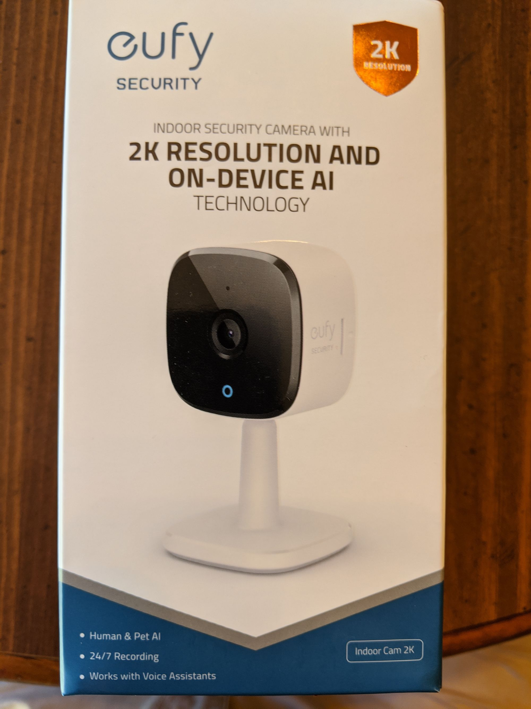
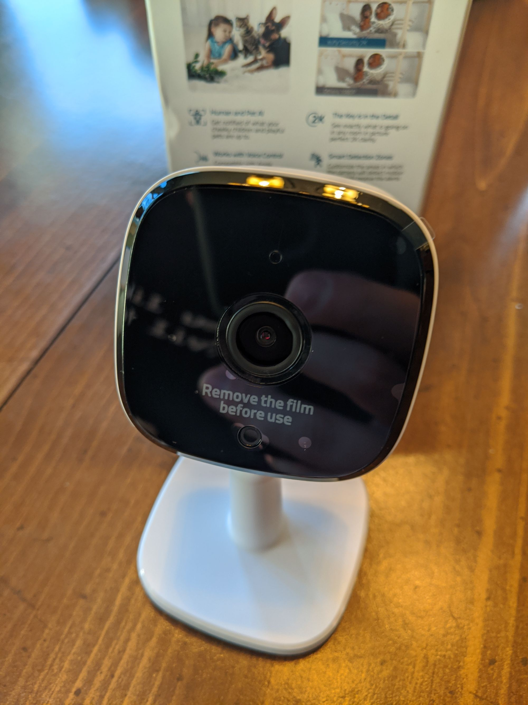
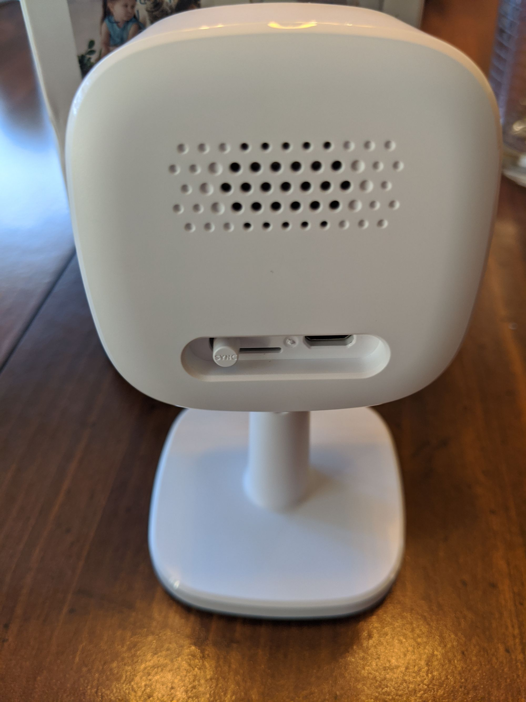
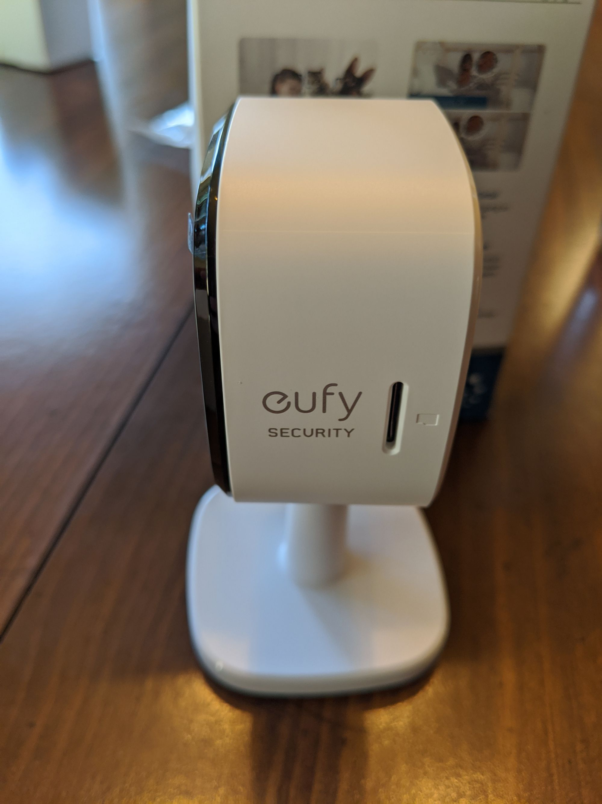
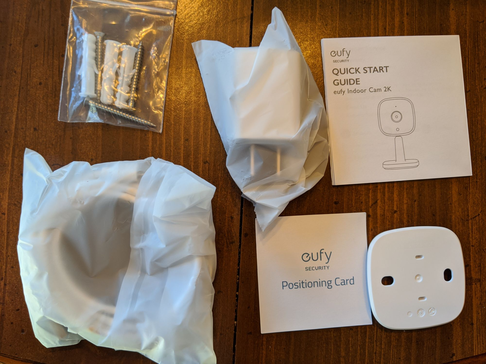
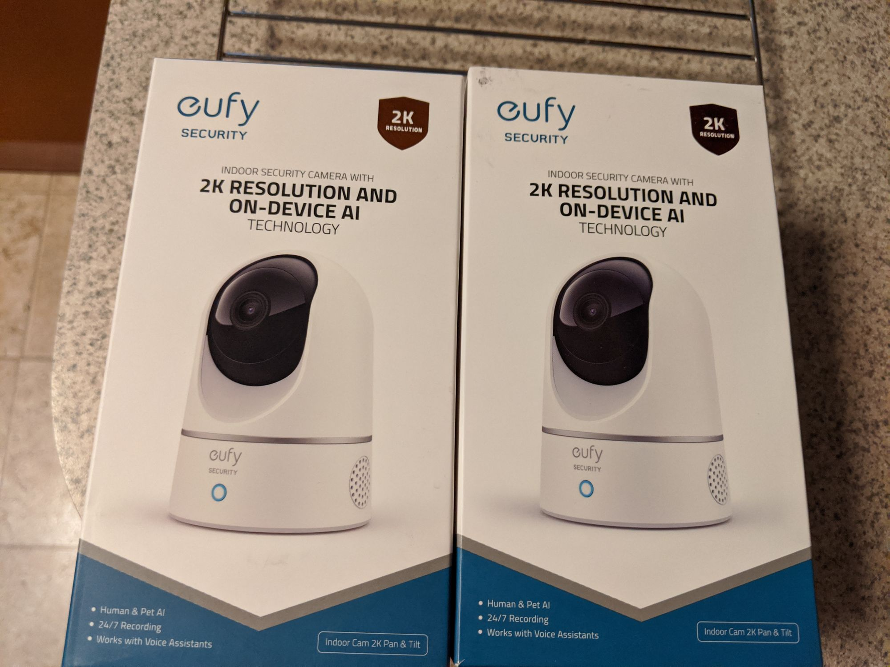
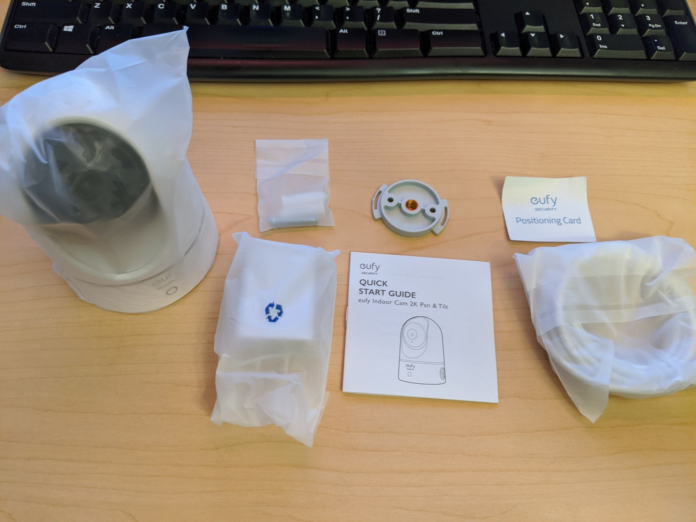

As I noted in [one of my first posts](/smart-home-hardware/), I have used the Wyze V2 indoor cams for almost 2 years.  I started off with the cameras flashed to the custom [Dafang-Hacks firmware](https://github.com/EliasKotlyar/Xiaomi-Dafang-Hacks) which worked OK.  I was using [Blue Iris](https://blueirissoftware.com/) as my NVR and I saw a lot of disconnects/breaks in the recording.  Eventually Wyze released a [custom firmware version](https://support.wyzecam.com/hc/en-us/articles/360026245231-Wyze-Cam-RTSP) that supported RTSP.  However, after more than a year development on the firmware has gone no where.  I still saw tons of drops/disconnects while recording and the picture quality was just ehh.  I know there are many people out there who have had lots of success with the RTSP firmware, but from what I've seen usually it's people running only 1 or 2 cameras.  I was running 6 and even after expanding my WiFi network capability by adding a dedicated wireless access point I still had drops.  I had more luck using MotionEye to record but then there was no sound.

To be clear, the Wyze Cam v2 was remarkable.  It was the first decent camera that sold for $20 ($25 with shipping) and I had no issue recommending them to friends and family looking for a cheap way to get cameras in their house.  They even could be mounted outside and fared fairly well all things considered.  The streaming quality was pretty decent for the price and the free cloud storage (with the 12 second clips) supplemented by an SD card was pretty awesome.  But after 2 years the limitations (and no progress on the RTSP end or getting the camera integrated into HomeAssistant) really was getting to me.

Then in March I saw an article about Eufy releasing an indoor 2K pan and tilt and a stationary camera.  The retail prices were announced at $49 and $39 respectively, but pre-orders saw about a 25% discount bringing the prices down to pretty much the same prices as the WyzeCam v2 and WyzeCam Pan.  I know and like the Eufy brand after being very pleased with my doorbell cam so I was interested in giving them a go.  So I went a bit crazy and ordered enough to replace every Wyzecam in my house.

## General Features/Thoughts

Let's start with the obvious question: did the RTSP work better on the Eufy cam? **YES**.  A million times yes.  I've had all 6 cameras streaming to Blue Iris without a single drop (or at least one that's noticeable) for almost 2 weeks.  That alone makes the camera worth it.  In terms of picture quality, it's mostly a tie with maybe a small nod towards the Eufy.  I definitely don't think it's "2K" in terms of quality but the color temps feel a bit more normal and it's easier to make out facial features.

Other vast improvements I've noticed over the Wyze cam are 1) the app/stream is very quick to load and rarely fails, 2) the speaker quality for the two way talk is pretty decent, and 3) more importantly the microphone is significantly better on the Eufy cam than the Wyze.  Another benefit of the Eufy cams is the on-board AI that is able to detect persons, pets and crying.  Wyze introduced person detection (though was forced to pull it when the company they used got bought by Apple) but from what I've gathered it was just OK.  The Eufy detection is pretty much spot on, though occasionally I get a notification about a pet being detected when my son is playing with his stuffed animals.  I'm sure that will get better with time.

Some other things I've noticed that differentiate the cameras.  First, an SD card is required in order to receive notifications on the Eufy.  I was planning on using an SD card anyway so this wasn't a big deal.  I also appreciated the ability to rate-limit the notifications so I wouldn't get constant notifications when motion was detected (anywhere from no cooldown to 5 minutes).  Pairing the Eufy cam to my wifi network was a much simpler process than with the Wyze.  Sometimes I would have issues getting a Wyze cam connected but I had no issues with the Eufy.  Perhaps because the Eufy pairing process uses bluetooth instead of a QR code the camera scans.

Recording is also very easy to set up and you can simultaneously record to an SD card as well as to an NVR via RTSP (I do this because sometimes it's easier to find the clip I want on the camera without having to go into my NVR software).  Video scrubbing on the Eufy app is infinitely superior to the Wyze experience.  On the Wyze I'd so often be unable to find the spot I needed because it would take forever to load the footage (and oftentimes would just flat out fail to load).  So far no issues on the Eufy, and as an added bonus there's a clear way to tell when the camera has detected motion/sound (yellow bar as opposed to the general blue).

## Indoor 2K Camera

I just wanted to include a few thoughts that are particular to each camera as there are some slight differences to note.  The Eufy camera is slightly bigger than the Wyze thanks to the larger stand that doesn't compact like the Wyze stand can.  But that's not a huge deal to me.  The stand also isn't as adjustable it's flexible enough that I don't think it'll be a big problem.  Unlike the Wyze, the mount is not magnetic so if you want to mount the Eufy cam on a wall you'll need to use the included mounting plate with screws.  Somewhat limiting but also not a huge deal.

## Pan/Tilt Camera

I don't actually have a Wyze Pan to compare the Eufy one too but I don't have a ton to say about the Eufy pan that hasn't been said above.  There's a standard mounting plate in the box that lets you screw into most available wall mounting solutions which is nice.  The camera motor is virtually silent (my kid never reacts when I move the camera around at night even before he falls asleep), versus I've read some complaints about the Wyze Pan motor being a bit loud.  Another cool feature of the Eufy is that when the camera is off the lens rotates back into the body (which also exposes the SD card slot, btw) so it's easy to tell that the camera is off.

# Conclusion

Overall I love the Eufy cams and I don't see myself going back to the Wyze cams unless the V3 is something remarkable (no, there's no official word on if/when a V3 is coming).  I loved the Wyze cams but they're long in the tooth at this point and the hardware limitations are obvious at this point.  The fact that it can't handle RTSP but the Eufy can is I think indicative of this issue.  My gripes with the Eufy are pretty small (no truly working HomeAssistant integration, limited ability to control the notification schedule) but other than that they're great and even for slightly more expensive than the Wyze cam at $15 I think it's money well spent.  Though I would expect there to be frequent discounts on the cameras in true Anker/Eufy style once they get past the initial roll out).
