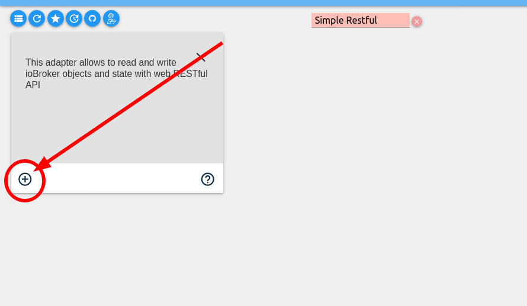

As I think should be obvious, I'm very big on HomeAssistant.  It's a great piece of software and does many many many things well.  However, I bought a Eufy Doorbell camera over a year and a half ago and genuinely love it.  It has great set of features (local person detection, fast notifications, quick loading of streams in app, 2k video quality) but it lacked a HomeAssistant integration.  I created a repo to document the API but Eufy changed things around and it grew well beyond my skill to understand.  There's a working integration for HomeAssistant but it's limited to getting still images of last motion activity and creating a 3 minute RTMP stream from the camera (limitation of the API, not the integration).

But then there's [this "adapter"](https://github.com/bropat/ioBroker.eufy-security/) for [ioBroker](https://www.iobroker.net/).  I will admit to not knowing much about ioBroker other than what you can glean from their website and some Googling.  It's a predominantly German IoT platform that in many ways is similar to HomeAssistant.  It is able to connect to [a lot of popular smart home devices](https://www.iobroker.net/#en/adapters).  And again, most importantly for my purposes, thanks to the work of @bropat it's able to control my Eufy Doorbell camera (and other Eufy indoor cameras).

In this post I will walk you through how to install ioBroker via Docker, set up the EufySecurity adapter, and then connect to it via HomeAssistant.

# ioBroker Setup
This guide is for setting up ioBroker in Docker.  If you're running HassOS, ~~you'll need to look elsewhere because there's no way to run ioBroker currently inside of HassOS.  Maybe someday.  But for now, you'll need to use another machine to run the container.~~  Check out @MaxW's HassOS add-on: https://github.com/MaxWinterstein/homeassistant-addons/.  Note that it's EXPERIMENTAL.  You have been warned.

For the Docker image, we'll be using https://github.com/buanet/docker-iobroker.  This seems to be the "official" image and it works well enough for me.  Here is my docker-compose:

```yaml
  iobroker:
    image: buanet/iobroker:latest
    container_name: iobroker
    ports:
      - "8081:8081" # Main
      - "8082:8082" # Web Server
      - "8087:8087" # Rest API
    volumes:
      - /home/fuzzy/docker/iobroker:/opt/iobroker
    environment:
      - LANGUAGE="en_US:en"
    restart: always
```
Adjust the volume mount path (in my case `/home/fuzzy/docker/iobroker`) to whatever suits your purposes.

There are a lot more things you can set via Docker environmental variables (see the Github page for more details) but this is the bare minimum that will get a container spun up and working.

Run `docker-compose up -d iobroker` and the image should download and start.  Go to http://yourip:8081 and you should see this screen:


Click that you agree to the terms and click "Agree."  Then enter your information or click "close" (this won't really matter for purpose of EufySecurity but if you want to mess around with ioBroker feel free to fill it out "correctly").  You'll then be taken to an "instance" page.  Ignore this for now and click on "Adapters" in the left-hand column.


Then click on "filter" and search for "Simple Restful API".  Click the blue 3 dots and then the plus sign in the bottom left corner.  Let it install/add the instance.  You can ignore the settings page that appears after installation.

 

Go back to the adapters page.  I also installed the "WEB server" adapter which will let you pull the last image from the eufy-security adapter into HASS, so this step is optional if you want to continue using the current HASS integration.

But this time click on the Github icon in the top left corner.  Click "Custom" and then enter the URL of the ioBroker EufySecurity Github: https://github.com/bropat/ioBroker.eufy-security.


You should now have the EufySecurity adapter installed.  Go back again to the adapters page and you should see a EufySecurity box.  Click on the blue circle with 3 dots and then click the plus button in the bottom left corner (exactly the same steps as we did to add the Restful API adapter).  It will create an instance for you.  Here you will want to fill in your information to set up the adapter.  You can change the polling interval (I have mine set to 5 minutes instead of the default 10) and the max camera livestream duration (default is 30 but I believe the API should support up to 3 minutes or 180 seconds).  Click "Save and Close" and you should see the circle next to "eufy-security.0" turn green eventually (may start red then go yellow and eventually green).


# HASS Integration

Now the fun part!  Integrating with HASS.  For this you'll need to dig around a bit in the "Objects" page of ioBroker.  Look for a "folder" called eufy-security.0.  Expand that folder and you should see a list of all your cameras available via the adapter.  They're listed by ID/Serial Number but also have the name you set up in the app.  You'll need the serial number to get things into HASS.


Let's start with the guard mode.  Hat tip to [@MaxW on the HASS forum](https://community.home-assistant.io/t/eufy-camera-integration/121758/425) for this part.  For each camera you want to track the guard mode status of, create a RESTful sensor in the `sensor:` portion of your HASS configuration.yaml file.  For example:

```yaml
sensor:
  - platform: rest
    name: Eufy Doorbell Guard Mode
    resource: "http://IOBROKER_SERVER_IP:8087/getPlainValue/eufy-security.0.CAMERA_SERIAL_NUMBER.station.guard_mode"
    scan_interval: 10
    value_template: >-
      
      {{ {0: "Away",
          1: "Home",
          2: "Schedule",
          3: "Custom1",
          4: "Custom2",
          5: "Custom3",
          47: "Geofence",
          63: "Disarmed"}[v] | default("Unknown state:" + (value|urlencode)) }}
```
Change the Server IP address and camera serial number to match your server/camera

This will get you the current status (at least, it polls every 10 seconds so close enough) of the guard mode of each camera.  To change the status, you'll need to create a rest command.  Here's an example config:

```yaml
rest_command:
  eufy_doorbell_disarmed:
    url: "http://IOBROKER_SERVER_IP:8087/set/eufy-security.0.CAMERA_SERIAL_NUMBER.station.guard_mode?value=GUARD_MODE_VALUE&ack=false"
```

Change the Server IP, Camera Serial Number, and Guard Mode as appropriate. You'll also want to make as many commands as you want to be able to change to.

Now there's two options for how to change the settings.  First, you could create a template switch that would go back and forth between two modes.  That's good enough for my use case as all I really want is "motion detection on" and "motion detection off."  So here's my template switch:

```yaml
  - platform: template
    switches:
	  eufy_doorbell:
        friendly_name: "Front Door - Guard Mode"
        icon_template: mdi:doorbell-video
        value_template: "{{ is_state('sensor.eufy_doorbell_guard_mode', 'Home') }}"
        turn_on:
          service: rest_command.eufy_doorbell_home
        turn_off:
          service: rest_command.eufy_doorbell_disarmed
```
The other option I could see is creating an `input_select` and then an automation to fire depending on which input you selected.  Whatever floats your boat.  I may go down the `input_select` route eventually but for now the switch does the job well enough.

The final step is if you want to pull the last motion image into HASS.  This is where the WEB Server comes into play.  Here's my camera config:

```yaml
camera:
  - platform: generic
    name: Eufy Doorbell
    still_image_url: http://IOBROKER_SERVER_IP:8082/eufy-security.0/CAMERA_SERIAL_NUMBER.jpg
```
~~I'm working on a way to get the RTMP stream into HASS.  I've figured out how to get the URL (via the RestfulAPI) but I haven't quite cracked the camera part yet.  The URL I get back has quotes and that doesn't seem to work in HASS.~~  Edit: Got it working!  Hat tip to @dezmui for cracking the quotes part and the camera part.  Here's how to do it:

Add the following as another rest sensor for any stream you want.

```yaml
  - platform: rest
    name: Eufy Doorbell Stream
    resource: "http://IOBROKER_SERVER_IP:8087/getPlainValue/eufy-security.0.CAMERA_SERIAL_NUMBER.cameras.CAMERA_SERIAL_NUMBER.livestream"
    scan_interval: 10
    value_template: >-
      
        {{ value.replace('"', "") }}
      
        No Stream
      
```

And then this as a camera component (and you also need to enable `stream:` in your configuration.yaml!).  Note that this is very similar to the above camera setup, we just added the stream_source as an option.

```yaml
camera:
  - platform: generic
    name: Eufy Doorbell
    still_image_url: http://IOBROKER_IP:8082/eufy-security.0/CAMERA_SERIAL_NUMBER.jpg
    stream_source: "{{ states('sensor.eufy_doorbell_stream') }}"
```
Now to start and stop the stream (subject to the limitation that the stream will time out based on what you have your setting in ioBroker set to), use the rest_commands:

```yaml
rest_command:
  eufy_start_stream:
    url: "http://IOBROKER:8087/toggle/eufy-security.0.CAMERA_ID.cameras.CAMERA_ID.start_stream"

  eufy_stop_stream:
    url: "http://IOBROKER:8087/toggle/eufy-security.0.CAMERA_ID.cameras.CAMERA_ID.stop_stream"
```

Restart HASS and then add this to your Lovelace:

```yaml
  - camera_image: camera.eufy_doorbell
    entities:
      - entity: camera.eufy_doorbell
    title: Camera
    type: picture-glance
    double_tap_action:
      action: call-service
      service: rest_command.eufy_start_stream
    hold_action:
      action: call-service
      service: rest_command.eufy_stop_stream
```
Should work!

# Conclusion
So there you have it.  Now you can control much of the functionality of EufySecurity cameras via HomeAssistant.  Not all functionality is supported but @bropat seems to be doing a great job fixing things and keeping on top of it.

What is not working for me (yet) is doorbell motion events/button pushes (even via MQTT).  Those are less important to me as my main thing was controlling when the doorbell camera would detect motion or not, but I'm sure @bropat will keep working on it.