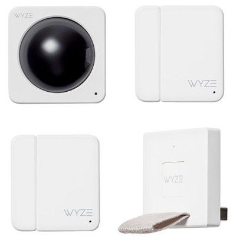

---
title: "Smart Home Hardware"
author: "FuzzyMistborn"
date: 2020-04-24T02:27:00Z
slug: smart-home-hardware
image: "header.jpg"
categories:
  - "Smart Home"
tags:
  - HomeAssistant
  - Hardware
draft: false
---

Well now that I've talked about what software I run my smart home on, what about the hardware?  Let's dig in.

(**Note**: All links here do NOT contain any kind of affiliate link.  They're just direct links to the product)

# Thermostat


I only have a single zone in my house so I went for an Ecobee 3.  At the time I made my purchase, it was unique in that it had the ability to use remote sensors.  These sensors can be placed in different rooms and then the thermostat can be told to include different sensors during different comfort profiles.  So for example, during the day I don't care what the temperature is in the bedrooms but I do care about the first floor, and vice versa at night.  Nest later added similar functionality so this is no longer unique.

One major issue with Ecobee is their servers.  There's been [so](https://www.reddit.com/r/ecobee/comments/e8c3e7/another_day_another_offline_ecobee_server/)  [many](https://www.reddit.com/r/ecobee/comments/ci7vm2/ecobee_server_down/)  [server](https://www.reddit.com/r/ecobee/comments/bk37ym/servers_down_again/)  [outages](https://www.reddit.com/r/ecobee/comments/b6wvja/servers_down_again/)  [that](https://www.reddit.com/r/ecobee/comments/bgmnby/i_get_the_servers_are_down_how_is_it_that_local/)  [I](https://www.reddit.com/r/ecobee/comments/bqskce/is_the_server_down_again/)  [can't](https://www.reddit.com/r/ecobee/comments/aledoe/server_issues/)  [even](https://www.reddit.com/r/ecobee/comments/bnuq32/server_issues_just_this_month/)  [count](https://www.reddit.com/r/ecobee/comments/anedtj/ecobee_server_dropping_out_like_crazy_last_night/).  It's almost a joke these days. There's also the "Home IQ" reports that are comical in how delayed they can be.  I can remember times when I'd log in to see and I literally have 3-4 months in a row without a report.  To the point where [beestat.io](/p/91412e02-0559-42a5-89a9-75a1e8888157/beestat.io) is what I would recommend people use instead of the Ecobee page.



In fairness to Ecobee, things have gotten better.  I haven't seen nearly as many outages lately and I can view the Home IQ reports for the past several months as of writing this.  Here's the other thing: I rarely open the app or check my historical data, and I don't think I've ever noticed a server outage.  I have my thermostat programmed to follow a schedule and that continues to work even when there is a server outage.

Probably my favorite feature of the Ecobee is "vacation mode."  I use this to set the temperatures to hold at slightly warmer/colder temperatures (depending on the season) when I'm away.  I use this heavily to adjust some of my home automations and I can set it via my calendar (works via HomeAssistant, you can also manually schedule in the app).

In hindsight, I might have gone with a Zwave thermostat if I was to do it again due to the server issues (and desire for local control).  That being said, I do like some of the features that are built in to the Ecobee (sensors/vacation mode) and I haven't really noticed server problems.  Overall, I'm happy enough with my Ecobee.

# Smart Home Hub


Ahhh the great Amazon Alexa v. Google Assistant debate.  I'm not going to spend much time on this just because I think the decision is largely personal.  For me, I started with all Echo Dots but recently got fed up with them.  I found myself having to repeat commands frequently (sometimes many times) and often times with a result I didn't want.

I did explore building my own smart assistant with some Raspberry Pis and [Rhasspy](https://github.com/synesthesiam/rhasspy).  It worked but to achieve what I was after (whole home music system and voice assistant) was going to be 1) significantly more expensive (about $100 per set up) and 2) not _quite_ as good as Alexa/Google.  I've had a few Nest Hub's (the small one with the screen) and really liked them, so after some discussions decided to rip the Echo Dots out and switch to Google.

Overall I've found the Minis to be  superior.  Much better recognition of commands and I really like the ability to cast music from my phone.  I have hit a few issues like automating music playback but that's partly due to my own personal use cases.  I also wish I could turn on "brief mode" for every response instead of just when the device is in the same virtual "room" as whatever device I'm trying to control.  IE right now if the device answering me is in the kitchen and so is the light, I get a "bing" in response, if the light is in the basement I get "Ok, turning on 3 lights in the basement."  Versus Alexa was always a "bing."  I also have some issues with integrating the Ecobee temperature sensors but it's not a dealbreaker for me.

So really, try out both and see what works for you.  In reality they're pretty much comparable in terms of the supported integrations and such (with some exceptions I know).

# ZWave


ZWave comprises a large majority of my smart home devices.  I use it for all my light switches and most of my motion/door sensors.  What I like about ZWave is that it uses it's own spectrum so there's very little chance of interference and every wired/plugged in device acts as a repeater so it's fairly easy to build a robust and expansive ZWave network.  It's also locally controlled via a hub.  For a hub, I use the [Aeotec Z-Stick Gen 5](https://www.amazon.com/Aeotec-Z-Stick-Z-Wave-create-gateway/dp/B00X0AWA6E/).  Haven't had any problems with it, and highly recommend it.

The downside to ZWave is that it is a proprietary protocol that requires a license to make products.  The result is that prices are higher than similar WiFi or Zigbee devices.  For example, Zwave motion sensors are usually $30+ whereas Zigbee ones are $15-20.

### Lights

For my lights, I pretty much only have GE switches.  I do have a few Zooz ones and they're OK, but overall I prefer the GE ones.  The main drawback to the GE ones is that they 1) require a neutral wire (which most modern houses have but NOT ALL) and 2) they require an "add-on" switch when there are multiple switches on the same circuit (which are about $20/switch).  That can make them an expensive option, especially when you look at both Zooz and Inovelli which have solutions that only require the "primary" switch to be smart and the other switches can be "dumb."  Both these solutions start coming out after I was mostly done installing the switches so in hindsight I would probably look more closely at Inovelli, but I'm still very pleased with my GE switches and don't regret the decision all that much.  The few Zooz switches I have work well but there are a few quirks that make them not a good fit for my use (mostly because I have so many GE switches that I just wanted consistent behavior across the board).

Basically every switch in my house at this point is "smart."  A lot of people (myself included) start off with smart light bulbs.  And they work great.  But there are 2 major issues with smart bulbs.  1) you (with a few exceptions) lose the ability to use the wall switches and 2) they can get $$$ quickly.  If you have a room with 4+ lights, that's easily $50+ in bulbs, versus $30 for a switch.  Plus having to train guests/visitors to not use the switches is just....no.

### Motion Sensors

I started out with Dome motion and door sensors and overall they work well.  My gripes are that every now and then the door sensors don't realize they're closed when I open/close the door somewhat quickly and with the motion sensors the luminescence sensors work only in about 25% of the ones I have.  Also, despite the fact you can configure the sensitivity of the motion sensors and they're supposed to be "pet proof" my cats set them off all the time.  Not a huge deal nor unique to the Dome sensors but....frustrating.

### Locks/Garage

For a lock, I use the [Schlage Connect](https://www.amazon.com/Schlage-Connect-Touchscreen-Deadbolt-SmartThings/dp/B00AGK9KOG) and I LOVE it.  I haven't had to use my house key pretty much ever.  When we go on vacation and need to let the pet sitters in I can turn on a door code that works for them (and is automatically turned on/off based on "vacation" mode).  Family members also have key codes.  And honestly it just works.  Really all I can ask for in a door lock.

For the garage, I use the [GoControl/Linear](https://smile.amazon.com/GoControl-Linear-GD00Z-4-Z-Wave-Controller/dp/B00M75TEIU) Zwave.  Again, I love it.  It works well, haven't had any issues with it at all.  Can't really say much more than that.  There are some other options out there that aren't ZWave based but if you want locally controlled and have a ZWave network, I'd strongly encourage you to get the GoControl.  And please please please please please STAY THE HELL AWAY FROM MyQ!!!

# Zigbee

So this is a recent addition to my smart home.  Zigbee is another protocol that is similar in some ways to ZWave in that it's 1) locally controlled and 2) you need a hub.  The major differences are that Zigbee is (I believe) an open standard (at least one without licensing fees) so it's easier and cheaper to make products, and more importantly it uses the same spectrum as 2.4 GHz WiFi.  Because it uses the same spectrum it's possible that you'll run into interference.  If you want to learn more/read how to avoid interference, go read [this article](https://support.metageek.com/hc/en-us/articles/203845040-ZigBee-and-WiFi-Coexistence).

One of the more popular brands of Zigbee devices is the Xiaomi Aqara.  There are a lot of different options here, from single click buttons to switches to magic six sided cubes.  The best part about them is that they are incredibly cheap, especially if you order them on eBay where you can get them for about $10-15.  Downside is the long shipping times and you can get them on Amazon in some cases for a few dollars more if you're impatient.  So far I've only used a few of the devices but I really like them.  The main reason I decided to go down the Zigbee hole was because of the single button devices.  With the death of the Amazon Dash buttons I was exploring other options and....they really didn't exist.  Zwave had some options but they were all $40+, and the only other options I could find were DIY which didn't appeal to me.

To control my Zigbee devices, currently I'm using a [Conbee II](https://www.amazon.com/dresden-elektronik-ConBee-Universal-Gateway/dp/B07PZ7ZHG5/) (running the deConz software).  I tried using ZHA in HomeAssistant but had some issues.  I'm also not sure I'm keeing the Conbee because I ordered a [CC2531 dongle from Sonoff](https://www.itead.cc/cc2531-usb-dongle.html).  This will supposedly work with Zigbee2MQTT.  For $7 shipped I'm intrigued to see how well it works compared to the $40 Conbee II.  However I'm still waiting for the CC2531 to arrive so can't test it yet.  Hoping it arrives soon, and maybe I'll do an update on it once I get to play with it and make a final decision.  For now, the Conbee works great.

# Doorbell


Most of the smart things I get I end up very happy with because I research and think hard about what I get.  I thought I'd done my homework in purchasing a Skybell HD.  I got it on a Black Friday deal for like $130 and it was The Wirecutter's pick for best smart doorbell.  I installed it and everything was great.  Best of all, there were no subscription fees (unlike Ring which was the only major competition at the time) and cloud storage for 7 days included.  Great!

The shine did not last long.  The motion sensing on the Skybell was utter garbage.  Even at it's lowest sensitivity it was picking up large trucks and school buses driving by my house (about 50 feet away).  Then conversely it would miss when UPS/USPS/FedEx would drop off a package.  I could understand how it could pick up a truck 50 feet away but not a person standing right in front of it.  To top it off, when I did get notifications oftentimes they were minutes later.  I kept hoping for software or firmware improvements (like setting detection zones) but they never came.  And oftentimes when I'd try to load the stream I would just get a black picture.  After 2 years, I was ready to move on.

Enter the [Eufy 2k Doorbell](https://www.amazon.com/Security-Doorbell-Resolution-Real-Time-Response/dp/B07R3WY95C/).  For $160 (usually on sale for $110ish) this is an amazing doorbell.  The picture quality is really good, it's fast to start streaming, and notifications are usually very quick.  Also, it allows you to set detection zones AND it uses some kind of AI to recognize human faces, so you can customize the detection settings a bit.  The result is that it's probably 95% accurate in picking up a human approaching (5% is picking up my front porch flag and trees moving on particularly windy days).

In terms of storage there's no cloud option and instead the storage is all local on a 4 GB built in SD card, which is both a pro and a con.  It's nice that the storage is local but I really wish there was a way to record via RTSP or back up to a NAS.  I'm not so worried about someone stealing my doorbell cam (though that's a legitimate concern) but more I just would prefer the storage to be off the device.  That's probably my main gripe (and the lack of HomeAssistant support but...that's being worked on).  Oh and you can't use your existing doorbell, you need to use the little chime that you plug into a wall.  Wish it used the existing bell but not a big deal to me.

Eufy also now has a [battery powered version](https://www.amazon.com/eufy-Security-Battery-Powered-Detection-Self-Installation/dp/B081C4JN51) of the camera that saves footage to a Homebase (which is sort of like a NAS).  It also apparently can tie directly into your existing chime AND wiring, so if I had to do it again I probably would go that route instead.  I really like Eufy (sub-brand of Anker who I find to be highly reliable) and find their products to be good quality.  Which leads me to....

# Cameras


I won't spend much time on this one because I'll probably have more to say in a month or so.  Right now I use Wyze v2 cams flashed with the RTSP firmware to get the feed into HomeAssistant.  It's....not great.  The cams work well enough and the video quality is acceptable, but that's when you're using the app.  The RTSP firmware has been in "beta" for over a year now and hasn't seen an update in 6 months.  There are tons of drop outs/disconnects that I just can't rely on getting a picture consistently enough to do anything more than just checking the streams on occasion in HomeAssistant.  I tried running automations off motion detection but just ended up frustrated.  And I tried multiple NVR solutions (BlueIris, MotionEye, ZoneMinder, Shinobi...) and all had their issues.  For a $25 camera I really can't be mad but I do wish the RTSP firmware worked a _little_ bit better.  Oh, and the Google Home integration is equally frustrating in that it's slow to work (if it ever actually loads the feed) and incredibly laggy to the point of uselessness.

So when Eufy recently announced their [new indoor 2k cameras](https://www.eufylife.com/activities/indoorcampresell) I was immediately intrigued.  They're only available for pre-order at the moment (though they're ~30% off which brings them down to Wyze level pricing.  Crucially for me is that they support RTSP _natively_.  I'm curious to see how well they do but if they're anything like the doorbell camera I think they'll work great.  I ordered several cameras to basically replace every Wyze camera I have and I'll post an update/review once I receive them (currently supposed to be released at the end of May).  So come back for more later.

# Other Sensors

As I said above, _most_ of my door and motion sensors are Zwave.  A few months ago I picked up some Wyze contact and motion sensors and overall I'm REALLY impressed by them.  They are incredibly cheap (you can get a 4 motion sensors or contact sensors for ~$20) and are very responsive.  They use a proprietary 900 MHz frequency so no interference and VERY long range.  The downside is you need yet another hub (comes with the starter pack).  Normally you plug the hub into the back of a Wyze camera but some smart people reverse engineered things and you can now get them imported into HomeAssistant with the hub plugged directly into a computer.  No Wyze Cam necessary.  The only real drawback I've found with the motion sensors is that they have a 40 second cool down which is a bit longer than I'd like (and it's not adjustable).  Not a major problem in most situations but a shorter cool down would be nice.

# Conclusion

Phew, that ended up longer than I was expecting it to be.  Any post about smart home hardware is going to be highly personalized to the individual user, but I thought it might be useful to see a fairly wide overview of what is out there and what kind of devices are useful.  And it's fun for me to review some of the stuff I've tried and not liked and some of the stuff I still love 2+ years later.
