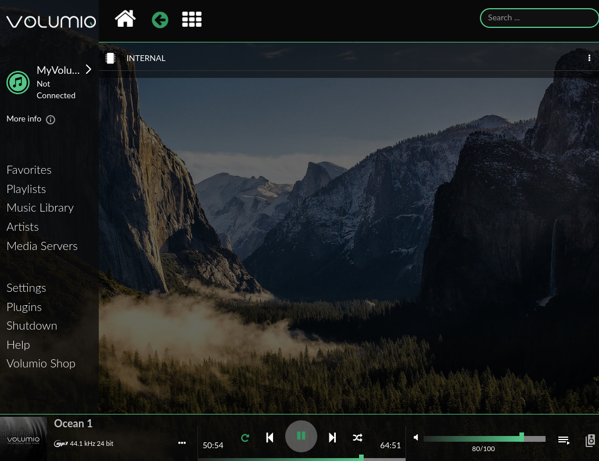
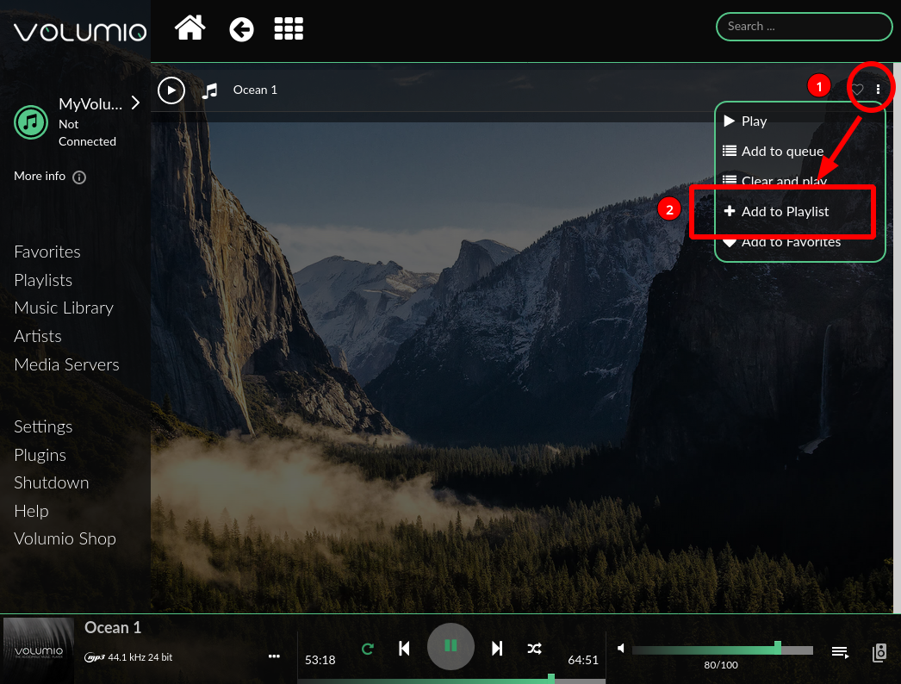

No, this is not and article on how to get your kids to want to create your home automations for you.  Sorry.  But I've been meaning for a long time to document some of the home automations things I do to make life easier with a baby/toddler.  Hope you find these helpful and perhaps give you some ideas of your own!

As inspiration, a popular baby item is the [Hatch Baby Rest](https://smile.amazon.com/Hatch-Baby-Night-Light-Machine/dp/B06XMRCC94), which is a sound machine, night light, and time-to-rise/ok-to-wake clock all built into one.  It's pretty reasonably priced at $60 and is "smart" in that you can control it from your smartphone.  However, I have two issues with the device.  1) it uses Bluetooth, which can be a notoriously fickle beast, and 2) because it's Bluetooth, it means no Home Assistant control!  There's an $80 version that's WiFi enabled [here](https://smile.amazon.com/Hatch-Baby-Machine-Monitor-Nightlight/dp/B07WFXGNGF) but again it's not in HomeAssistant.  So where's the fun in that when you can DIY something yourself that's infinetly more customizable?

# Sound Machine

## Introduction

My very first automation set up was a smart sound machine.  For a while we were using a dumb sound machine which worked fine.  The first one ran on batteries and we churned through them.  We upgraded to a plugged in one but then it was well...annoying to have to turn on the sound machine like a caveman.  To make a smart sound machine, I ultimately settled upon a Raspberry Pi running [Volumio](https://volumio.org/).  This is a pretty nifty piece of software that is a great option if you want high quality sound.  I wasn't particularly interested in that aspect of it, but it checks the boxes of 1) Runs on a Pi and 2) has a [HomeAssistant component](https://www.home-assistant.io/integrations/volumio/) that allows us to do what we need.

Parts Needed:
- Raspberry Pi (a 3B or 3B+ will do.  So would a 4 but that is overkill), along with a power supply
- Speaker with a 3.5mm headphone jack (and a cable to connect the Pi to the speaker)
- Optional (but strongly recommended): Door/contact sensor.  Useful for being the trigger to turn the sound machine on/off, but can use voice controls if needed.  Zwave/Zigbee/433mhz all would work here depending on your setup.
- Optional: Raspberry Pi UPS.  I picked [this one](https://smile.amazon.com/Makerfocus-Raspberry-2500mAh-Lithium-Battery/dp/B01MQYX4UX) but there are a few drawbacks.  1) it's got some stupidly bright LEDs that I've had to cover with electrical tape and 2) it's design is such that if the battery is completely drained and power is restored, the Pi won't boot back up without manual intervention.  I can live with that since if the power is out for that long and the Pi dies, I've got bigger issues.  I also struggled to find a case that would work, ultimately deciding to leave the Pi naked.

## Volumio Setup

The build here is really pretty simple.  Take a Pi, get an SD card, flash it with your flashing program of choice (I like [BalenaEtcher](https://www.balena.io/etcher/) personally), insert the SD card and start up the Pi.  The Volumio [Getting Started Guide](https://cdn.volumio.org/wp-content/uploads/2019/01/Quick-Start-Guide-Volumio.pdf) is pretty well done and should get you set up so the Pi is on your network (WiFi works fine for our purposes, you'll just need to follow the steps to get the Pi on your network).  There'll be a setup guide, you should be able to just stick to the defaults.

If you want to use a network drive you can add it during the setup.  But I'd suggest the following instead in case your internet/power goes out.  Enable SSH following [these instructions](https://volumio.github.io/docs/User_Manual/SSH.html).  What white noise you want to use/works best for your kid is up to you.  Mine likes ocean noises.  Save the file to `/data/INTERNAL` using your SFTP program of choice (I like FileZilla).

When you navigate to the IP address of the Pi an you'll see a screen like this (versions may have different versions):



Unfortunately it's been a while since I set these up so I can't recall all the settings I needed to change, but the file we loaded to the Pi should appear in "Music Library".  You can tweak some of the other settings to your liking.  The one that you need to change is in "General Playback Options."  Scroll down till you get to "Playback Mode" and make sure it's on "Continuous" and not "Single."  Otherwise the track will just play once and not repeat (which is something you'll want for white noise).  I also set the startup volume to 80% but you'll want to tweak based on your setup/what works for you.



Next let's set up a playlist.  Click on "Music Library" and "Internal."  You should see the file you loaded up.  If you click the 3 dot icon on the far right side, you should see an option to add to playlist.  Create a new playlist (call it what you want, I called mine "Whitenoise").

 

I suggest playing the playlist to test that everything is working on the Volumio side.  Including making sure the track repeats.

## HASS Setup

Assuming everything is working on the Volumio side, let's move to HASS.  Open your HASS instance, go to Integrations and click the add button and search for Volumio.  Input the IP address of your Volumio instance and everything should get set up for you.  This will create a `media_player` entity for you.  Personally I found a switch easier (will allow easier automations and voice controls), so I set up a template switch like this:

```
  - platform: template
    switches:
      kid_sound_machine:
        friendly_name: "Kid Sound Machine"
        value_template: "{{ is_state('media_player.kid_sound_machine', 'playing') }}"
        turn_on:
          service: media_player.select_source
          data:
            entity_id: media_player.kid_sound_machine
            source: Whitenoise
        turn_off:
          service: media_player.media_pause
          data:
            entity_id: media_player.kid_sound_machine
        icon_template: mdi:cast-connected
```

The above switch will be on if Volumio is playing and off otherwise.  Toggling the switch will call the `media_player.select_source` service call.  You'll need to alter the entity_id to match your device and the source to be the name of your playlist.  Alter the entity_id for the turn_off call as well and you should be good and ready to automate!

How exactly you want to automate is up to you so I'm not going to share any automation code.  But here's what I have setup.  For starters, I have a "bedtime" script that gets triggered by a Zigbee Aqara button (my toddler loves to push it) that does a random TTS saying "Goodnight" and dims the lights while we read books.  The script pauses until the door to the kid's bedroom is closed, and then it shuts off the lights and turns on the sound machine.  If we open the door in the middle of the night, the light turns on very dim so we can see but not blind anybody (and again shuts off if the door is closed).  It doesn't shut the sound machine off.  In the morning (i.e. between 5:30 and 8:00am), if the door is opened the sound machine shuts off and the light slowly ramps up to full brightness.

I have a slightly different setup for naptime.  During the daytime, if the door is closed and the light in the kiddo's room is still on, the sound machine doesn't turn on, though the automation loops every couple of seconds to check if the light is off.  Once the light is off, the sound machine turns on.  I did put a check for naptimes to not turn the sound machine off/turn on the lights during the day if the sound machine changed within the last 15 minutes, using this template: `{{ ((as_timestamp(now()) - as_timestamp(states.switch.kid_sound_machine.last_changed)) / 60 | float ) > 15 }}`.  That way we can go if needed right after putting kiddo down.  Outside of that, if the door is opened and the sound machine is on, the sound machine shuts off and the same slow light ramp up as the morning runs.

Honestly the setup has been fairly bulletproof (even when grandparents visit/watch the kiddo while mom and dad go out for a date) and has made things just a little easier for bedtime and in the morning.

### Misc. Thoughts

Note in some circumstances I ran into issues where when I connected the Pi and the speaker to the same power plug I was getting ground feedback which was REALLY painful to hear.  Ultimately just doing some finagling and I resolved this, so if you run into the issue try different cords/power supplies/adapters/plugs etc.  Originally I was planning on using Bluetooth for the connection from the Pi to the speaker but...see my thoughts on Bluetooth and it being temperamental.

# Ok to Wake Clock

This one is fairly new as my toddler started getting out of bed in the middle of the night and we wanted to try to find a way to get him to stay in bed.  And also for some naps when he doesn't sleep we wanted a way to signal to him when it is ok to get out of bed.  So I designed a series of automations that 1) will turn the light red when he gets out of bed in the middle of the night (doubles as a night light) and 2) will turn the light red an hour before a time we set and then green when the time hits.  Then for naptime there's a timer that when there's less than 10 minutes left turns the light red, and then when the timer hits zero goes green.

I can't say it's completely successful as my toddler has still gotten out of bed on multiple ocassions and pounded on his door until we go in and tuck him back into bed.  But there have been a few times where he's gotten out of bed, the light has gone red and he's gotten back in so I'm going to call it a win.  Hey, you take your victories with toddlers where you can!

Parts Needed:
- Bed sensor (previously covered [here](https://blog.fuzzymistborn.com/esp8266-projects/), based on guide [here](https://medium.com/the-smarter-home/smart-bed-7de9ad55276e))
- Some kind of smart LED bulb
- Optional: Door sensor (but you already have one for the sound machine right?)

## HASS Entity Setup

Initially I used some `input_selects` to set the wakeup times, but I recently switched to using [`input_datetime`](https://www.home-assistant.io/integrations/input_datetime/) instead and it's much nicer.  I created 2: one for "normal" wakeup times and the other for custom wakeup times in case I need to change something on the fly and don't want to change the "normal" time.

```
input_datetime:
  toddler_wake:
    name: "Time"
    has_date: false
    has_time: true

  toddler_custom_wake:
    name: "Time"
    has_date: false
    has_time: true
```
I also created an `input_boolean` to toggle the custom time on/off.

To control the color of the light, I created a fairly complicated template sensor:

```
  - platform: template
    sensors:
      toddler_wake_trigger:
        friendly_name: 'Trigger'
        value_template: >
          {% if (state_attr('input_datetime.toddler_wake', 'timestamp') - 3600) | timestamp_custom('%H:%M', false) <= states('sensor.time') < state_attr('input_datetime.toddler_wake', 'timestamp') | timestamp_custom('%H:%M', false) %}
            Red
          {% elif (state_attr('input_datetime.toddler_wake', 'timestamp')) | timestamp_custom('%H:%M', false) <= states('sensor.time') < (state_attr('input_datetime.toddler_wake', 'timestamp') + 600) | timestamp_custom('%H:%M', false) %}
            Green
          
            off
          
      toddler_wake_custom_trigger:
        friendly_name: 'Trigger'
        value_template: >
          {% if ((state_attr('input_datetime.toddler_custom_wake', 'timestamp') - 3600) | timestamp_custom('%H:%M', false) <= states('sensor.time') < state_attr('input_datetime.toddler_custom_wake', 'timestamp') | timestamp_custom('%H:%M', false)) and states('input_boolean.caw_wakeup_custom') == 'on'  %}
            Red
          {% elif (state_attr('input_datetime.toddler_custom_wake', 'timestamp') | timestamp_custom('%H:%M', false) <= states('sensor.time') < (state_attr('input_datetime.toddler_custom_wake', 'timestamp') + 600) | timestamp_custom('%H:%M', false) ) %}
            Green
          
            off
          
```
To explain, if the time is between 1 hour of the time set by the `input_datetime` and the current time, the sensor state is Red.  I use the [Time&Date](https://www.home-assistant.io/integrations/time_date/) integration but you could also substitute in `now` if you wanted.  If the current time is equal to or greater than the time set (up to 10 minutes) then the state is Green.  Otherwise it's off.  I use this sensor state to drive a series of automations to turn the light to Red/Green/Off depending on if the kiddo is out of bed when he shouldn't be.  I'll have a copy of my NodeRed flows at the end of the post so you can see what I'm doing.

The other thing I have is a [timer](https://www.home-assistant.io/integrations/timer/) that controls naptime.  When the door is closed during the day, an automation calls the `timer.start` service with a duration set by an `input_select`, though I subtract 10 minutes off.  When the timer ends, an event is generated by HASS that you can then trigger off of, which I use to set the light to red for 10 minutes and then turn green.

## Lovelace Setup

For my dashboard, I relied on the awesome [Time Picker Card](https://github.com/GeorgeSG/lovelace-time-picker-card), with a final product that looks like this:



Simple but functional.

# Conclusion

If you have any other great parenting automations I'd love to hear!  This post turned out to be longer than I anticipated and I may have left some things out.  If you are at all interested in more information on my setup, please feel free to hit me up on Discord, Reddit, or open a Github issue on my blog's repo.  But overall these automations have assisted me in parenting by handling menial tasks (like controlling lights and sound machines) so I can focus on the kiddo.

## Automation

Here's my NodeRed flow for the Ok To Wake part:



```
[{"id":"c70c60fa.07d298","type":"time-range-switch","z":"b06c555f.69395","name":"","lat":"","lon":"","startTime":"19:00","endTime":"05:45","startOffset":0,"endOffset":0,"x":570,"y":4400,"wires":[["bf7349b0.84f1a8"],[]]},{"id":"50d4e1aa.35ce68","type":"api-call-service","z":"b06c555f.69395","name":"Nightlight Red 50%","server":"63517380.eb951c","version":1,"debugenabled":false,"service_domain":"light","service":"turn_on","entityId":"light.toddler_lamp","data":"{\"color_name\":\"red\",\"brightness_pct\":\"50\",\"transition\":\"1\"}","dataType":"json","mergecontext":"","output_location":"","output_location_type":"none","mustacheAltTags":false,"x":950,"y":4420,"wires":[[]]},{"id":"580415a.1f37fec","type":"api-call-service","z":"b06c555f.69395","name":"Nightlight Off","server":"63517380.eb951c","version":1,"debugenabled":false,"service_domain":"light","service":"turn_off","entityId":"light.toddler_lamp","data":"","dataType":"json","mergecontext":"","output_location":"","output_location_type":"none","mustacheAltTags":false,"x":930,"y":4460,"wires":[[]]},{"id":"bf7349b0.84f1a8","type":"switch","z":"b06c555f.69395","name":"","property":"payload","propertyType":"msg","rules":[{"t":"eq","v":"on","vt":"str"},{"t":"eq","v":"off","vt":"str"}],"checkall":"true","repair":false,"outputs":2,"x":675,"y":4400,"wires":[["50d4e1aa.35ce68"],["580415a.1f37fec"]],"l":false},{"id":"8c020bf5.2132b8","type":"server-state-changed","z":"b06c555f.69395","name":"Toddler Door","server":"63517380.eb951c","version":1,"exposeToHomeAssistant":false,"haConfig":[{"property":"name","value":""},{"property":"icon","value":""}],"entityidfilter":"binary_sensor.door_toddler_bedroom","entityidfiltertype":"exact","outputinitially":false,"state_type":"str","haltifstate":"","halt_if_type":"str","halt_if_compare":"is","outputs":1,"output_only_on_state_change":true,"for":"","forType":"num","forUnits":"minutes","ignorePrevStateNull":true,"ignorePrevStateUnknown":false,"ignorePrevStateUnavailable":false,"ignoreCurrentStateUnknown":false,"ignoreCurrentStateUnavailable":false,"x":250,"y":4400,"wires":[["12a622ef.49a37d"]]},{"id":"12a622ef.49a37d","type":"api-current-state","z":"b06c555f.69395","name":"Sound","server":"63517380.eb951c","version":1,"outputs":2,"halt_if":"on","halt_if_type":"str","halt_if_compare":"is","override_topic":false,"entity_id":"switch.toddler_sound_machine","state_type":"str","state_location":"","override_payload":"none","entity_location":"","override_data":"none","blockInputOverrides":false,"x":410,"y":4400,"wires":[["c70c60fa.07d298"],[]]},{"id":"e04cfc1b.c8318","type":"server-state-changed","z":"b06c555f.69395","name":"Toddler out of bed","server":"63517380.eb951c","version":1,"exposeToHomeAssistant":false,"haConfig":[{"property":"name","value":""},{"property":"icon","value":""}],"entityidfilter":"binary_sensor.toddler_bed_sensor","entityidfiltertype":"exact","outputinitially":false,"state_type":"str","haltifstate":"","halt_if_type":"str","halt_if_compare":"is","outputs":1,"output_only_on_state_change":true,"for":"","forType":"num","forUnits":"minutes","ignorePrevStateNull":true,"ignorePrevStateUnknown":true,"ignorePrevStateUnavailable":true,"ignoreCurrentStateUnknown":true,"ignoreCurrentStateUnavailable":true,"x":270,"y":4500,"wires":[["ad0c136a.3b262"]]},{"id":"1a97fdb0.6f7e1a","type":"switch","z":"b06c555f.69395","name":"","property":"payload","propertyType":"msg","rules":[{"t":"eq","v":"on","vt":"str"},{"t":"eq","v":"off","vt":"str"}],"checkall":"true","repair":false,"outputs":2,"x":515,"y":4500,"wires":[["ee3c11ad.ab3f4"],["7a9130e7.19b018"]],"l":false},{"id":"3c1cf6ba.8db91a","type":"server-events","z":"b06c555f.69395","name":"Naptime Over","server":"63517380.eb951c","event_type":"timer.finished","exposeToHomeAssistant":false,"haConfig":[{"property":"name","value":""},{"property":"icon","value":""}],"waitForRunning":true,"x":250,"y":4700,"wires":[["4ca59a1d.91eb04"]]},{"id":"4ca59a1d.91eb04","type":"switch","z":"b06c555f.69395","name":"","property":"payload.entity_id","propertyType":"msg","rules":[{"t":"eq","v":"timer.toddler_nap","vt":"str"}],"checkall":"true","repair":false,"outputs":1,"x":390,"y":4700,"wires":[["6ff4e0f4.16a788"]]},{"id":"ad0c136a.3b262","type":"api-current-state","z":"b06c555f.69395","name":"Sound","server":"63517380.eb951c","version":1,"outputs":2,"halt_if":"on","halt_if_type":"str","halt_if_compare":"is","override_topic":false,"entity_id":"switch.toddler_sound_machine","state_type":"str","state_location":"","override_payload":"none","entity_location":"","override_data":"none","blockInputOverrides":false,"x":430,"y":4500,"wires":[["1a97fdb0.6f7e1a"],[]]},{"id":"6a0240f6.f4479","type":"api-call-service","z":"b06c555f.69395","name":"Nightlight Red 20%","server":"63517380.eb951c","version":1,"debugenabled":false,"service_domain":"light","service":"turn_on","entityId":"light.toddler_lamp","data":"{\"color_name\":\"red\",\"brightness_pct\":\"20\",\"transition\":\"1\"}","dataType":"json","mergecontext":"","output_location":"","output_location_type":"none","mustacheAltTags":false,"x":950,"y":4560,"wires":[[]]},{"id":"813a29ca.756498","type":"server-state-changed","z":"b06c555f.69395","name":"Toddler Normal Wake","server":"63517380.eb951c","version":1,"exposeToHomeAssistant":false,"haConfig":[{"property":"name","value":""},{"property":"icon","value":""}],"entityidfilter":"sensor.toddler_wake_trigger","entityidfiltertype":"exact","outputinitially":false,"state_type":"str","haltifstate":"","halt_if_type":"str","halt_if_compare":"is","outputs":1,"output_only_on_state_change":true,"for":0,"forType":"num","forUnits":"minutes","ignorePrevStateNull":false,"ignorePrevStateUnknown":false,"ignorePrevStateUnavailable":false,"ignoreCurrentStateUnknown":false,"ignoreCurrentStateUnavailable":false,"x":280,"y":4560,"wires":[["552e2175.3a42e"]]},{"id":"92f176f0.e80ea","type":"api-current-state","z":"b06c555f.69395","name":"Custom Off","server":"63517380.eb951c","version":1,"outputs":2,"halt_if":"off","halt_if_type":"str","halt_if_compare":"is","override_topic":false,"entity_id":"input_boolean.toddler_wakeup_custom","state_type":"str","state_location":"","override_payload":"none","entity_location":"","override_data":"none","blockInputOverrides":false,"x":630,"y":4560,"wires":[["f66c8284.fe6128"],[]]},{"id":"f66c8284.fe6128","type":"switch","z":"b06c555f.69395","name":"","property":"payload","propertyType":"msg","rules":[{"t":"eq","v":"Red","vt":"str"},{"t":"eq","v":"Green","vt":"str"}],"checkall":"true","repair":false,"outputs":2,"x":745,"y":4560,"wires":[["6a0240f6.f4479"],["d8bef19b.c0597"]],"l":false},{"id":"d8bef19b.c0597","type":"api-call-service","z":"b06c555f.69395","name":"Nightlight Green 30%","server":"63517380.eb951c","version":1,"debugenabled":false,"service_domain":"light","service":"turn_on","entityId":"light.toddler_lamp","data":"{\"color_name\":\"green\",\"brightness_pct\":\"30\",\"transition\":\"1\"}","dataType":"json","mergecontext":"","output_location":"","output_location_type":"none","mustacheAltTags":false,"x":960,"y":4620,"wires":[[]]},{"id":"1dd70335.de05dd","type":"server-state-changed","z":"b06c555f.69395","name":"Toddler Custom Wake","server":"63517380.eb951c","version":1,"exposeToHomeAssistant":false,"haConfig":[{"property":"name","value":""},{"property":"icon","value":""}],"entityidfilter":"sensor.toddler_wake_custom_trigger","entityidfiltertype":"exact","outputinitially":false,"state_type":"str","haltifstate":"","halt_if_type":"str","halt_if_compare":"is","outputs":1,"output_only_on_state_change":true,"for":0,"forType":"num","forUnits":"minutes","ignorePrevStateNull":false,"ignorePrevStateUnknown":false,"ignorePrevStateUnavailable":false,"ignoreCurrentStateUnknown":false,"ignoreCurrentStateUnavailable":false,"x":280,"y":4620,"wires":[["7faf5a5f.a5726c"]]},{"id":"7aa5433f.5e89ac","type":"api-current-state","z":"b06c555f.69395","name":"Custom On","server":"63517380.eb951c","version":1,"outputs":2,"halt_if":"on","halt_if_type":"str","halt_if_compare":"is","override_topic":false,"entity_id":"input_boolean.toddler_wakeup_custom","state_type":"str","state_location":"","override_payload":"none","entity_location":"","override_data":"none","blockInputOverrides":false,"x":630,"y":4620,"wires":[["c1edd371.4f068"],[]]},{"id":"c1edd371.4f068","type":"switch","z":"b06c555f.69395","name":"","property":"payload","propertyType":"msg","rules":[{"t":"eq","v":"Red","vt":"str"},{"t":"eq","v":"Green","vt":"str"}],"checkall":"true","repair":false,"outputs":2,"x":745,"y":4620,"wires":[["6a0240f6.f4479"],["d8bef19b.c0597"]],"l":false},{"id":"2468b11d.f25156","type":"delay","z":"b06c555f.69395","name":"","pauseType":"delay","timeout":"10","timeoutUnits":"minutes","rate":"1","nbRateUnits":"1","rateUnits":"second","randomFirst":"1","randomLast":"5","randomUnits":"seconds","drop":false,"x":670,"y":4700,"wires":[["d8bef19b.c0597"]]},{"id":"7a9130e7.19b018","type":"api-render-template","z":"b06c555f.69395","name":"Green?","server":"63517380.eb951c","template":"{{ state_attr('light.toddler_lamp', 'rgb_color') != (0,255,0) }}","resultsLocation":"result","resultsLocationType":"msg","templateLocation":"","templateLocationType":"none","x":620,"y":4520,"wires":[["deb18a84.7afe4"]]},{"id":"deb18a84.7afe4","type":"switch","z":"b06c555f.69395","name":"","property":"result","propertyType":"msg","rules":[{"t":"eq","v":"True","vt":"str"}],"checkall":"true","repair":false,"outputs":1,"x":715,"y":4520,"wires":[["6a0240f6.f4479"]],"l":false},{"id":"ee3c11ad.ab3f4","type":"api-render-template","z":"b06c555f.69395","name":"Checks","server":"63517380.eb951c","template":"{{ states('binary_sensor.door_toddler_bedroom') == 'off' and ( states('sensor.toddler_wake_trigger') == 'off' and states('sensor.toddler_wake_custom_trigger') == 'off' ) }}","resultsLocation":"result","resultsLocationType":"msg","templateLocation":"","templateLocationType":"none","x":620,"y":4480,"wires":[["6bd1c50f.179e34"]]},{"id":"6bd1c50f.179e34","type":"switch","z":"b06c555f.69395","name":"","property":"result","propertyType":"msg","rules":[{"t":"eq","v":"True","vt":"str"}],"checkall":"true","repair":false,"outputs":1,"x":715,"y":4480,"wires":[["580415a.1f37fec"]],"l":false},{"id":"552e2175.3a42e","type":"api-current-state","z":"b06c555f.69395","name":"Sound","server":"63517380.eb951c","version":1,"outputs":2,"halt_if":"on","halt_if_type":"str","halt_if_compare":"is","override_topic":false,"entity_id":"switch.toddler_sound_machine","state_type":"str","state_location":"","override_payload":"none","entity_location":"","override_data":"none","blockInputOverrides":false,"x":450,"y":4560,"wires":[["92f176f0.e80ea"],[]]},{"id":"7faf5a5f.a5726c","type":"api-current-state","z":"b06c555f.69395","name":"Sound","server":"63517380.eb951c","version":1,"outputs":2,"halt_if":"on","halt_if_type":"str","halt_if_compare":"is","override_topic":false,"entity_id":"switch.toddler_sound_machine","state_type":"str","state_location":"","override_payload":"none","entity_location":"","override_data":"none","blockInputOverrides":false,"x":450,"y":4620,"wires":[["7aa5433f.5e89ac"],[]]},{"id":"6ff4e0f4.16a788","type":"api-current-state","z":"b06c555f.69395","name":"Sound","server":"63517380.eb951c","version":1,"outputs":2,"halt_if":"on","halt_if_type":"str","halt_if_compare":"is","override_topic":false,"entity_id":"switch.toddler_sound_machine","state_type":"str","state_location":"","override_payload":"none","entity_location":"","override_data":"none","blockInputOverrides":false,"x":510,"y":4700,"wires":[["2468b11d.f25156","6a0240f6.f4479"],[]]},{"id":"63517380.eb951c","type":"server","name":"Home Assistant","legacy":false,"addon":false,"rejectUnauthorizedCerts":false,"ha_boolean":"y|yes|true|on|home|open","connectionDelay":true,"cacheJson":true}]
```