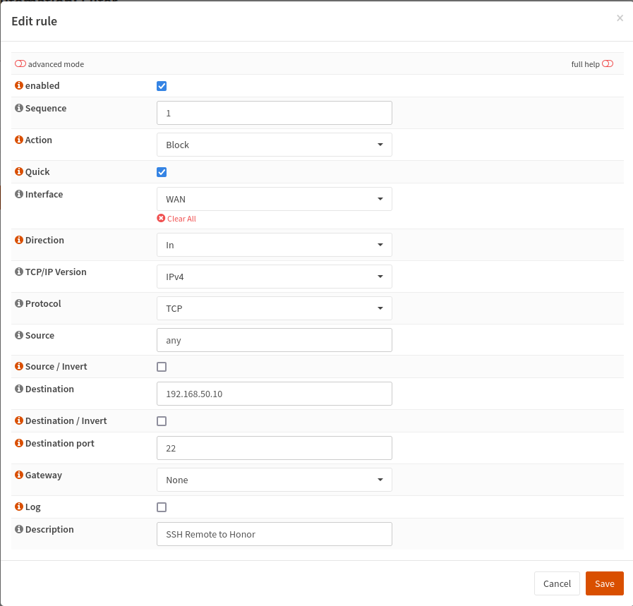

I've been running [OPNsense](https://opnsense.org/) for a few months now and absolutely love it.  It can do basically everything I want/need and does it with a relatively easy to understand interface (with some exceptions).  It also has a good API.  I talked more about OPNsense in a [previous post](https://blog.fuzzymistborn.com/opnsense-wol/) so I'm not going to revisit a discussion again of OPNsense itself.  But in this post, we're going to talk about being able to remote turn on and off firewall rules...from HomeAssistant!

I try to minimize my firewall rules as much as I can, and especially port forward rules that expose my network to the outside internet.  Thanks to the global pandemic, I've been working from home a few days a week.  Therefore I find I generally don't need to remotely access my network as much as before.  However, every now and then I need to get in to fix something, so I leave SSH open (on a non-standard port and secured with SSH keys!) to a [bastion server](https://en.wikipedia.org/wiki/Bastion_host).

If I'm working from home though, I don't need to leave open SSH (and would prefer not to even with all the security precautions in place).  I started toggling the port forward rule on/off manually but then I forgot one day and needed to get back in and couldn't, which was infuriating.  So I started looking for a solution.  Here's how I did it.

## OPNsense Setup

First thing is we need to make some changes on OPNsense.  First, you need to install the `os-firewall` plugin.  This plugin adds an "Automation" section to the Firewall menu in OPNsense.  There are two options, "Filter" and "Source NAT."  


I'm going to assume you already have a port forwarding rule set up in `NAT->Port Forward`.  You'll still need this part set up.  What's going to change is that you will no longer need a rule under `Rules->WAN`  We're going to replace that with a rule under `Automation->Filter` that will be toggleable from the OPNsense API thanks to the `os-firewall` plugin.

Click the plus icon in the bottom right corner and fill out the information as you need, depending on what you're trying to accomplish.  Here's my rule setup for allowing SSH:



It's very similar to how you would set up a normal firewall rule in OPNsense.  There are plenty of guides for how to manage/setup OPNsense firewall rules.  Personally I found [this site](https://homenetworkguy.com/) incredibly helpful.

Note, you could do this for virtually any firewall rule.  It doesn't necessarily need to be a port forward rule.

The next step is you need to create a REST API token.  I went over this in [my WOL blog post](https://blog.fuzzymistborn.com/opnsense-wol/) so I'll direct you there for how to do it.  You could even reuse the same API, just expand it's permissions a bit if you wanted.  The only difference between the WOL role and this one is that you need to add the right privileges.  For the firewall, that's `GUI:Firewall: Rules: API`.

The last thing we need is the UUID from the firewall rule we set up in automation.  The easiest way to get this IMO is to go to `System->Configuration->Backups` and click "Download configuration."  Search for the name of your firewall rule and the UUID should be right there.

## HomeAssistant

Now that everything is set up in OPNsense, let's move to HomeAssistant.  First off, I want to give a big thanks to [this post](https://forum.opnsense.org/index.php?topic=16943.0) for basically laying out exactly what the API calls needed to be.  I just made modifications to make it work with HomeAssistant.

I'm not going to explain a whole lot because I think it's all relatively self-explanatory, but here are the various bits and pieces you'll need to get set up.

First is the REST Commands.  These are what make the API calls.  Substitute out the UUID from above and the IP address of your firewall.  You'll also want to set the username/password to be the keypair you created above.  I store mine in secrets.yaml.

```yaml
rest_command:
  ssh_rule_toggle:
  url: 'http://OPNSENSE_URL/api/firewall/filter/toggleRule/UUID_OF_AUTOMATION_RULE'
  method: POST
  username: !secret opnsense_user
  password: !secret opnsense_key

  ssh_rule_apply:
  url: 'http://OPNSENSE_URL/api/firewall/filter/apply'
  method: POST
  username: !secret opnsense_user
  password: !secret opnsense_key
 ```

Next is a binary sensor that will check to see if the firewall rule is enabled or disabled.  Again, swap out your firewalls IP address and the relevant UUID.
```yaml
binary_sensor:
  - platform: rest
    name: SSH Firewall Rule
    scan_interval: 30
    device_class: connectivity
    resource: http://OPNSENSE_URL/api/firewall/filter/getRule/UUID_OF_AUTOMATION_RULE
    username: !secret opnsense_user
    password: !secret opnsense_key
    value_template: "{{ value_json.rule.enabled }}"
 ```

Since you need two commands to enable/disable the firewall rule (one to toggle the rule on/off, the other to actually apply the change), I found it easier to create a simple script to call both commands.
```yaml
script:
  remote_ssh_firewall:
    alias: Toggle Remote SSH
    sequence:
      - service: rest_command.ssh_rule_toggle
      - service: rest_command.ssh_rule_apply
```

And finally, a nice switch that you can both use in automations and also in the Lovelace UI to toggle the rule on/off.
```yaml
switch:
  - platform: template
    switches:
      remote_ssh:
      friendly_name: "Remote SSH"
      value_template: "{{ is_state('binary_sensor.ssh_firewall_rule', 'on') }}"
      turn_on:
        service: script.remote_ssh_firewall
      turn_off:
	    service: script.remote_ssh_firewall
	  icon_template: mdi:wan
```

And here's what the final result looks like:


## Conclusion
There you have it.  You can now automate enabling or disabling firewall rules in OPNsense as needed.  There are probably other ways to do this, such as with a VPN, but this works for me.  Hope someone finds it helpful!

