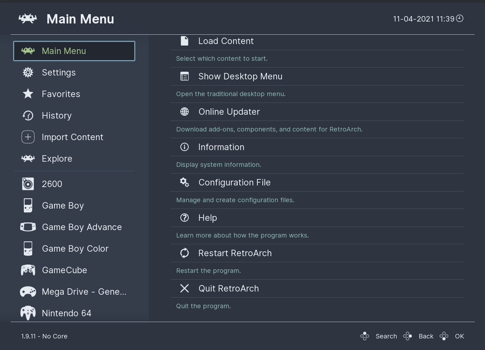
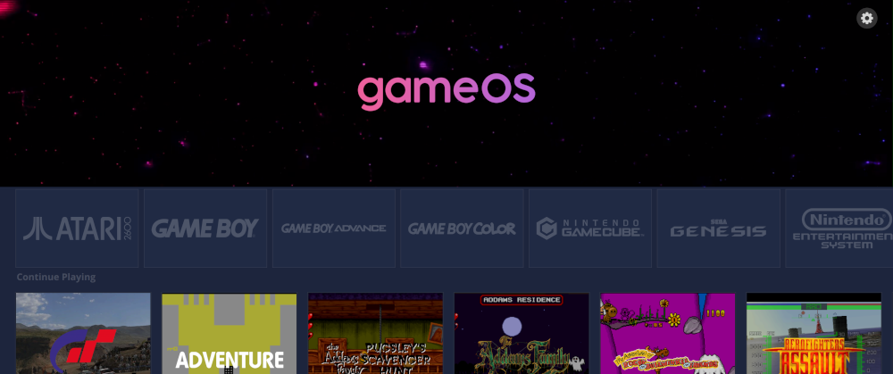
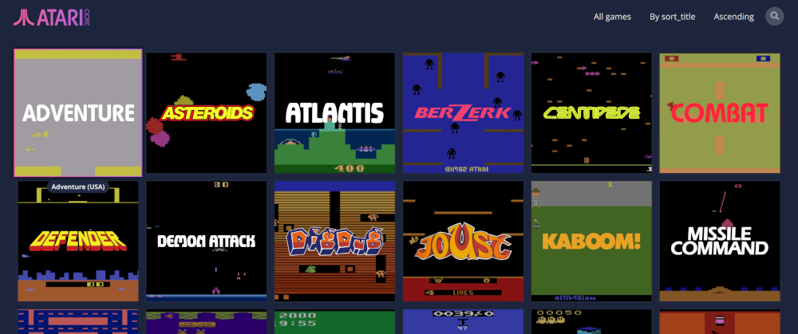

And now for something entirely different!  While I'm not the biggest gamer, I do appreciate playing games from time to time, both retro games and more modern games.  I'm very very excited to be picking up a [SteamDeck](https://www.steamdeck.com/en/) and am lucky enough to be getting one in December.  I also have a computer hooked up to my TV and my desktop 

## RetroArch
The dominant program in the retrogaming space is [RetroArch](https://github.com/libretro/retroarch) which utilizes the `libretro` API.  RetroArch has tons of "cores", or emulators, which can emulate pretty much any gaming system you can think of.  Basically every retro gaming front end/program that I'm aware of/have tried relies on RetroArch as a backend to actually play the game.  I'm not going to cover much of installing/configuring RetroArch itself as that's a whole post in and of itself.  I use Ansible to modify a few of the basic settings I want (like hiding certain menu options) and downloading the cores I prefer but beyond that RetroArch "just works.""

## Frontends
There's a number of frontends you could use to select and play your games which can utilize RetroArch as a backend.  Things like [Lakka](https://lakka.tv/). [Batocera](https://batocera.org/), [Recalbox](https://www.recalbox.com/), and [RetroPie](https://retropie.org.uk/) are popular options.  All have limitations however.  Lakka/Batocera/Recalbox use stripped down OS's that don't allow much flexibility in terms of installing other software (like syncthing as discussed below) which I found to be a dealbreaker.  RetroPie is really meant to run on a Raspberry Pi and while there's a [script to install it on Ubuntu](https://github.com/MizterB/RetroPie-Setup-Ubuntu) I'm not the biggest fan of the RetroPie UI as it's not internally consistent and settings aren't grouped together.  The above solutions may work for you so I'd suggest checking them out but ultimately were not what I was after.

### RetroArch
The easiest solution here would be to use the default/built in GUI in RetroArch.  And it's....fine.  There's a few different themes (I like the now-default "Ozone" theme) and you can do a fair amount of tweaking of the `retroarch.cfg` file once you find the right setting (or change it in the UI).  Honestly it would work in a pinch but it just didn't "wow" me by any means. 

RetroArch uses `playlists` to create lists of games you can play.  I found a [python script](https://github.com/FuzzyMistborn/infra/blob/main/roles/config_retroarch/templates/create_playlist.py.j2) that can generate the playlists for you and then I manually pulled the appropriate game art into the `thumbnails` directory.  But I found that to be a pain to do



The biggest issue for me was that I also wanted to be able to easily open/play some of my Steam games (either directly or via SteamLink) or something like Minecraft.  There's no way to do that from the RetroArch UI (or at least not easily that I could find), which meant I'd have to pull out a keyboard to launch them.  Not ideal.  So I went off in search of alternatives.

### Pegasus
I found a few options in this space.  [Launchbox](https://www.launchbox-app.com/) is Windows only (boo) so was out.  [GameHub](https://github.com/tkashkin/GameHub/) was a real contender but it didn't seem to have the ability to go true "full screen."  I decided to keep looking.

After searching a bit more, I stumbled across [Pegasus-Frontend](https://pegasus-frontend.org/) which literally checked every box for me.  It allows for launching third party apps like SteamLink or the Minecraft launcher.  It has some nice [themes](https://pegasus-frontend.org/tools/themes/).  And it easily integrated with RetroArch/retro games.

Figuring out the configuration was a bit tricky.  The files are saved to `~/.config/pegasus-frontend` and specifically a `settings.txt` and `game_dirs.txt` file, as well as a `metadata` folder.  Note that you'll want to create individual folders inside the `metadata` folder with a `metadata.pegasus.txt` per folder.  So for example, I have:

```
pegasus-frontend/
└── metadata/
    └── roms/
        |-─ atari2600/
			├── metadata.pegasus.txt
			└── media (optional)
		|── nes/
			├── metadata.pegasus.txt
			└── media (optional)
```

Steam games are automatically imported.  To get retro games automatically added I used [Skyscraper](https://github.com/muldjord/skyscraper).  Configuration is a bit beyond the scope of this post but you can take a look at my Skycraper [config file](https://github.com/FuzzyMistborn/infra/blob/main/roles/config_pegasus/templates/config.ini.j2) and the [bash script](https://github.com/FuzzyMistborn/infra/blob/main/roles/config_pegasus/templates/scrape.sh.j2) I use to scrape/import the media into Pegasus.  Basically I run that bash script and everything gets generated.  Note that the `launch` command in the `config.ini` file is the key as that is used to call RetroArch and launch the games.  You can customize RetroArch to exit when you close the game, which then takes you right back to Pegasus.

Like I said above, Pegasus has a lot of themes.  The default one is pretty nice.  I really liked the GameOS theme though.



## Syncthing
Now we have a nice way to view/find the games, how do we get the games themselves onto the various devices and ideally sync save files/progress so I can stop playing on one device and pick up playing on another right where I left off.

The easiest solution to this problem would be a simple network share using Samba or NFS.  This way you don't use up storage on the device and everything is easily accessible.  There's a few issues with this approach though.  First and most importantly, with something like the SteamDeck where I can be on the move and off my WiFi network I would lose access to the games/save files.  Second, a potential issue, particularly if you're using a Raspberry Pi using an SD card, would be data corruption.  Using a network share there's a chance the file may get corrupted and synced back to the central storage location.  This is probably pretty unlikely but it's possible.

I came across a solution that I like which is using [syncthing](https://syncthing.net).  Credit for this idea goes to Jay from [LearnLinuxTV](https://www.learnlinux.tv/).  Syncthing is a binary written in GO which is highly customizable and efficient in syncing data between multiple devices.  And it solves the two issues above because it syncs the data directly to the other device and also allows for one way sync (so no bitrot/corruption issue).

Syncthing is supposed to "just work" and be able to detect other devices running syncthing and allow you to share folders easily.  Personally I could never get the automatic detection to work (possibly because of my VLAN/firewall rules), which is fine because it's possible to set it up with IP addresses.

To make this easier, I created a [syncthing Ansible role](https://github.com/FuzzyMistborn/infra/tree/main/roles/install_syncthing) that 1) installs/updates syncthing as a GO binary directly and 2) creates a configuration file you can customize to pre-define shares.  I didn't want to rely on a PPA/package manager because those can be notoriously out of date.  For configuration, syncthing uses an XML file for configuration so it's pretty easy to modify the file, reload syncthing and the settings will be updated.  What I do is sync the games folder one way from my NAS/server to my desktop/TV box/SteamDeck and then sync save files between all the devices.  Now all my save files are synced up so I can pick up right where I left off on any device.  And it all happens seamlessly.

## Conclusion
In the end I now have a unified way to view and play basically all my games.  It took me probably longer to figure out how to do all this than I care to admit but I'm pretty happy with the result.  Really excited for my SteamDeck and looking forward to playing with it once I get it (which I guess now is February....).