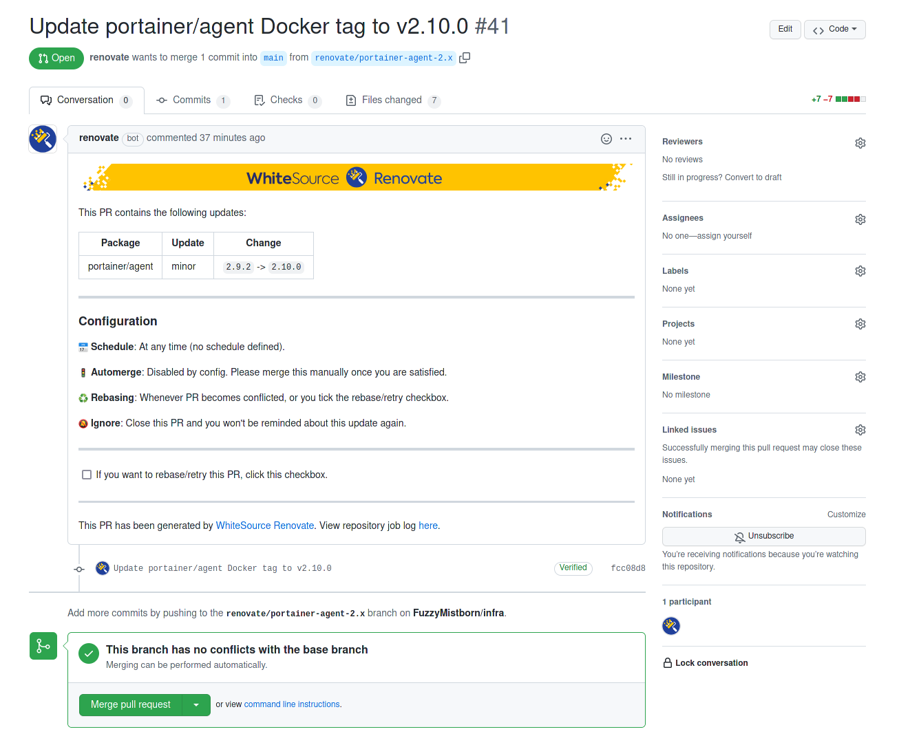

Combined with using [Ansible](https://blog.fuzzymistborn.com/ansible-intro-basics), I've also begun using [Renovate-Bot](https://github.com/renovatebot/renovate/) to update my [infrastructure](https://github.com/FuzzyMistborn/infra) GitHub repo.  My main use case is to update the tags on my Docker containers.  I'll be honest and I've barely scratched the surface of what Renovate-Bot can do.  But having tried various means of notifying and updating me of updated docker containers and I've found Renovate-Bot to be the best.  Below are the solutions I've tried and the pros/cons of each.

# Updating Docker Containers

## Watchtower
There are many ways to update your docker containers.  One of the more popular approaches is to tag your containers using `latest` and then run [Watchtower](https://github.com/containrrr/watchtower).  Watchtower is another docker container that can run on a predefined period and will automatically update the containers you specify.  This approach has a ton of appeal.  It's the most "set and forget" approach and ensures you're always running the latest container version.  However, the main drawback (and it bit me many times) is an upgraded latest container that breaks/doesn't work.  Nothing like waking up in the morning to find several of your critical containers have stopped functioning.  With Docker it's relatively easy to roll back and get back up and running, but sometimes that can be a pain.  Particularly if a database is involved and the updated version is incompatible with earlier versions.

## DIUN
After Watchtower, I moved on to[DIUN (Docker Image Update Notifier)](https://crazymax.dev/diun/).  DIUN can also run on a pre-defined schedule and was the solution I ran for a long time.  It's a really well-developed tool and is highly flexible and customizable.  Basically it monitors the various Docker container registries (such as Docker Hub and the GitHub Container Registry) on a cron-based schedule.  If it detects a new container image it can send a notification to any of a number of notification services (Telegram, Slack, Gotify, etc).

My annoyance with DIUN isn't really DIUN's fault.  DIUN tracks updates based on whether the hash of the container has changed.  If you're running the `latest` I ran into some containers where DIUN would say the container was updated but in fact it wasn't.  Mostly this would happen with multi-arch containers.  Eventually I got tired of getting notifications telling me there was an update when there wasn't.  

I could solve most of the issues by moving to a different tag (such as a semver appropriate one like `4.4` or something like `stable`) but sometimes the only tag available for an image is `latest`.  Also, by pinning to a specific version unless I was paying close attention I would miss that a container had moved to, let's say `4.5` instead of `4.4`.

Ultimately I still run DIUN for a few images that don't have good tags available and just run `latest`.  It's not ideal but it works for the few where that's a problem.

## Renovate-Bot

By far the best solution I have found is Renovate-Bot.  Renovate is like Dependatbot on GitHub in that it automatically can update dependencies as specified.  What makes it better than Dependabot is it is way more flexible. It supports a ton of languages and backends (GitHub, Gitea, Gitlab, etc.).  Really I've only begun to understand a tiny fraction of what it can do and I'm very much impressed.  I mean, just check out all the [configuration options](https://docs.renovatebot.com/configuration-options)!  Best of all, it's free and open source.

My usecase is to manage the version tags of my Docker containers.  Renovate-Bot automatically creates pull requests that detail the version it would update to and in some cases a link to or a description of the changes based on the changelog.  Then I just have to merge the PR, pull it down to my local repo and then push the update out to the appropriate server.  It took a little work to get my configuration right to track the versions but once I got it it really just works.  And best of all, I don't have to monitor all the various containers/repos to be notified when there's an update.

There are [many ways](https://docs.renovatebot.com/getting-started/running/) to run Renovate-Bot.  Basically you can either self-host it (yes there's a Docker container) or run it via Renovate's service.  Personally I'm using the [GitHub App](https://github.com/marketplace/renovate) option instead of GitHub Actions but I've been exploring self-hosting it eventually.  Maybe once I deploy [Drone](https://www.drone.io/) and some more CI stuff I'll get around to it.

# Conclusion
In the end, there's no "right" or "wrong" way to manage container updates (though I'd argue Watchtower is borderline on the "wrong" way TBH).  I know some people have scripts that notify them via Discord or Telegram and they can respond and have the bot update the container.  I know other people just run `latest` and update as they remember in one big update with a `docker-compose pull && docker-compose up -d`.  In the end, you'll need to figure out what's best for you.