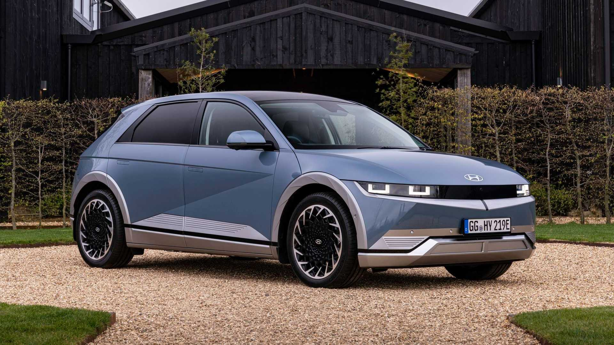
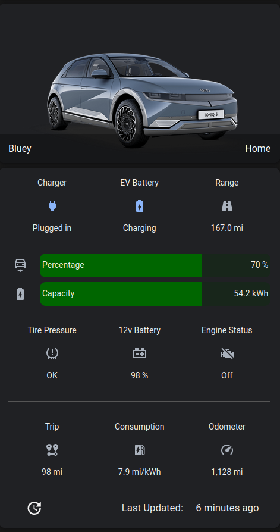

Long before the current spike in gas prices, I was in search of a new car.  Generally I try to drive cars until they die, but the Mrs.'s car was approaching 150,000 miles and 10 years old so we figured it was time for a new one.  She really wants a truck for her next car, which we don't need currently (and she wants an electric too!) so we figured we'd wait.  That put me in search of a new car for myself.

I've loved my Hyundai Ioniq hybrid for years.  Sure it's no muscle car but it gets me from A to B, gets great gas mileage (45-50 in the winter, 55+ in the summer) and is pretty roomy.  We started looking at another Ioniq hybrid when I saw the Ioniq 5, Hyundai's new fully electric crossover.



At first, I was totally putoff by the retro look.  But after some reconsideration, it ended up on the top of my wanted list.  And eventually I finally got my hands on an Ioniq 5.  Granted, I was more interested in an SEL trim than a Limited, but the Limited is what became available.  And boy is it a sweet ride.  It's loaded with all kinds of fun tech (heads up display on the windshield, 360 camera, phone-as-a-key) and...yeah it's all electric so no more gas.

As a brief aside, two absolutely invaluable sites that aided my search were [TheEVFinder](https://theevfinder.com) and a [user-submitted dataset that tracks dealer markup over MSRP]([EV Dealer Markup Tracker](https://datastudio.google.com/reporting/7a243d54-2a8d-44f3-a405-ce2a509c1c07/page/3KHiC)).  That combo eventually led me to my car.

## Technology/Tools

Now having an EV is great, but it definitely comes with a few hiccups/requirements.  Below are some of the tools I've come across that help EV owners plan trips and keep track of the status of your car.

### HomeAssistant

First, there's the all important HomeAssistant integration (naturally).  This is a custom integration you can find [here](https://github.com/fuatakgun/kia_uvo/).  Unfortunately it's not feature complete (at least not in the US) so important things like controlling charge percentages aren't yet working.  Hopefully soon.  There is a [fork](https://github.com/dahlb/ha_kia_hyundai) out there as well if you want to look at that.

Another big limitation on this integration is on Hyundai's end.  They limit the number of API calls that can be made to somewhere around 30/day in the US.  So the integration only does a hard pull every 4 hours by default and does not update during the evening (can be customized).  The lack of frequent updates does limit data resolution, particularly when it comes to charging the car.  But have to live with it.  As a result of this limitation I haven't done a whole lot of automations yet.  Mainly just tracking the battery level and sending an alert if the battery runs low, or on Sunday evenings if the battery isn't charge enough to get me through the week.

That doesn't mean I haven't worked on creating a nice UI to view the car stats.  I did borrow most of the template from another user in the HASS forum, with some tweaks.  It does require a few custom cards: `custom:stack-in-card` and `custom:bar-card`.  I'll have the dashboard YAML at the bottom of the post.  The other tweak I've done is creating a few sensors to track the car's performance in miles per kilowatt hour.  It takes a bunch of `input_number` entities and template sensors and I'm not really sure it's worth the effort.  If someone is really interested in how I did it, please feel free to reach out and contact me and I'm happy to share.



### A Better Route Planner

While the charging infrastructure is OK, there are some definite gaps and going on a road trip is not nearly as easy as in a gas car.  This next tool is absolutely invaluable when it comes to planning said road trip.  A Better Route Planner (ABRP) is both an app and a website that, well, plans your route better.  You type in your start point and destination, along with your EV model and some basic charge information, and it'll map out a route for you, including where to charge, for how long, and to what percentage.

If you pay for [Premium](https://abetterrouteplanner.com/premium/), you can take it one step further and have the app factor in real-time weather and traffic information, both of which can have a significant impact on an EV's range.  It also adds some other useful perks, like charger availability and Android Auto/Carplay functionality.

To go one step even further, you can pick up a Bluetooth Low Energy ODB2 plug that allows ABRP to read the actual remaining battery percentage.  This allows ABRP to recalculate your actual consumption (measured in miles per kWh) and re-estimate your charging needs.  There are a few models recommended by ABRP [here](https://www.iternio.com/abrp-obd).  For the Ioniq, for some reason the Vgate one wouldn't start back up when the car was off.  I ended up going with the ODBLink CX which has worked great (though is on the pricier side).  Note the big huge security warning with this though and make sure you're OK with the ramifications.

### PlugShare

Now this next one isn't necessarily unique, but I've found [PlugShare](https://www.plugshare.com/) to be one of the better tools for figuring out where plugs are located.  You can filter by all sorts of conditions and can see user reviews/check-ins to better determine if a charger is working or where it's located.  In combination with ABRP I have been able to map my trips with relative ease.


## Conclusion

Recently I put all these tools to the test when I took a 700 mile road trip.  Overall I was pretty pleased, though I will say ABRP was super conservative when it came to estimating my charging needs.  For instance, on basically every leg of my trip it indicated when I started that I would arrive with ~10% charge.  With one exception (first leg of the day when it was slightly chilly and I was going 70 MPH which was the speed limit), I arrived with way more left in the tank.  Sometimes to the tune of 30% extra.  While I'd rather it be conservative and have me charge more often to be safe, I did find this a bit annoying.  Perhaps after some further tweaking and refinement it'll improve.  Still for now it's the best tool I've found for the job.


**Dashboard YAML:**

```yaml
type: vertical-stack
cards:
  - type: picture-entity
    image: /local/ioniq5.png
    entity: device_tracker.bluey_location
    name: Bluey
    tap_action:
      action: none
    hold_action:
      action: none
    card_mod:
      style: |
        ha-card {
          --ha-card-background: transparent;
          box-shadow: none;
        }
  - type: custom:stack-in-card
    mode: vertical
    keep:
      background: false
      border_radius: false
      box_shadow: false
      margin: false
      outer_padding: false
    cards:
      - type: glance
        entities:
          - entity: binary_sensor.bluey_plugged_in
            name: Charger
          - entity: binary_sensor.bluey_charging
            name: EV Battery
          - entity: sensor.bluey_range_by_ev
            name: Range
        show_state: true
        show_name: true
        state_color: true
      - type: custom:bar-card
        entities:
          - entity: sensor.bluey_ev_battery
            name: Percentage
            icon: mdi:car-electric-outline
            color: '#161616'
            severity:
              - from: '25'
                to: '100'
                color: '#006600'
              - from: '15'
                to: '25'
                color: '#c1c100'
              - from: '0'
                to: '15'
                color: '#660000'
          - entity: sensor.bluey_battery_capacity_remaining
            name: Capacity
            icon: mdi:battery-charging
            color: '#161616'
            max: 77.4
            severity:
              - color: '#006600'
                from: '50'
                to: '78'
              - color: '#c1c100'
                from: '25'
                to: '50'
              - color: '#660000'
                from: '0'
                to: '25'
      - type: glance
        entities:
          - entity: binary_sensor.bluey_tire_pressure_all
            name: Tire Pressure
          - entity: sensor.bluey_car_battery
            name: 12v Battery
          - entity: binary_sensor.bluey_engine
            name: Engine Status
        show_state: true
        show_name: true
        state_color: true
      - type: markdown
        content: ___
      - type: glance
        entities:
          - entity: sensor.bluey_mileage_since_last_charge
            name: Trip
          - entity: sensor.bluey_comsumption
            name: Consumption
          - entity: sensor.bluey_odometer
            name: Odometer
        show_state: true
        show_name: true
        state_color: true
      - type: custom:button-card
        entity: sensor.bluey_last_update
        show_last_changed: true
        styles:
          grid:
            - grid-template-areas: '"i n l"'
            - grid-template-rows: 100%
            - grid-template-columns: 25% 45% 30%
          label:
            - justify-self: start
          name:
            - justify-self: end
            - margin-right: 10%
        name: 'Last Updated:'
        aspect_ratio: 7/1
        tap_action:
          action: call-service
          service: kia_uvo.force_update
