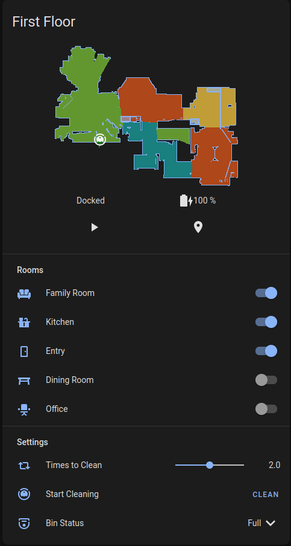

For a while I've been using a trio of Eufy 30C Robovacuums to clean my house.  And they worked....fine.  They were your standard bump-and-turn variety of vacuum robot, meaning no floor mapping/LIDAR or other advanced features.  And like I said, they worked fine.  Until they didn't.  I've already had to replace one under warranty and I had another die about 6 months after the warranty ended.  I thought about replacing it with another Eufy but given that I've gone through two in less than two years I wasn't keen to drop another $200+ without exploring the alternatives.

I had been curious about [Valetudo](valetudo.cloud/) for a while.  It's open source software that, in short, removes the cloud from your robot vacuum.  Meaning it's entirely locally controlled.  Think of it as [Tasmota](https://tasmota.github.io/docs/) for robot vacuums.  However, Valetudo only works on robots in the Xiaomi ecosystem.  Roborock used to be the go-to, but they've apparently patched things in such a way that it's not easy to root anymore.  They still make great vacuums, so I almost went with them, but instead I started looking at DreameTech.

# Hardware

DreameTech uses the same underlying tech as Xiaomi/Roborock.  They make a number of robot vacuums.  The specific ones I have/looked at were the Dreametech [D9](https://www.amazon.com/gp/product/B08HKYVRTG?psc=1) and [Z10 Pro](https://www.amazon.com/gp/product/B09997J3W6?psc=1).  There also is the L10 Pro but I did not get that one.  The main difference as best I can tell between the L10 and D9 is that there's more memory, greater suction, and longer run time.  To me that was not worth the extra $200.  

Overall the Dreametech vacuums are leagues better than Eufy.  For starters, the LIDAR mapping works great.  I'm able to control which rooms the vacuum cleans and I know it will clean the whole room instead of hoping that every spot gets covered with many random passes.  I also can add "no go zones" where I don't want the robot to go.  For example there's tassles on the carpet or an area where I know the robot will get stuck.  Also as a result of the mapping, the Dreametech vacuums are also a lot more efficient.  The Eufy vacs used to run for ~1 hour.  The Dreametechs run for closer to 40 minutes.

## D9


The D9 is a great, basic vacuum.  It comes with LIDAR for room mapping, which works really well as discussed above.  It's really a no-frills vacuum that you can get for ~$250 on Amazon.  It *does* come with a mop attachment but...it's pretty lackluster.  Basically it just drags a wet cloth around your floor.  It can do an OK job but it won't work any miracles.  My biggest knock on it is that it sometimes gets twitchy with Valetudo and loses the map data or drops the wifi connection.  But I think for the price, it's great.

## Z10


The Z10 is basically the same robot as the D9 with a few more bells and whistles.  The biggest extra features are the self-emptying bin and the object avoidance.  Honestly not sure that was worth the premium but... #forscience.  Both features are nice to have (and the self-emptying part does save me some time) but neither are revolutionary game changers.

# Installation
Installing Valetudo on the Dreametech vacuums is both simple and tricky.  The first thing to know is that the most commonly used method to root the Dreametech vacuums was patched in September 2021.  However, from my experience no robot has yet shipped with the newer firmware.  For example, my Z10 Pro was produced in December 2021 and I had no issues rooting it.  This may change in the coming months so be aware.  Newer root methods may be available, open up a ticket with the Dustbuilder dev [here](https://vaers.dontvacuum.me/otrs/customer.pl).

Oh, that's one important thing to understand here: Valetudo is the software you use to control the robot.  To root the robot, you use [Dustbuilder](https://builder.dontvacuum.me/).  It took me a combination of the Valetudo instructions [here](https://valetudo.cloud/pages/general/rooting-instructions.html) and the Dustbuilder FAQ [here](https://builder.dontvacuum.me/dreame/faq.txt) to figure the whole process out.  Below are some of my tips/experiences to help along the way.

Also keep in mind you will need a UART adapter to flash the robot.  They're pretty cheap on Amazon.  And also you'll need a wifi device later, preferably one that also runs Linux.  I used a Pi for the job.

Once you have what you need, I would suggest starting with the Valetudo instructions.  You'll need to pry open the robot (takes a decent amount of force but just take your time).  Connect the pins to the headers and to your computer.  Keep following the instructions until you get to the part where you need to login.  To get the password you'll need the FULL serial number (meaning BOTH lines in the dustbin.  I used the calculator linked in the Valetudo docs.  Now we'll need to switch over to the Dustbuilder site to get the firmware we need to continue.

On the Dustbuilder site, pick your vacuum, provide a VALID email address (firmware will get emailed to you) and provide again the full serial number for the vacuum.  I suggest keeping the Patch DNS and Preinstall nano/curl/wget/htop/hexdump options selected.  And also select "Prepackage valetudo" obviously.  Click "Create Job" and wait a few minutes for the firmware to be built.  Download the firmware and move it to the device you're using to root.  In my case, the Raspberry Pi.

Now that you have the firmware, it's time to start rooting.  But first, BACKUP THE VACUUM!  This will help you if you run into problems.  From the shell with the robot, execute the following command: `cd / ; tar cvf /tmp/backup.tar /mnt/private/ /mnt/misc/`.  This will create a tarball of the needed files.

Now comes the part that I found to be unclear/difficult and took me a while to work around.  First, you'll want to install Python's webserver module.  Run `python3 -m pip install --user uploadserver` to install.  Next, you need to connect your computer/Pi to the vacuum via WiFi.  I used `raspi-config` to find and connect to the correct SSID.

Once you're connected, you'll want to run the Python webserver to allow uploads.  `python3 -m uploadserver` on the computer/Pi should be what you need.  Then on the ROBOT, type `curl -X POST http://<your-laptop-ip>>:8000/upload -F 'files=@/tmp/backup.tar'.`  Keep in mind, `your-laptop-ip` is probably going to be something like `192.168.5.2` or something like that.  That took me longer than I care to admit to figure out.  The backup tarball should now be on your Pi (double check with an `ls` if you're paranoid like me).

You'll need to do something similar to move the Dustbuilder firmware tarball over to the robot.  I ran a Python webserver on the Pi in the directory where the firmware was located with `python3 -m http.server`.  Then on the robot, change into the /tmp directory (`cd /tmp`) and run `wget {url-of-firmware.tar.gz}` where again the URL will be the IP of your computer/Pi along with the filename.  So for example `wget 192.168.5.2:8000/dustbuilder.tar.gz`.  The file should be transferred over.  Next run `tar -xzvf {name-of-firmware.tar.gz}`.

Make sure the robot is docked/plugged in and then run `./install.sh`.  This will run the root script and get your Valetudo.  As noted in the Valetudo docs, the robot will reboot after it's done installing.  BE PATIENT THIS CAN TAKE A WHILE.  After the reboot, you'll see the MOTD as described in the docs.  Hooray, success!

**YOU ARE NOT DONE YET.**

Let me repeat that:  **YOU ARE NOT DONE YET**.  The robot has two system partitions, meaning you need to root the robot AGAIN in order to fully gain control.  You'll need to start back over at the step where you copied the Dustbuilder firmware over onto the robot and go from there again.  You don't need to backup the robot again.  Done it a second time and the robot has rebooted again?  Congrats, you've now rooted your new robot vacuum and own it without the cloud!

# Conclusion
From here, you'll need to connect the robot to your wifi.  I suggest using your phone for this part.  There is an Android app available for Valetudo (I'm no aware of one for iOS, sorry).  But you shouldn't need it.  Just connect to the robot's Wifi SSID and go to either `192.168.5.1` or `192.168.8.1`.  From there you should be directed to the Valetudo config page where you can provide the wifi credentials.

Now that you own the robot, you can easily get the robot to appear in HomeAssistant (just follow the Valetudo docs for this, and keep in mind you'll need an MQTT broker).  I also highly recommend the [Valetudo map card](https://github.com/TheLastProject/lovelace-valetudo-map-card).  I played around with some customization where I can control what rooms gets cleaned on what day and how many passes to do but I'll go into that in a later post.

