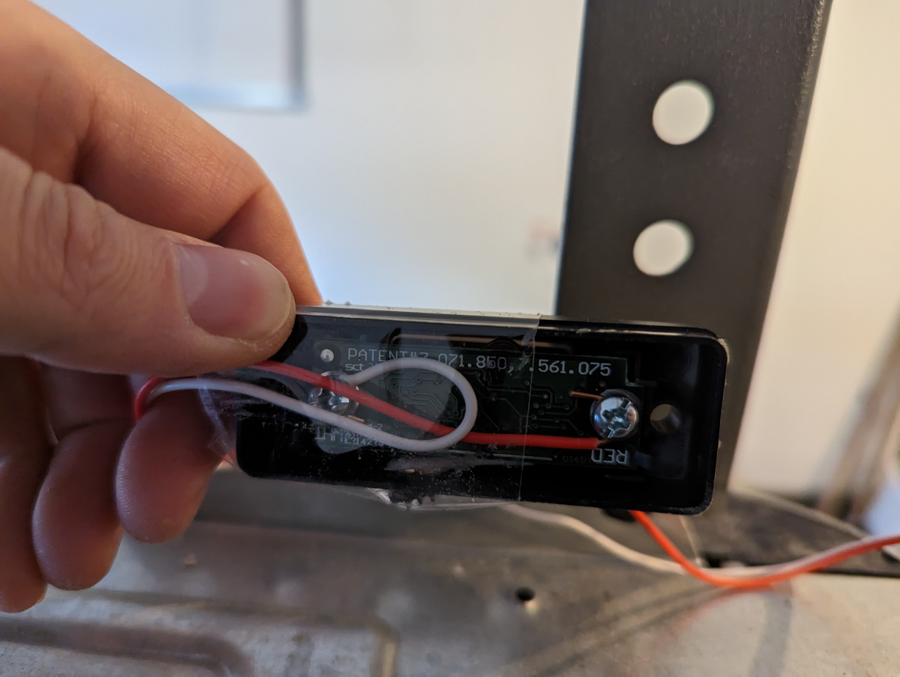
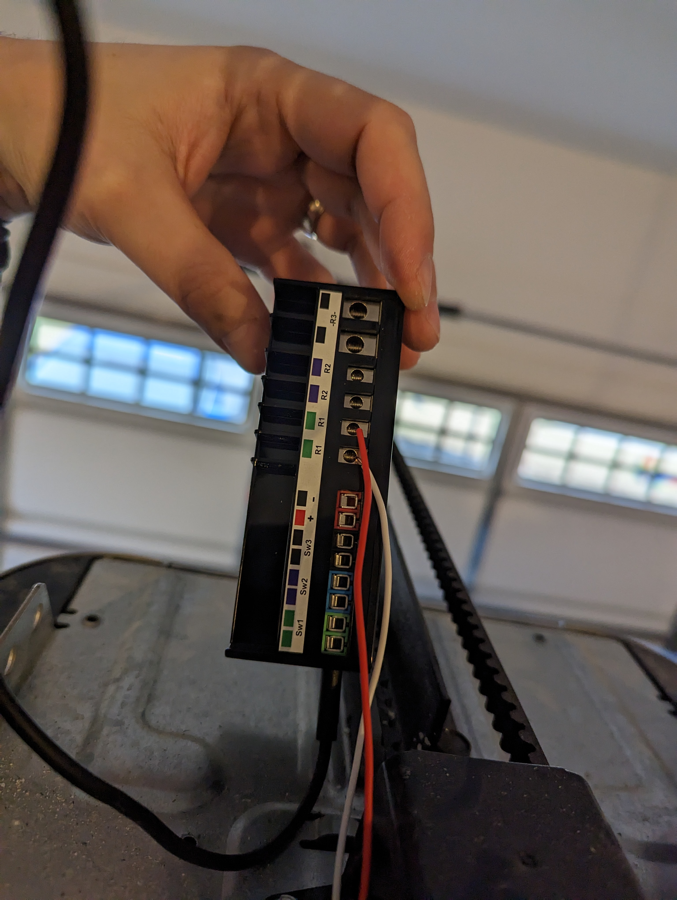
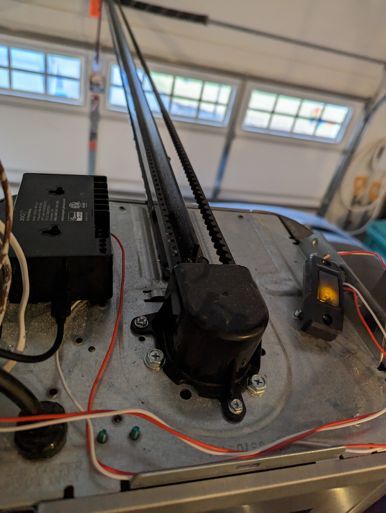

>**EDIT 11/11/2023**: [Chamberlain has announced](https://www.theverge.com/23949612/chamberlain-myq-smart-garage-door-controller-homebridge-integrations) they've intentionally broken all third party integrations that don't pay them, claiming they are preventing "unauthorized access."  As a result, HomeAssistant is going to be [removing its MyQ integration](https://www.home-assistant.io/blog/2023/11/06/removal-of-myq-integration/) in the 2023.12 release.  Since this post, I've become aware of [Ratgdo](https://github.com/PaulWieland/ratgdo), which is an ESP based project which directly integrates with the garage opener and in effect emulates being a MyQ/Security 2.0 device.  I bought one and have had it installed for about a month, and quite frankly it's awesome.  It allows for a lot more nuanced control (such as opening the garage to a set position, and also the number of times the door has opened/closed).  Plus it just looks a lot cleaner than the below solution.  At this point I would highly recommend Ratgdo over the below solution, but the below still works if you are interested.

Unfortunately, when we built our new house, the options for garage door opener were: MyQ, MyQ and MyQ (aka there were no options).  MyQ is made by Chamberlain (who also makes LiftMaster products), which basically is the garage door opener market.  There are a few other brands out there, but mostly all I see these days is Chamberlain.  Why don't I like MyQ?  Well, putting aside that it's a cloud-dependent garage door opener, I'm not a fan of Chamberlain's business practices.  In the past, they've tweaked their API with the apparent purpose of preventing third party integrations like HomeAssistant.  And also, they've charged for integrating MyQ with Alexa and Google Home.  Which just feels....dirty.

Personally I would have preferred a "dumb" garage door opener that I could then have smart-ified as I had before with a [Zwave-based GoControl/Linear opener](https://www.zwaveproducts.com/products/z-wave-garage-door-opener-remote-controller).  But I didn't feel like ripping out a perfectly good garage door opener and replacing it to the tune of a few hundred dollars.  So alternatives had to be found.  Unfortunately, Chamberlain has implemented something they call "Security 2.0."  As I understand it, in "ye olden days," when you hooked up a button to a garage door and pressed the button, it basically shorted the connection and that caused the door to open or close.  Security 2.0 adds "security" by sending a rotating code to the door.  I honestly don't know any security this actually provides, but it does mean that the *only* devices that can work to open/close a MyQ garage door have to be made by Chamberlains (bet you didn't see that coming....).

So how to work around it?  Well thankfully some clever people figured out that you can solder some wires to a cheap Security 2.0 button and hook it up to a smart relay (and the garage door).  Then all you need to do is trigger the relay, which "presses" the button, and then boom, open garage door!

Here's what you need:

1) a Security 2.0 controller.  You can use a wireless remote if you want, or a button like [this](https://www.amazon.com/gp/product/B07W5RMN56/) for $10-12 on Amazon.  Don't feel like soldering?  You can [buy one from Garadget for](https://www.garadget.com/product/security-2-0-dry-contact-adapter/) $20ish (plus shipping).
2) some kind of smart dry contact relay.  Personally I picked up a [Zooz Zen16 Multirelay](https://www.thesmartesthouse.com/products/zooz-z-wave-plus-s2-multirelay-zen16-with-3-dry-contact-relays-20-a-15-a-15-a) but something like a Shelly should work too.
3) wire (doorbell wire is fine), solder, and a solder iron
4) Optional (and highly recommended) - some kind of tilt sensor so you can monitor whether the garage door is open or close.  I used a [Zooz XS Tilt/Shock sensor](https://www.thesmartesthouse.com/products/zooz-z-wave-plus-700-series-xs-tilt-shock-sensor-zse43).  Note that Zooz sells this as a kit along with the multirelay [here](https://www.thesmartesthouse.com/products/diy-smart-garage-opener-kit-zooz-multirelay-ecolink-tilt-sensor).

I forgot to take a picture of where exactly to solder, but here's a good thread from the [Hubitat forum](https://community.hubitat.com/t/cutting-out-myq-cloud-from-garage-door-control/101531).  As you can see next to the button there are 4 contacts.  You need to solder two wires to the board (IIRC you need to pick a side, so if holding the board vertically, either the top or the bottom).  Then connect more wire to the screw terminals.  Basically think of the button as a pass through.  You are going to use your smart relay to trigger the button, which then in turn will trigger the garage door.



Take that to the garage and wire in your smart relay (the wires you soldered onto the button).  That will depend on what relay you picked.  For me, mine looked like this:



Last step is to wire the button with the wires coming off the "normal" button terminals into the garage door opener.  I just stuck mine on the top of the garage door opener as it gave me convenient access to power for the relay and my wire runs didn't have to be that long.



At this point I'd suggest testing your relay to make sure it all works.  To get the garage door into HomeAssistant I used a [Template cover](https://www.home-assistant.io/integrations/cover.template/), using the tilt sensor for the `value_template` (and also throwing MyQ in there for the "opening" and "closing" as a "why not") to track whether the door is open or closed.  Then the open/close is just a trigger to the relay.  Here's my template:

```yaml
- platform: template
  covers:
    garage_door:
      device_class: garage
      friendly_name: "Garage Door"
      unique_id: "garage_door_template"
      value_template: >
        
          {{ states('cover.garage_door_myq') | capitalize }}
        
          Closed
        
          Open
        
          N/A
        
      open_cover:
        - service: switch.turn_on
          target:
            entity_id: switch.garage_door_opener
      close_cover:
        - service: switch.turn_on
          target:
            entity_id: switch.garage_door_opener
      stop_cover:
        - service: switch.turn_on
          target:
            entity_id: switch.garage_door_opener
```

I did need to do some adjusting to the Zen16 configuration.  I set the Switch Type to "Momentary" (not "Garage Door momentary" as that didn't work for some reason) and set an auto turn off for the relay (I set mine to 1 second).  You may need to do something different.

This was actually a pretty easy thing to set up, and it is so nice to have local control of my garage door and not be dependent on MyQ (while I guess still having access to MyQ if I still need it for whatever reason).
