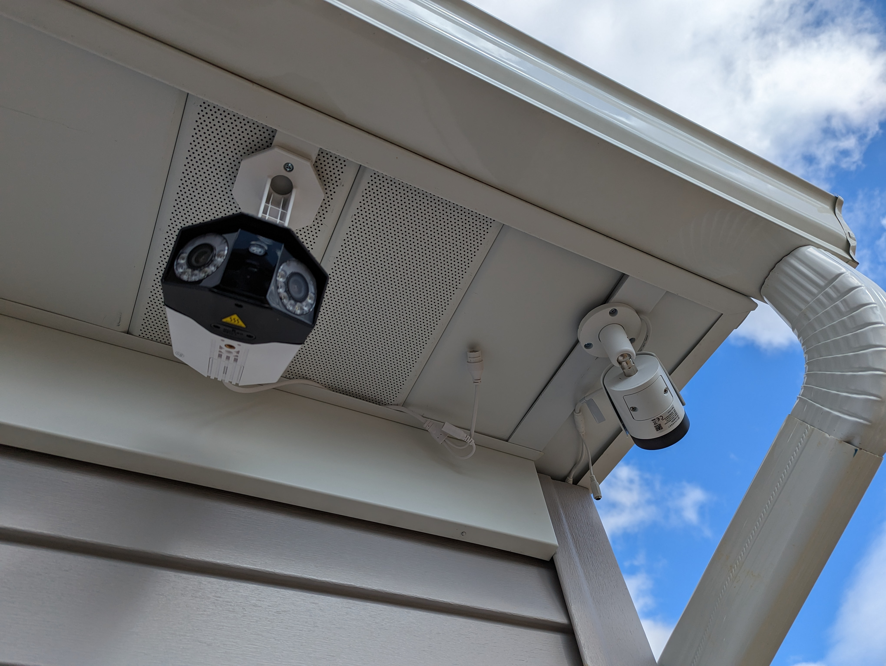

I still intend to do a write up on my choices for cameras at the new place, but in the meantime I wanted to do a quick bit on how I mounted cameras outside.  At my old house, I'd drilled/screwed into the siding/soffit but I don't like how that leaves holes if/when you move.  I was keen to find a solution that was solid without leaving lasting damage.  After some searching, I found a few ideas, including siding clips and aluminum strip slotted under the eaves.  The clips looked interesting, but I was worried about how they'd hold up in the wind.  I was intrigued by the aluminum strip idea and it looked pretty simple.  Credit to [this video](https://www.youtube.com/watch?v=UjWkB0UZM1M) for the idea.

All you need is some aluminum bar, and if you really want it to blend in, some spray paint that matches your siding/soffit color.  You'll also need a saw and a drill, and screws/washers that fit your camera mount.  For me that was #8 machine screws.

Figure out where you want to mount the cameras and measure the width of the eave.  After you cut down the strip, take the camera mount and trace the mounting holes.  Don't worry about being too close to the edge, the aluminum should hold pretty well.  Drill through the aluminum (be patient and take your time here) and check your mount.  At this point I took the strip and spray painted it white.

After you're done, it should look something like this:

I did find that after I had screwed everything through, I needed to cut the screws down to the nut, otherwise they stuck out too far/scratched the soffit.  Nothing a hack saw can't solve, but again take your time.

When it came to mounting below the eaves, it was pretty easy.  Just stick one end in and then slide the other end in on an angle.  The hard part is getting the ethernet cable through after that.  It should be prety easy from there to adjust where the camera is pointing and get the view you want.

And here's a closer look:

So far the cameras haven't moved or fallen at all, and it gets *windy* around here.  Haven't seen if they'll stay up in a hurricane or anything like that, but 20-30 mph winds are no problem.  If you want, you could use silicone or screws but I haven't found that necessary.
