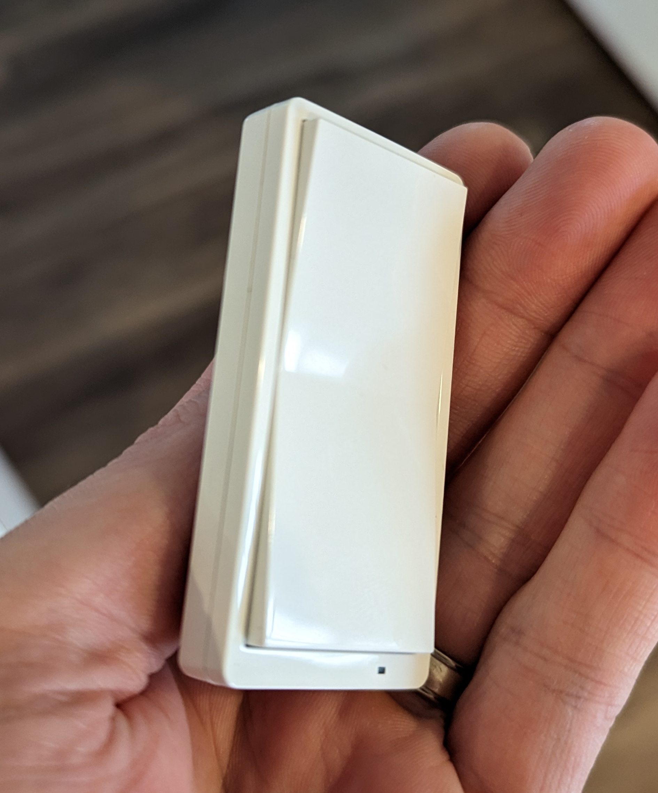

I realize in hindsight I didn't post much in 2022.  Well it's 2023 now and I guess you could say I have a new year's resolution to post more.  But in reality, the reason why I didn't post much last year was because I was moving.  No, it didn't take me all year to move.  But we decided to build a new house after searching a bit and the whole build process took about 9 months start to finish.  And while the build was happening, I had zero interest to make major changes to any of my home automation or networking setup.  Instead, I focused my time on planning out hardware in the new place as after about 5 years of a smart house I'd learned a few things.  I'm not at all close to done with getting everything set up automation wise, but I am 95% done with the installation.  I thought now would be a good time to start documenting the new gear.  This will be in two parts.  Part 1 will focus on the smart home gear and part 2 will focus on my networking setup.

> If you want to look at what I had in my old house, you can see the post [here](https://blog.fuzzymistborn.com/smart-home-hardware/)

Here's an image of all the stuff I've deployed (may be a few things missing, and things I've reused aren't pictured)

![[2023/new-home-hardware/header.jpg]]

# Thermostat

In the old house, I ran an Ecobee 3 for the entire time I lived there and I was pretty happy with it.  While it's cloud connected (and a few years ago Ecobee had more than it's fair share of server outages), lately it's been very reliable.  That being said, I did strongly consider going Zwave for the thermostat, specifically the [Honeywell T6 Pro](https://www.amazon.com/Honeywell-TH6320ZW2003-Thermostat-Comfort-Control/dp/B07HFL7R44/).  It can be had on eBay for pretty cheap and it doesn't look terrible.  However, Ecobee has a few features based on their room sensors that brought me back to it.  Specifically, my favorite feature is the ability when creating a schedule to tell the Ecobee "only focus on the temperature/room sensors in these rooms" when determining the temperature of the house.  So in the evenings/at night, I only care about the bedrooms.  But during the day, I don't care as much about the bedrooms bu worry more about the first floor/office.  I'm sure there was a way to create a similar functionality with Zwave and other temperature sensors but having it all integrated/automatic in Ecobee was too nice a benefit to pass up.

Same goes for Ecobee being able to track things like HVAC maintenance, replacing the air filters, high/low humidity, etc.  All could be done in other ways, but it's nice that they are just built into a good looking device with a functional app.  So I picked up an Ecobee Enhanced Thermostat which does not have any voice control (absolutely *fine* by me, I kinda hated that in the Ecobee3) and it all works.

My only gripe at the moment is that in HomeAssistant there's a way to use Homekit to control the Ecobee so all the controls are local.  Very handy.  And in the old house I used that to pull the temperature/room sensors into HomeAssistant as it avoided any issues with cloud outages.  However, I have a bunch of he "old" room sensors and those do not seem to play nice with HomeKit and Ecobee.  They just show up as "unavailable."  Hoping that gets fixed soon.

# Smart Home Hub

I don't have much to add here beyond what I said in my last post.  I remain a Google Home house/user.  This year HomeAssitant is focusing on voice (in fact, it's the [Year of the Voice](https://www.home-assistant.io/blog/2022/12/20/year-of-voice/)).  I will be eager to see what they come up with and improve.  However, I find I rarely need to use voice control  as most things are handled by automations so I don't know if I'll switch any time soon.

The main thing I enjoy using the Google hubs for is the ones that have screens.  Being able to cast things like my front doorbell camera video stream or weather/radar map when I wake up is super convenient.  [CATT](https://blog.fuzzymistborn.com/homeassistant-and-catt-cast-all-the-things/) is your friend here.

# Zwave

I'm still a big fan of Zwave devices, though I will admit that it's role in my house is greatly reduced.  As part of my upgrade, I switched from the Aeotec 5th gen Zwave control stick to a Zooz 700 series stick.  There is an issue with the 700 series sticks requiring a firmware update, you can read more about that [here](https://github.com/kpine/zwave-js-server-docker/wiki/700-series-Controller-Firmware-Updates-(Linux).

Really what made me stick with Zwave was Zooz's switches being only $20-30.  I really liked the ones I had in the old house (I left them there because I just didn't feel like rewiring those AND the new house) so decided to stick with what worked.  As you can see in the main image above, the vast majority of the switches in my house are Zen71's and Zen 72's.  So far, no major issues.  They work well, they have a lot of handy configuration parameters, and if I do find I want some Zwave sensors I have a strong mesh network.

I also got some Leviton ZW4SF fan speed control switches for the bedrooms.  I have not had a chance to use these much yet as by the time I moved in winter was coming, but from my quick testing they work great.  I'm really looking forward to being able to control fan speeds at the switch instead of with a pull chain.

Two other sets of devices that are new and worth mentioning.  First is the [Zooz Zen34](https://www.thesmartesthouse.com/products/zooz-z-wave-plus-700-series-remote-switch-zen34-battery-powered), a battery powered paddle switch.  I LOVE these things.  Despite having the full floor/electrical plans for my house for months AND meeting with the electrician before install, I failed to grasp that the placement of the switches in my kitchen...well....sucks.  Basically there's 3 sets of lights: island lights, kitchen surround, and breakfast nook.  Only the kitchen island has a 3-way switch and is controllable from the entrances to the room.  And the other two light switches are placed in inconvenient locations.  So to fix the problem, the Zooz paddle buttons let me add some additional "switches" to control the other lights (via Zwave group association) in the kitchen remotely.  They aren't a completely perfect solution as you can tell they aren't real switches, but they solve the problem well enough I can overlook that failing.

 

The second device is the [Ring Alarm Panel (2nd gen)](https://www.amazon.com/Ring-Alarm-Keypad/dp/B07ZB2DFMB).  I haven't a chance to play around with this a ton, but it's a Zwave alarm panel.  It looks nice, is battery powered, and can do a whole host of things which will allow me to control the alarm system without a tablet.  I probably will post some more details later, but for now here's a good [GitHub write up](https://github.com/ImSorryButWho/HomeAssistantNotes/blob/6f05b3f90a979f7118e7c688ce2d01b878227328/RingKeypadV2.md) and [another blog post](https://static.xtremeownage.com/blog/2022/home-assistant-alarm/#step-2-from-zwavejs-scan-the-qr-code) with how to get it to play nicely in HomeAssistant.

In terms of sensors/other gear, I didn't keep a ton from the old house as I really wanted to try to standardize as much as possible for the sake of consistency.  So I sold all my old contact/motion sensors and went with Zigbee ones (more below).  What I did keep was some flood/leak sensors and my Schlage door lock.  I even picked up another Schlage lock (which was *not* easy to find even on Ebay) for my side garage door.  I looked at other options like Ultraloq but there just seemed to be a bunch of problems, most notably that the Zwave lock just....doesn't do anything smart.  IMO really the only lock game in town is Schlage, and I'm hoping that the issues with stock are related to production issues and not Schlage getting out of the game.

# Zigbee

While Zwave saw a major drop in usage, Zigbee now plays a significantly increase role in my house.  That's not to say I particularly like Zigbee over Zwave.  In a perfect world where money was no object, I'd only have Zwave.  However, there's just so much more variety in the Zigbee world with some clever devices and just...well...they're cheaper too.  For now, I'm sticking with my "run both, pick whatever device is cheapest and best for the job" strategy, and I haven't been disappointed yet.  I really do think there are pros to running a blended network and very little downside.

For my Zigbee controller, for a long time I've been using the Deconz Conbee II and had very few issues, other than the Deconz software which I fixed by [moving to Zigbee2MQTT](https://blog.fuzzymistborn.com/z2m-v-deconz/).  As it's replacement, I picked up the [Sonoff Zigbee 3.0 USB Dongle Plus-E](https://sonoff.tech/product/gateway-and-sensors/sonoff-zigbee-3-0-usb-dongle-plus-e/).  This is different from the popular -P model as it uses a different chip, the EZSP.  You can see more of the differences on the Sonoff website.  I decided to go with the E model because the EZSP chipset is the "future" of Zigbee as it will support Matter/Thread.  The [HomeAssistant SkyConnect](https://www.home-assistant.io/skyconnect/) uses the same chipset.  Unfortunately the EZSP chipset is still pretty early in it's support in things like Zigbeee2MQTT and I've run into a few issues along the way.  It does seem to be getting better though.  Haven't had any devices drop off my network in over a week!  If I was to go back and do it again I probably would have gotten the -P model of the Sonoff stick, but in the long run I'm sure the -E will be fine.

For sensors, I went basically all Xiaomi Aqara.  I already had a number of the motion sensors and picked up some more, along with contact sensors.  The contact sensors are hands down the best, as demonstrated by [Rob over at The Hook Up](https://www.kickstarter.com/projects/flirc/the-skip-1s-universal-remote-control-by-flirc).  The motion sensors are....fine.  I wanted to get the newer Aqara P1 motion sensors as they have the ability to change the detection sensitivity and cooldown.  But I got one to test and it had horrible detection range.  Instead I bough the older model from [Cloudfree.shop](https://cloudfree.shop).

I also have been playing with the Aqara FP1, which is a mmWave presence detection device.  It's actually good at detecting presence because unlike IR (used in most motion sensors) which requires a ton of movement, the FP1 can pick up on a tiny amount of movement and detect that someone is still in the room.  It's not 100% accurate (curtains fluttering from AC running can trip it, for example) but it's miles better than I had before.  Currently I'm testing them in my home office and family room.  With some further tweaking/placement work I'm sure I'll get it to a good spot.  Note that [Aqara at CES announced the FP2](https://www.aqara.com/us/news/article/1610997530217459712).  This device won't run on ZIgbee but rather WiFi/Matter, so that's a pro to some and a con to others.  Also note that you can't get the FP1 in the US directly.  Cloudfree has it available as does a few stores on AliExpress in China.  I bought mine on AliExpress and had no issues.

I had the [Ikea Fyrtur](https://www.ikea.com/us/en/p/fyrtur-black-out-roller-blind-smart-wireless-battery-operated-gray-50417464/) blinds in the master bedroom in our old house and liked them well enough.  They're a basic roller blind so they didn't completely black out the room.  I was fully prepared to buy sets for all the bedrooms in the new house when I came across the new [Ikea Tredansen](https://www.ikea.com/us/en/p/tredansen-black-out-cellular-blind-smart-wireless-battery-operated-white-50512456/) cellular blinds.  I gotta say I'm in love with these things.  They look like normal cellular blinds that you'd get from Lowes or HomeDepot and are full black out shades.  All the bedrooms have them (and I repurposed the Fyrtur's in the office).  They open after we wake up automatically, close at sunset (or around 7pm if it's in the summer), and will close earlier if it's going to be a warm day (front bedrooms get a ton of direct sunlight).  Yes they're expensive but such a wonderful product to have.  As an FYI the curtains do not come with screws (really annoying IMO).  I used #8 wood screws (I want to say 1.5 inches long but I can't remember exactly) and they worked great.

Finally, while as I said I really like the Zooz Zwave switches, I knew because I was going to be deploying a *ton* of Zigbee devices I needed a good Zigbee mesh, which means powered devices.  I had some Sonoff Zigbee plug in outlets that worked as repeaters but again, I knew I needed more.  Thankfully Inovelli had just announced their new [Blue line of switches](https://inovelli.com/products/blue-series-smart-2-1-switch-on-off-or-dimmer) and I ordered a 10 pack.  And I gotta give it to Inovelli, they made a really nice switch.  While there was a defect in about 50% of the first production batch (only affected 2 of my 10), Inovelli was quick to get replacements out.  I love the LED strip along the side (which I plan to use with automations for things like showing if a door is locked, for example) and rewiring a 3 or a 4 way setup was far easier as I didn't have to touch the other switches (for now).  I do plan to eventually swap the secondary switches for the [Inovelli Whites](https://inovelli.com/products/white-series-add-on-aux-switch).  Inovelli also is working on some cool new stuff, like [switches with built in mmWave detection](https://community.inovelli.com/t/zigbee-matter-motion-switch-project-linus-blue-series/10904/) and also a [Blue series fan switch](https://inovelli.com/products/blue-series-fan-switch-zigbee-3-0).  Ultimately while I paid a bit more for the Blue switches, it was worth it in my mind.

# Sound Machines

Ok this one hurts a little bit.  I had this grand plan to use Volumio on a couple of Wyse 3040's powered by POE, similar to what I had in [the old house](https://blog.fuzzymistborn.com/automations-for-kids/) with some Raspberry Pis and battery backup.  It was going to be this whole great thing that was locally controlled and bulletproof as it had worked flawlessly for years.

Then my son spent a week at his grandparents where my nephew has one of those "ok to wake" clocks that has an actual clock on it.  And apparently my son learned what "7:00" was and that *that* was an OK time to wake up and get out of bed (instead of various times between 5 and 7am despite my "red light" strategy in the old house).  So I began looking at various options.  Ultimately I decided to go with the Hatch Rest+ (1st gen) which were on sale for the holidays.  

![[hatch.png]]

As you can see, it has a built in clock, LED light, and sound machine, and it's controllable over WiFi, not Bluetooth as the older models were.  AND it has a battery backup that can last a few hours in the event of a power outage.  So while I *could* have built something custom again with Raspberry Pis, some LEDs, and all that, ultimately it just seemed easier to bite the bullet and pay for a polished product.

What really sealed the deal is that there's a [HACS integration](https://github.com/dahlb/ha_hatch/) for HomeAssistant.  When I ordered the Rests, only the Gen 1s were supported, but recently the 2nd gen Rests are supported.  I don't think any of the second gen features are all that compelling (other than maybe toddler lock but my solution there is just to put the clock up on a bookshelf that can't be reached) so I didn't mind saving some money.  Every now and then I have some weird issue where the integration doesn't work and devices don't turn on when I have automations set to do it, but I'm chalking that up to my internet (not the most stable).  And I found a workaround where I just reload the integration about 15-20 minutes before my kids wake up, go down for naps, or go to bed.

# Doorbell/Cameras

I was going to talk about the new doorbell and camera setup, but given how long this post already is I'll put this topic off to another time.

# Other/Misc.

Just a few other miscellaneous things that I picked up that are now smart.

For home audio, I was tolerant of using the Google Homes as Chromecast devices for sound, but after a while that started to get glitchy.  The obvious big name here would be Sonos, but I 1) hate how expensive they are and 2) feel like it's yet another closed ecosystem.  I know Ikea has their line of speakers but I saw them in person and they looked cheap.  Instead I went with some Denon HEOS speakers (the 150 to be precise).  I got 2 refurbished on eBay for pretty cheap.  Haven't played with them a ton, but sound wise they're stellar.  And I can use them in HomeAssistant, which I'm still exploring.  I did consider doing in-ceiling speakers all running back to a central amp/receiver but given how little I listen to music it felt like overkill.

Naturally, just after the house went under contract, our washing machine started to make a weird sound and not spinning enough to dry our clothes.  Le sigh, it was only 5 years old.  Thankfully we'd excluded it from the purchase so we didn't end up needing to buy a new one for the old house AND for the new house, but we still needed a new washer.  And while smartifying it wasn't the primary goal, it was a nice benefit.  We went with the GE GFW850 and have been very happy with it so far.  There's a custom HACS component so I can get notified when the washer is almost done/done, and have an automation set to constantly nag me until the door is opened and wash moved.

The other appliances we chose to make smart was the dishwasher.  With kids, we end up running the dishwasher a lot, and the worst thing with our old dishwasher was that we'd set it on a delayed cycle.  That way we could add dishes until after we went to bed.  The only problem was that if you opened the door, you had to press start again, otherwise the delay timer wouldn't start.  Nothing worse than coming downstairs in the morning to dishes that aren't clean, especially if they're needed for school/daycare.  Enter the Bosch 800 series dishwasher.  Now with a Aqara button next to the dishwasher, I can press the button and after we go to sleep the washer will turn on and run.  Really handy.

I had been playing around with the idea of making some of the recessed lights in my house smart (as in the bulbs themselves) for color/ambience.  I tested a lot of options, including some Zigbee options.  Ultimately I decided I didn't want to go down the smart bulb route as they were pretty expensive (~$30 a bulb, or more if you look at Hue).  That's when I found the Phillips Wiz bulbs.  These are WiFi based bulbs, BUT they can be 100% locally controlled.  I still didn't want them in my recessed lights for a number of reasons (such as not having the lights all turn on in sync) but for my kids bedrooms they are perfect.  I got the 100w ones so they're nice and bright, and having color control is super handy.  Favorite usecase is at night if their door is opened the light turns on red, which makes it easier to see without destroying night vision.

Lastly, despite my best efforts I now am a "proud" owner of a MyQ garage door opener.  It literally was the *only* opener provided by the builder.  And man I hate it.  It took me probably 20 tries to get the damn thing connected to my WiFi network (using multiple devices even).  The good news is that while now it's on my network and it's hooked up to HomeAssistant, I don't use it.  I have a more detailed post planned on this but basically there's a Zwave relay and a dumb garage door button involved and I have complete local control of my garage door.  F U MyQ.

# Conclusion

OK wow this ended up longer than I was originally thinking.  Lots of fun new toys, LOTS of automating still to do.  Happy to answer any questions if you have them!