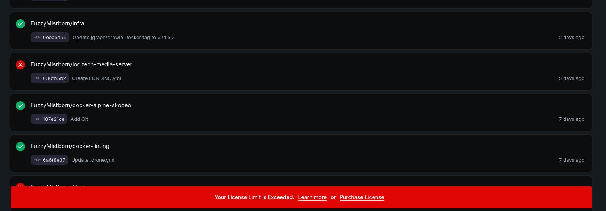
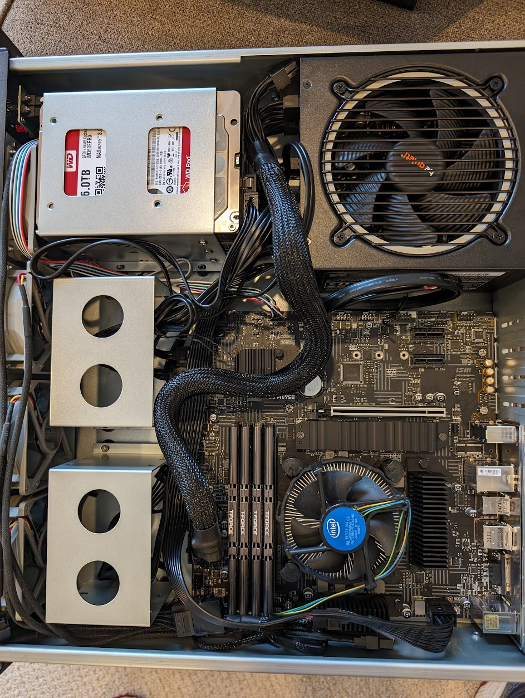
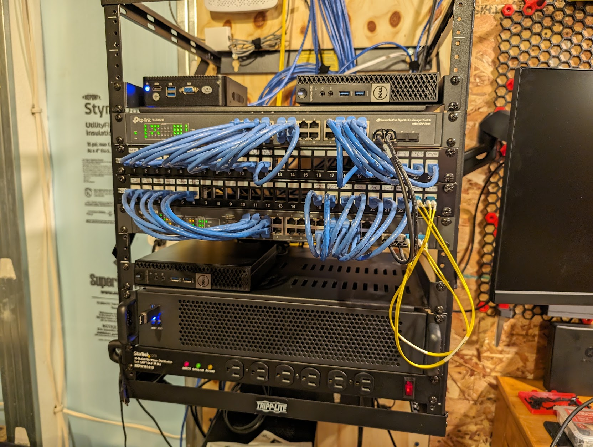
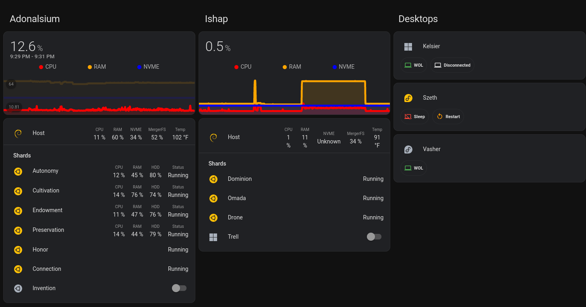

I recently finished some homelab renovations, both in hardware and in software, that I think are pretty neat.  This post will be a quick summary of some of the bigger changes.  

## No More Drone
Continuing on [my love/hate relationship with Drone](https://blog.fuzzymistborn.com/drone-love-hate/), I finally hit an overwhelming sense of hate, so that's where I"m going to start.  Part of the reason why it's been a while between posts (Ok ok, I've also just been super busy) is that my automated build setup for deploying this blog to my VPS has been annoyingly broken due to [this issue.](https://github.com/drone-plugins/drone-hugo/issues/38)  And over a year later there's been no resolution (and no other commits to the repo/image).  Now granted, as I've now discovered, I could use just any Docker image with Hugo I wanted to generate the blog, but I think this issue underscores an issue I've had with Drone, namely that there hasn't been anything new or added in the almost 3 years I've run it.

The positive way to look at that is that there hasn't been anything that's particularly broken about Drone in that time.  But I think it's representative of a larger issue, namely that they no longer support the open source version.  There's also this:

Whenever I logged into Drone, this banner was stuck on the bottom.  No way to hide or remove.  And more annoyingly, IT BLOCKS PEOPLE FROM SEEING THINGS IN THE UI!  Plus, I'm self-hosting Drone, which should be free (and as best I could tell, there was no limit on what I could do, beyond the banner).  So while not itself a dealbreaker, I was reminded every time I logged in that Drone is basically dead for self hosters.

So I decided to take another look at Woodpecker CI.  And wow things have improved over the past few years.  I was able to move all my repos over to Woodpecker over the course of 2 nights, largely helped by this [helpful plugin to convert Drone pipelines to Woodpecker](https://codeberg.org/lafriks/woodpecker-pipeline-transform).  I was able to take the converted files and with a little trial and error (plus some tweaking because things had broken over the past few years) I was able to fully convert off Drone.  Honestly the part I struggled with the most was getting the agent/runner on my local server to connect to the Woodpecker server running on my VPS.  But in the end, I'm happy with the change and to be running an actively developed project.  So if you're running Drone still, I'd highly suggest checking out Woodpecker.

Now why not GItea Runner you may be asking?  I looked hard at it, but what ultimately held me up were 2 things.  First, my VPS lacks a lot of horsepower (on purpose) so I'd prefer the build agents to be on my local server.  While I understand I can run the Gitea runner/agent locally I tried it and it didn't seem to be the easiest thing to run.  More importantly, I would have had to move all my development over to Gitea instead of Github.  I wasn't keen on the idea, largely because I view my Gitea instance as a testbench and as a backup/mirror of my work.  Not the primary source.  So it would have been a fundamental change in my setup that I'm not quite ready to take.  Not knocking Gitea at all here, it's just not what I'm after right now.

## Goodbye Synology
In hardware upgrades, I realized that my Synology NAS was...well....old.  It's a DSM 713+, meaning it's from 2013.  The Linux kernel on the thing was 3.10, I'm pretty sure it wasn't getting updates anymore....it was time.  I recently sunset my BlueIris box in favor of going all in on Frigate (which has been amazing and it looks like the next release in 0.14 is going to make some major UI improvements I'm eagerly awaiting), so I realized I had a spare i5-10400 lying around doing nothing.  I decided to use this as the basis for a new NAS box.  And I decided I wanted to make it rack-mounted.  I ultimately landed on this [RackChoice 2U server chassis.](https://www.amazon.com/gp/product/B0CH3JXKZF/)  Overall, I'm going to say I'm impressed with it.  The build was a little tight in some spots and cable management was....well...basically non-existent.  I largely just tried to make sure the airflow wasn't too obstructed.  

I also had to deal with a dead power supply which was annoying (the BeQuiet in the above picture, swapped it for a Corsair RM750 which works just fine).  The only other hardware change I made was I swapped the 4 front mounted fans for some Noctua NF-R8's.  The included fans were probably *fine*, but I've always loved Noctua fans for their performance and silence.  And they weren't too expensive.

I also dealt with some *tight* clearance in the back of my rack (19" wall mounted).  I accidentally squeezed the box's networking cable (still works just fine but...it's on the "to replace" list).

Software wise, I went with Proxmox and created a cluster with my other rig, so now I can move LXCs/VMs around as needed for maintenance if needed.  Plus, I have a ton more horsepower at my disposal.  I've got 3 disks in the 2U chassis (with room for 2 more if needed, which I probably won't), running with MergerFS and Snapraid to create a main volume of about 12TB.  Plenty for some on-site backups/redundancies.

Here's the crazy part though.  I swapped the Nvidia Quadro P400 from my main server rig into this new box (while adding a 3060 to the other box for AI/Immich photo processing, more on this another time).  All of that resulted in a power load that basically matched what the Synology was using.  I'm calling this a big win overall.

## LNXLink
The last thing I want to mention is a very handy piece of software if you're running Linux on your desktop and want to get data into HomeAssistant: [LNXLink](https://github.com/bkbilly/lnxlink).  If you ever used [HASS.Agent](https://github.com/LAB02-Research/HASS.Agent)or [IOTLink](https://iotlink.gitlab.io/) on Windows, this is basically the Linux equivalent.  All communication is sent over MQTT, which makes it very easy to import into HomeAssistant.  Versus before I was using Telegraf to export data to Influx and then had to define all these sensors to get data back into HomeAssistant.  Extremely convoluted and not easy to manage.

I've cobbled together a [somewhat basic install role via Ansible](https://github.com/FuzzyMistborn/infra/tree/main/roles/install/lnxlink) that also allows me to dynamically set the configuration for each computer.  And I have it running on several of my LXC's (as well as the main Proxmox hosts) reporting data back to HomeAssistant that then gets nicely displayed.

On top of my Telegraf-Influx-HomeAssistant setup, I was running an app called [Webhook](https://github.com/adnanh/webhook/) that allowed me to execute scripts/commands on some of my hosts.  Things like rebooting the computer, running a bash script to display traffic information for my commute, starting/stopping a VM, etc.  LNXLink has a Bash module that lets you define commands that can be executed with a push of a button.  **Obviously, be careful doing this since the commands can be executed via MQTT**.  But it removed yet another piece of software for me to keep up/manage.  And the icing on the cake is that the developer is super responsive and willing to add new features.  Really awesome piece of software.

## Conclusion
I've made a few other changes in my digital life over the past few weeks (moved off Arch to Fedora, got a new Framework laptop, started messing with AI/Immich) which maybe I'll cover in more detail later.  But for now those are the big things that have sucked up my time lately in my #HomeLab.