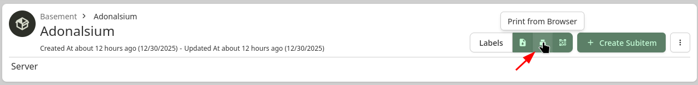
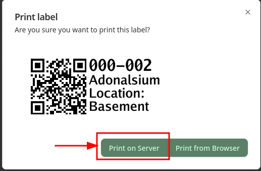

Yes, it's the end of another year.  And while I could look back and reflect on the year, I'm instead looking forward to next year and some things I want to accomplish.  I'm not going to necessarily call them "resolutions" as I kinda hate that idea, but I would like to keep better track of all the stuff in my house.  Things like how many of a specific smart switch I have, do I have any spare SSDs, when did I buy that TV for warranty purposes.  All that info would be helpful to have in any easily accessible place.
## Homebox Setup

I will admit that I have not spent much time setting up [HomeBox](https://github.com/sysadminsmedia/homebox) yet, but in short it's software to help you take inventory of and organize things in your house.  It's pretty feature rich, with lots of customization and data that can be stored.  Essentially it does exactly what it says on the box.  It's something I've known about but never really played around with.

I give full credit to [/u/flybrys on Reddit](https://www.reddit.com/r/selfhosted/comments/1py3gze/printing_homebox_labels_directly_to_a_niimbot/) for the inspiration here (and really the inspiration to finally take a look at HomeBox) as they did most of the work figuring this out.  Also, for pointing out the [Niimbot D110](https://www.amazon.com/dp/B0CZ6WCHGF), which is just $18 on Amazon as a label printer.  It works over Bluetooth, so you'll need some Bluetooth proxies to use it with HomeAssistant.  I already have some ESP32's set up to do just that so this was not an issue for me.

In terms of the setup from /u/flybrys, I've mostly just made some tweaks to streamline things.  Namely their setup used network shares (and a number of scripts) and I am instead using MQTT.  There's nothing wrong with network shares, but in my homelab the LXC that runs HomeAssistant is 1) on a different VLAN and 2) doesn't have network shares enabled.  I could have resolved both of those, but I really didn't want my IOT stuff having access to a network mount, so I endeavored to find another solution.  

To start, here is my Docker Compose snippet to setup HomeBox:

```
  homebox:
    image: ghcr.io/sysadminsmedia/homebox:0.22.3
    container_name: homebox
    restart: unless-stopped
    environment:
      - HBOX_LOG_LEVEL=info
      - HBOX_LOG_FORMAT=text
      - HBOX_WEB_MAX_UPLOAD_SIZE=10
      - HBOX_LABEL_MAKER_PRINT_COMMAND=cp {{.FileName}} /labels/label.png
      - HBOX_LABEL_MAKER_PADDING=5
      - HBOX_LABEL_MAKER_WIDTH=350
      - HBOX_LABEL_MAKER_HEIGHT=120
      - HBOX_OPTIONS_ALLOW_ANALYTICS=false
    volumes:
      - "{{ appdata_path }}/homebox/data:/data/"
      - "{{ appdata_path }}/homebox/labels:/labels/"
    ports:
      - 7745:7745
```

Key things to note:
1) Make sure you update the image tag to whatever the latest version is!
2) The `HBOX_LABEL_MAKER_PRINT_COMMAND` is necessary to enable the "Print on Server" button.  All we need is a simple `cp` command to copy the QR code label out of the container to the mounted directory `/labels`.  `{{.FileName}}` is straight from the HomeBox docs.
3) The rest of the padding/width/height specs come straight from /u/flybrys's post.
## To HomeAssistant!

Once you spin up HomeBox and create a user/your first item, you'll now have the option to "Print from Browser".  If you click it you'll see a "Print on Server" button.  Right now if you click it, all it will do is create a `label.png` file in the directory you mounted in `/labels`.  Let's fix that so it does more now.





The next step is to create a bash script that uses `inotify` to monitor the `/labels` directory for a new PNG file.  When it detects a new PNG file in the directory, it fires off the image to MQTT.  We'll use this to get the image into HomeAssistant pretty seamlessly.

>Sidenote: The reason for the script outside the container is that the HomeBox image does not contain mosquitto-client, so we have to go external in order to push it over MQTT.  Perhaps someday mosquitto will be built into the container and you won't need this part.

```bash
#!/bin/bash

WATCH_DIR="PATH-TO-HOMEBOX-LABELS"
MQTT_BROKER="BROKER-IP-ADDRESS"
MQTT_USERNAME="MQTT-USERNAME"
MQTT_PASSWORD="MQTT-PASSWORD"
MQTT_TOPIC="homebox/labels"

inotifywait -m -e close_write,moved_to "$WATCH_DIR" --format '%w%f' |
while read FILE
do
    if [[ "$FILE" == *.png ]]; then
        echo "Detected new PNG: $FILE"
        # Publish file via MQTT
        mosquitto_pub -h "$MQTT_BROKER" -u "$MQTT_USERNAME" -P "$MQTT_PASSWORD" -t "$MQTT_TOPIC" --retain -f "$FILE"
    fi
done
```

You can remove the MQTT username and password fields/arguments if you aren't using them for your MQTT setup.  The rest should all be customized as applicable.  You can test it by running the script (mine is called `monitor_homebox.sh`, so `./monitor_homebox.sh` worked for me).  Note you will probably want to run the script as root since the label.png file will be owned by root with limited permissions.  You could tweak the `HBOX_LABEL_MAKER_PRINT_COMMAND` environment variable to run a bash script like /u/flybrys does and `chmod` the file.  I didn't feel like taking that step, so I just run it as root.  /shrug.

Go back to HomeBox and click the "Print on Server" button and check your MQTT server to see if there's a new entry.  Now to run the script all the time in order to monitor the folder for any new labels created, I just created a simple systemd service file, like the one below (again notice I'm running this as root, you can change that if you are uncomfortable with the approach).

```
[Unit]
Description=Homebox Label Monitor Service
After=network.target

[Service]
ExecStart=PATH/TO/YOUR/SCRIPT/monitor_homebox.sh
Restart=always
User=root

[Install]
WantedBy=multi-user.target
```

Don't forget to enable and start the systemd service (and check to make sure it's running) before proceeding to the next step.
## Final Steps

Almost there!  To tie the Niimbot D110 into HomeAssistant, you'll need [this integration](https://github.com/eigger/hass-niimbot).  Install it (HACS is easiest as a custom repository).  You'll also want to set up an [MQTT Camera](https://www.home-assistant.io/integrations/camera.mqtt/) entity in your config based on the MQTT topic you set up in the `monitor_homebox.sh` script.  Mine is just this:

```yaml
mqtt:
  - camera:
    - name: Homebox Labels
      topic: homebox/labels
```

And reboot HomeAssistant.  Now add your D110 to HomeAssistant as a device (may have to scroll depending on how many Bluetooth devices you have in range).

I don't do a lot of HomeAssistant automations (I use NodeRed) but I'm fairly certain there's an MQTT trigger, so you can trigger the below action based on that trigger.

```
action: niimbot.print
data:
  payload:
    - type: dlimg
      url: >-
        http://HA_IP:HA_PORT/{{ state_attr('camera.YOUR_CAMERA_NAME',
        'entity_picture') }}
      x: -10
      "y": 10
      xsize: 260
      ysize: 130
  width: 240
  height: 120
  rotate: 90
  print_line_batch_size: 10
  wait_between_print_lines: 0.01
  density: 5
  preview: false
target:
  device_id: YOUR_D110_DEVICE_ID
```

A few things.
1) You can play with `print_line_batch_size`.  /u/flybrys used 32.  From my own trial and error I've settled on 10.  My understanding is it controls print speed, and I found 10 to be fine.
2) The Niimbot requires a URL in order to print and can't print a local file.  Hence why we set up an MQTT camera.  Using the template pulls the necessary camera API token to allow printing. 
3) You can change `preview` to `true` if you want to test without physically printing anything.  You can see what would have been printed if you look at the `Last Label Made` entity.
4) To find the device_id, go to the Actions screen and use the UI to select the Niimbot device and then switch back to YAML mode.

That should be it!  Now if you go into HomeBox and click the "Print on Server" button a label should be printed within a few seconds on your Niimbot.  Pretty sweet!

Happy organizing!