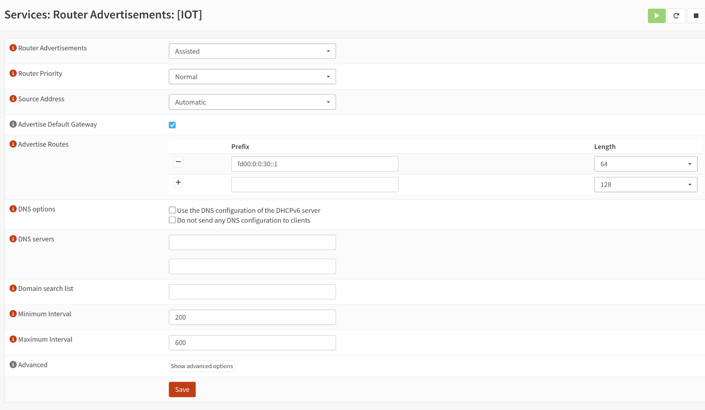

I've wanted to play around with the new hot smarthome standard, known as [Matter](<https://en.wikipedia.org/wiki/Matter_(standard)>), for a while.  What is Matter?  Simply put it's supposed to be an interoperable standard for all smart home devices.  Big companies like Apple, Amazon, and Google are all backing the standard.  The hope is to avoid the classic xkcd comic called "Standards"


Personally I'm not fully bought into the Matter standard as I think it has a long way to go and it needs more features/support more device types, though to the standard's credit they're continuing to move things along.  I'll put it this way: I'm not going to purposefully no buy a device because it supports Matter, but I'm also not going to go out of my way to buy a Matter-compliant device either.  Nor am I going to go out and replace all my devices just to switch to Matter.

I did finally get some Govee LED lights (the Permanent Outdoor LED 2s) and spent a good day and half hanging them up.  They support Matter so I figured I would take some time and configure Matter.  However it proved to be a bit of an adventure to get it all working because I had to enable IPv6, which is something I had not messed around with before.  Nor could I find any good guides for enabling it.  Hence this post sharing my experience.

## IPv4 v. IPv6

A long, detailed explanation of IPv6 and it's importance is beyond the scope of this post.  In short, we've exhausted existing pools of [IPv4](https://en.wikipedia.org/wiki/Ipv4) addresses (192.168.1.1 is an IPv4 address, for example).  IPv4 just uses a set of numbers and therefore only has 4,294,967,296 unique addresses.  Sounds like a lot right?  But remember with the explosion of cell phones and other smart home devices (as well as the world becoming more connected) there [aren't nearly enough addresses](https://en.wikipedia.org/wiki/IPv4_address_exhaustion).  Hence the development of IPv6, which has 340,282,366,920,938,463,463,374,607,431,768,211,456 unique addresses.  That...should be enough for a while.

Matter relies on IPv6 for communication, which is frustrating because I have enough IPv4 addresses internally.  But....standards I guess?  Anyway, on to how I configured IPv6 on OPNsense.

## OPNsense Configuration

The first step is to log into your OPNSense box and go to Interfaces->Settings and make sure the "Allow IPv6" is clicked/toggled on.


Click Save.  Not the bit at the bottom that the change will only take affect upon reboot of the machine or reconfiguring each interface.  I didn't need to reboot as we're going to reconfigure the interfaces.

The next step is to configure/enable DHCP for IPv6 on each VLAN/interface.  Personally I have multiple VLANs, but I really only need IPv6 on my IOT VLAN.  I also enabled IPv6 on my management VLAN so my network switches and APs would have an IPv6 address.  To set up the DHCP, go to the specific interface you want to add IPv6 to.  Set `IPv6 Configuration Type` to `Static IPv6`.  That will add a new dropdown box for configuring DHCP for IPv6.  I used the following for my address `fd00:0:0:30::1`.  My IOT network uses VLAN 30, so you can adjust the `30` to be whatever you want.  You also need to adjust the `128` to `64` that is in the dropdown next to the address box.  Again click Save.


I'm not sure if this next step is necessary because I have VLANs or if it's optional but I found it mentioned in a few articles/Reddit posts so I figured I would enable it.  You'll need to use "[Router Advertisements](https://docs.opnsense.org/manual/radvd.html)" under Services and configure it like this:



Essentially I set the "Router Advertisement" setting to "Assisted" and copied the IPv6 prefix from the earlier settings (in my case `fd00:0:0:30::1`) and clicked Save.  You should be able to leave all the other settings the same.

## Omada Configuration

I run TP-Link Omada switches/Access Points for my network, and they required a little extra configuration to work as well.  Basically I had to go into each network switch, go to "Config", and scroll down a bit till I saw DHCP options.  I needed to enable IPv6 and then I made sure "Dynamic IP (SLAAC/DHCPv6)" was selected.  I did similar for each Access Point.


## Configuring Proxmox

I had to make a minimal change to my Proxmox network configuration in `/etc/network/interfaces` to enable IPv6.  Specifically I needed to add `iface vmbr1 inet6 manual`.  I use Linux Bridges, so my configuration looks like this:

```
auto bond0  
iface bond0 inet manual  
       bond-slaves enp4s0f0 enp4s0f1 enp4s0f2 enp4s0f3  
       bond-miimon 100  
       bond-mode 802.3ad  
  
auto vmbr0  
iface vmbr0 inet static  
       address 192.168.1.10/24  
       gateway 192.168.1.1  
       bridge-ports eno1  
       bridge-stp off  
       bridge-fd 0  
       bridge-vlan-aware yes  
       bridge-vids 2-4094  
#Onboard NIC (VLAN 1)  
  
auto vmbr1  
iface vmbr1 inet manual  
       bridge-ports bond0  
       bridge-stp off  
       bridge-fd 0  
       bridge-vlan-aware yes  
       bridge-vids 2-4094  
#LAGG Connection (All VLANs)  
  
iface vmbr1 inet6 manual #THIS IS NEW FOR IPv6!
```

You'll need to reboot the server or run `sudo ifreload -a` to reload the interfaces for Proxmox.

To enable IPv6 for the LXC where I run HomeAssistant, I picked `SLAAC`.


Now when I go into the LXC (probably need to reboot the LXC), when I run the `ip` command I see an IPv6 address!

```
$ ip -6 a show eth0  
2: eth0@if21: <BROADCAST,MULTICAST,UP,LOWER_UP> mtu 1500 qdisc noqueue state UP group default qlen 1000 link-netnsid 0  
   inet6 fd00::30:893:69ff:fe34:159f/64 scope global dynamic mngtmpaddr noprefixroute    
      valid_lft 86226sec preferred_lft 14226sec  
   inet6 fe80::893:69ff:fe34:159f/64 scope link    
      valid_lft forever preferred_lft forever
```

In this case, its `fd00::30:893:69ff:fe34:159f` (notice the 30 from the early step in OPNsense?).

## Matter Docker Container

Thankfully this part is pretty easy.  The OpenHome Foundation (folks behind HomeAssistant) have made an Docker container to run the server.  I suggest running it on the same VLAN as your HomeAssistant instance as I imagine crossing VLANs will be painful.  Here's my Docker-Compose configuration:

```yaml
 matter-server:  
   image: ghcr.io/home-assistant-libs/python-matter-server:stable  
   container_name: matter-server  
   restart: unless-stopped  
   network_mode: host  
   volumes:  
     - /home/fuzzy/docker/matter-server/data:/data/
```

Just run `docker compose up -d matter-server` and it should spin up and hopefully `Just Work` provided IPv6 is working.  You can then add Matter in HomeAssistant (mine popped up automatically when I went to the Devices menu).  You'll have to pair the actual Matter device from your phone as for now Matter also relies on Bluetooth for now (hopefully that will be changing as [Matter 1.4.2 was just released](https://www.helpnetsecurity.com/2025/08/11/matter-1-4-2-smart-home-security/) that permits WiFi only commissioning).
## Conclusion

I may be forgetting a step, but that should get you most of the way there.  Not really intuitive at all, but at least now I can connect to Matter devices.  But it's still VERY finicky to get paired into HomeAssistant.  Have to disable any VPN, need to be on the same WiFi network, and you sometimes need to factory reset the device/reboot it in order to get it to successfully pair.

The functionality in Matter for the Govee lights is pretty limited, but I'm hoping that improves with time.  Still not completely sold on Matter as it's not very consumer friendly to set up, but again...time.