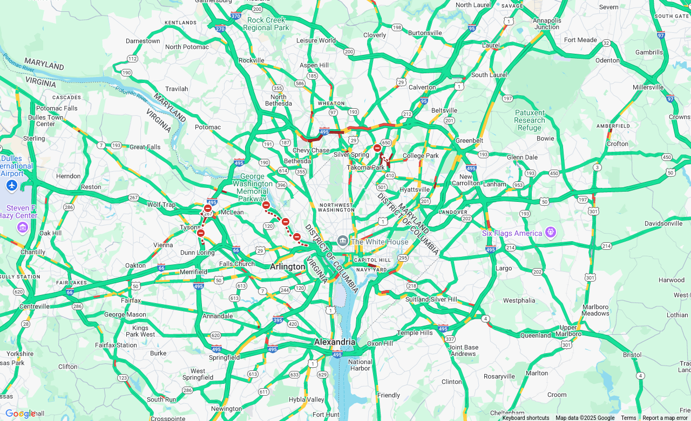
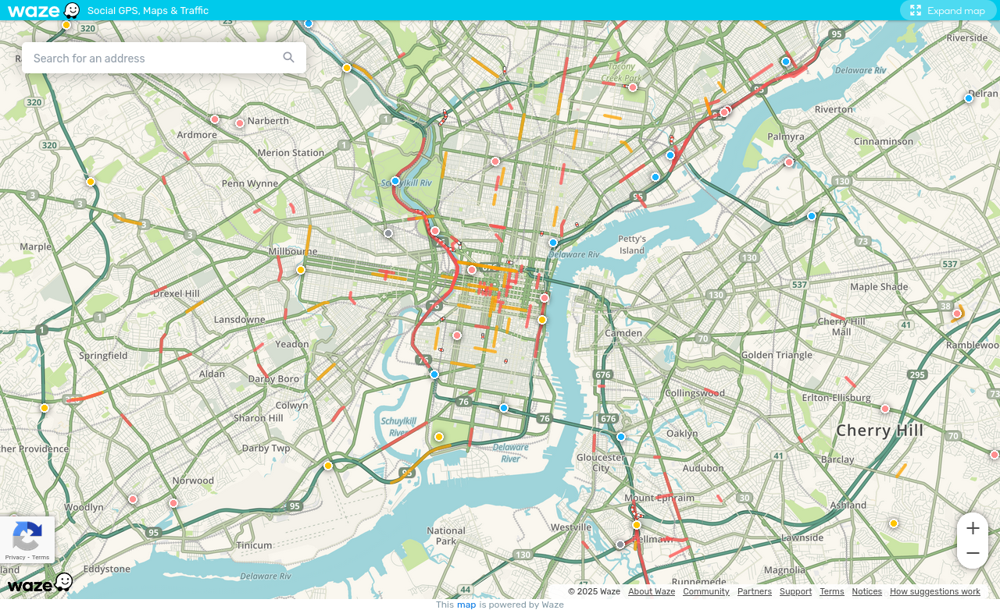
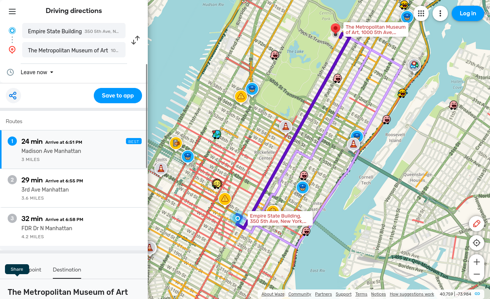
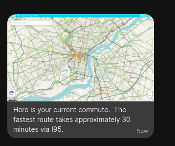

One of my absolute favorite automations I have set up is the one that sends me a notification on workdays with an image displaying a Google Map with the traffic layer turned on.  Thankfully I have several ways I can get from home to the office, but the main way along the interstate backs up very quickly if there's an accident or other issue.

I've been using Google Maps for a while, but this solution should work for any traffic map you can find that allows you to set the lat/long/zoom by URL.  I also just started playing around with using the [Waze map](https://www.waze.com/live-map/directions) to send myself a screen shot of the possible routes home.  And the other benefit is I can use CATT in the morning to cast the map to the Google Home Hub that sits in my kitchen so I can see my commute as I'm eating breakfast and making my lunch.

Under the hood this relies on [Selenium](https://www.selenium.dev/) and [Splinter](https://github.com/cobrateam/splinter/), which is a Python app that has a relatively straightforward API to interact with Selenium.
## Install Splinter
You'll want to install Splinter in a Python virtual environment,  particularly if you're running recent versions of Ubuntu or Debian.  `pipx` won't work.  You can read more about virtual environments [here](https://docs.python.org/3/library/venv.html), but essentially it's like a mini virtual machine but just for python, allowing it to be isolated from the system's python packages.

I set my `venv` up in `.venv`, so the command to create it for me was: 
```bash
python3 -m venv .venv
```
You can use whatever directory/path you want though.  Once that's done, you need to activate the virtual environment with this (adjust the `.venv` part at the beginning depending on the path you selected above):
```bash
source .venv/bin/activate
```
Once the virtual environment is activated, run this command to install Splinter:
```bash
pip3 install splinter[selenium]
```
This also will install the needed [driver/bindings for Selenium](https://pypi.org/project/selenium/).
## Install Selenium
For running Selenium, I found the available docker container to be easiest.  I'm a fan of Firefox, so I chose the Firefox version but you could probably do this with Edge or Chrome as well.  Here's my docker-compose snippet:
```yaml
services:
  selenium:
    image: selenium/standalone-firefox:133.0
    container_name: selenium
    ports:
      - 4444:4444
    environment:
      - SE_NODE_MAX_SESSIONS=2
      - TZ=SET_YOUR_TIMEZONE
    shm_size: 2g
    restart: unless-stopped
```
You'll want to update the tag to be whatever version you want.  I'd recommend running the latest version (you can read more how I handle updates to my infrastructure [here](https://blog.fuzzymistborn.com/using-renovatebot/)), but not the `latest` tag.  Also set the timezone as that will be helpful if you also want the Waze directions option discussed below.

I did notice a bit of a memory leak with Selenium, so I scheduled a daily reboot at 4:30am via cron with the following:

```
30 4 * * * docker container restart selenium > /dev/null 2>&1
```
## Google Maps Setup
You can skip this part if you don't want to use Google Maps.  I understand the want/desire to deGoogle, but I still find Google Maps to be unparalleled, particularly for traffic data.  Since the only thing Google is getting is the location of the map I want to generate, I think the trade off is worth it, but again, entirely up to you.

The first thing you'll need is a Google Maps API key.  You can follow the instructions [here](https://github.com/googlemaps/google-maps-services-python#api-keys).  We'll be using the [Maps JavaScript API](https://developers.google.com/maps/documentation/javascript/overview).  You **do** need to provide credit card information to access it, but there is a free tier that you should be able to stay well under.  Google is making [changes to their API pricing](https://developers.google.com/maps/billing-and-pricing/faq), but from what I can gather, I don't think the changes impact the Maps JavaScript API.  You only get charged an API hit when you load the map, so based on the cronjob I have detailed later, I only use ~1,000 API requests a month.  I'm sure I could streamline that down further if needed.  If you're worried about being charged, you can [set quota limits](https://developers.google.com/maps/documentation/distance-matrix/usage-and-billing#set-caps).

Now that you have the API key, you'll need to have a way to display the map.  Below is some HTML that will render the map in a browser.
```html
<!DOCTYPE html>  
<html>  
 <head>  
   <meta name="viewport" content="initial-scale=1.0, user-scalable=no">  
   <meta charset="utf-8">  
   <title>Traffic Layer</title>  
   <style>  
     /* Always set the map height explicitly to define the size of the div  
      * element that contains the map. */  
     #map {  
       height: 100%;  
     }  
     /* Optional: Makes the sample page fill the window. */  
     html, body {  
       height: 100%;  
       margin: 0;  
       padding: 0;  
     }  
   </style>  
 </head>  
 <body>  
   <div id="map"></div>  
   <script>  
     function initMap() {  
       const map = new google.maps.Map(document.getElementById("map"), {  
         zoom: YOUR_VALUE,
         center: {lat: YOUR_VALUE, lng: YOUR_VALUE},  
         disableDefaultUI: true  
       });  
       const trafficLayer = new google.maps.TrafficLayer();  
       trafficLayer.setMap(map);  
     }  
  
     window.initMap = initMap;  
   </script>  
   <script async defer  
   src="https://maps.googleapis.com/maps/api/js?key=INSERT_YOUR_API_KEY_HERE&callback=initMap">  
   </script>  
 </body>  
</html>
```
You will need to insert your API key towards the bottom (replace `INSERT_YOUR_API_KEY_HERE`).  You'll also need to set the desired latitude and longitude, as well as the zoom level (replace `YOUR_VALUE`, from my experience something like 10-13 gets you into the ballpark you probably want).  Save it as an html file, like `traffic.html`.

To view the page there are a few options.  The option I used for a long time was to copy the HTML file into the `www` directory in HomeAssistant and accessed it via `http://YOUR_HA_INSTANCE_IP:PORT/local/traffic.html`.  However, if your HA instance is publicly accessible, so is your map.  Which isn't ideal, because 1) bots could abuse it and rack up a bill if you didn't set a limit and 2) well...it's public so anyone could see roughly where you live if you set the view around your house.  The other option is to use a reverse proxy, like Caddy, nginx, or Apache (I *think* Traefik can handle static files but I'm not 100% sure).  Here is an example of my Caddy file:
```json
traffic.example.com {  
       file_server  
       root * /home/fuzzy/web  
       tls /home/fuzzy/lego/certificates/_.example.com.crt /home/fuzzy/lego/certificates/_.example.com.key  
}
```
Note that the TLS/HTTPS part is optional.  I've used AdGuardHome to rewrite URL queries to a custom domain pointed at my Caddy instance.  So HomeAssistant and other things on my network can access it, but it's inaccessible outside my LAN.

You'll end up with a screen shot that looks like this:

## Waze Setup

If all the above seems way too complicated to you (API keys, html pages, reverse proxies oh my!), there's another simpler option.  Waze offers a [live map](https://www.waze.com/live-map) that shows real time traffic info (yes I know Google owns Waze, but I haven't found another traffic map with programmable URLs, let me know in the comments if you know one).  The URL is this:
> https://embed.waze.com/iframe?zoom=YOUR_VALUE&lat=YOUR_VALUE&lon=YOUR_VALUE&ct=livemap

Just like with the Google map, play around with the zoom level (from my experience something like 10-13 gets you into the ballpark you probably want) and location latitude/longitude.  This is the result:


Alternatively, you can use the Driving Directions map to generate a map.  The URL looks something like this:
> https://www.waze.com/live-map/directions/the-metropolitan-museum-of-art-5th-ave-1000-manhattan?utm_campaign=iframe_search&utm_medium=fullscreen_map&utm_source=direct_link&to=place.w.187433368.1874595822.373029&from=place.w.187433367.1874399211.868693

And the result is this:

## Putting it All Together
Now that we have all the pieces, time to actually get it to work in HomeAssistant!  The first thing you'll need is a Python script to take the snapshot.  Here's an example for the Google Map option:

```python
from splinter import Browser  
  
browser = Browser(driver_name='remote',  
   command_executor='http://SELENIUM_IP_ADDRESS:4444/wd/hub',  
   browser='firefox',  
   wait_time=20  
)  
browser.visit("https://traffic.example.com")  
  
# Solution to fix "wait" which is broken  
browser.find_by_css('Test')  
  
browser.screenshot("/home/fuzzy/hass/tmp/commute", full=True, unique_file=False) 
  
browser.quit()
```
And the Waze LiveMap option:
```python
from splinter import Browser  
import time  
  
browser = Browser(driver_name='remote',  
   command_executor='http://SELENIUM_IP_ADDRESS:4444/wd/hub',  
   browser='firefox',  
   wait_time=20  
)  
browser.visit("YOUR_WAZE_URL")  

# Hack to wait for JavaScript to fully load
time.sleep(10)  
  
browser.screenshot("/home/fuzzy/hass/tmp/waze", full=True, unique_file=False)  
  
browser.quit()
```
And finally, the Waze Directions option:
```python
from splinter import Browser  
  
browser = Browser(driver_name='remote',  
   command_executor='http://SELENIUM_IP_ADDRESS:4444/wd/hub',  
   browser='firefox',  
   wait_time=20  
)  
browser.visit("YOUR_WAZE_URL")  
  
# Solution to fix "wait" which is broken  
browser.is_text_present("Arrive")  
browser.find_by_xpath("/html/body/div[1]/div[2]/button").click()  

browser.screenshot("/home/fuzzy/hass/tmp/waze", full=True, unique_file=False)  
  
browser.quit()
```
FY the `xpath` bit clears out the Waze banner at the bottom about installing the Android/iOS app.

You'll want to adjust the visit URL as well as the Selenium IP address and screenshot save path.  Note you do not need to put a file extension for the screenshot path.  In my example, it will save the screenshot as `/home/fuzzy/hass/tmp/commute.png` or `waze.png`.  I'd suggest putting it in a subdirectory in your HomeAssistant folder to make the next part easier.  Make the .py file executable: `chmod +x YOURFILE.py`.

To take the screenshot, I use two cronjobs.  The first handles snapshots during commute times, the second during times surrounding commute time
```
*/10 7-8,16-18 * * 1-5 .venv/bin/python3 /home/fuzzy/scripts/traffic.py
*/30 9-15 * * 1-5 .venv/bin/python3 /home/fuzzy/scripts/traffic.py
```
You'll need to update `.venv/bin/python3` to be whatever path you set up your venv in above.  Basically the first cronjob updates every 10 minutes between 7 and 8am and 4 and 6pm Monday through Friday, and the second runs every 30 minutes between 9am and 3pm Monday through Friday.  IE it updates more frequently during the times I'm most likely to commute, and less often during the workday in case I leave a bit later or earlier.  And then it doesn't run any other time.  This is how I greatly limit the number of API calls.  You can use https://crontab.guru to come up with your own setup.

## HomeAssistant
After all that work, you finally should have a snapshot of whatever map you chose saved in a directory HomeAssistant can access.  You can then use this to send a notification to your phone as desired.  I also add a little spice by adding the following text beneath the image:


> Here is your current commute.  The fastest route takes approximately XY minutes via I-95.

You can get the "via" part if you use the [Waze Travel Time integration](https://www.home-assistant.io/integrations/waze_travel_time/) though I've found it to be slow to update.  Here's an example of how it looks in Signal:



Again, over the years I've found this to be invaluable for knowing both how long my commute is going to take and if there's going to be traffic and I need to find a different way home.  I hope you find it useful as well!